# StreetFoodNarrator - Use Case + Sequence + Activity Theo Sự Kiện Chức Năng (PlantUML)

Ghi chú: Tài liệu này dùng PlantUML cho toàn bộ sơ đồ Use Case và Sequence.

Xem thêm class diagram cho báo cáo tại: Documentation/Project-Class-Diagrams.md

## Bảng đánh dấu flow — Toàn bộ F0–F35

> Mỗi sự kiện luôn có 4 phần chính: **Đặc tả Use Case** (bảng chuẩn + luồng chính/thay thế/ngoại lệ) · **Use Case Diagram** (PlantUML) · **Sequence Diagram** (PlantUML) · **Activity Diagram** (PlantUML). Bản đầy đủ bên dưới đã bổ sung Activity cho toàn bộ F0-F35; khi trích sang PRD DOCX có thể chọn subset trọng tâm.

| Flow ID | Sự kiện | Nhóm | Flow này làm gì |
|---|---|---|---|
| F0 | Sự kiện 0 | Tổng quan | Mô tả hành trình tổng thể hệ thống |
| F1 | Sự kiện 1 | User App | Khởi động app, đọc cache, đồng bộ dữ liệu |
| F2 | Sự kiện 2 | User App | Cập nhật GPS và geofence vào/ra vùng |
| F3 | Sự kiện 3 | User App | Mở chi tiết POI với tab Fun Fact |
| F4 | Sự kiện 4 | User App | Phát audio với fallback 4 tầng |
| F5 | Sự kiện 5 | API | Tạo TTS ở backend và trả audio URL |
| F6 | Sự kiện 6 | Auth | Đăng nhập và cấp JWT |
| F7 | Sự kiện 7 | User App | Gửi review và cập nhật rating POI |
| F8 | Sự kiện 8 | Web | Nhận thông báo theo polling sidebar |
| F9 | Sự kiện 9 | Web Vendor | Vendor xem và lọc POI của mình |
| F10 | Sự kiện 10 | Web Vendor/Admin | Auto-translate nội dung POI sang đa ngôn ngữ |
| F11 | Sự kiện 11 | Web Admin | Xem và phân tích narration logs |
| F12 | Sự kiện 12 | User App | QR landing → 2 lựa chọn: Web App hoặc Tải APK |
| F13 | Sự kiện 13 | Web Admin | Admin đăng nhập web và truy cập trang bảo vệ |
| F14 | Sự kiện 14 | Web Admin | Admin duyệt hồ sơ Vendor pending |
| F15 | Sự kiện 15 | Web Admin | Admin duyệt nội dung POI pending từ Vendor |
| F16 | Sự kiện 16 | Web Vendor/Admin | Vendor tạo bộ audio, Admin duyệt 3 ngôn ngữ |
| F17 | Sự kiện 17 | Web Vendor | Vendor tạo/sửa POI gửi Admin duyệt |
| F18 | Sự kiện 18 | Web Admin | Xem heatmap tương tác và focus theo POI |
| F19 | Sự kiện 19 | Web Admin | Xem thống kê KPI tổng quan và báo cáo theo thời gian |
| F20 | Sự kiện 20 | Web Admin | Quản lý tour với ràng buộc free tour và premium POI |
| F21 | Sự kiện 21 | Web Vendor | Vendor quản lý menu item theo POI |
| F22 | Sự kiện 22 | Web Admin | Admin quản lý vòng đời tài khoản và phân quyền |
| F23 | Sự kiện 23 | Web / Auth | Đăng ký tài khoản web (mặc định role Vendor) |
| F24 | Sự kiện 24 | User App | Xem và tham gia Tour từ Mobile App |
| F25 | Sự kiện 25 | Web Admin | Quản lý bản dịch nội dung POI (Translations) |
| F26 | Sự kiện 26 | Web Admin | Theo dõi thiết bị và lịch sử truy cập |
| F27 | Sự kiện 27 | Web Vendor | Vendor thanh toán premium và kích hoạt ngay |
| F28 | Sự kiện 28 | User App + Web PWA + API | Xác nhận VIP theo thiết bị (Mobile + Web PWA 3 bước) và khôi phục bằng recovery code |
| F29 | Sự kiện 29 | Web Admin | Quản lý thanh toán user app theo thiết bị (admin mode app) |
| F30 | Sự kiện 30 | Web Admin | Vận hành QR campaign công cộng (status + test rotate) |
| F31 | Sự kiện 31 | Web Public + Android User | Tải APK từ landing công khai, deeplink từ QR, và fallback iOS → Web |
| F32 | Sự kiện 32 | User App | Onboarding lần đầu: chọn ngôn ngữ, xin quyền vị trí, vào map |
| F33 | Sự kiện 33 | User App | Hoàn tất dữ liệu offline theo 2 pha: dữ liệu thiết yếu trước, đồng bộ đầy đủ nền sau |
| F34 | Sự kiện 34 | User App | Hiển thị bản đồ an toàn khi offline và không có tile cache |
| F35 | Sự kiện 35 | User App | Tương tác tab Đã lưu (Saved): xem danh sách đã lưu, mở chi tiết, bỏ lưu |

## Bản Trích Dùng Cho PRD (Copy Nhanh)

> Mục tiêu PRD: mô tả feature-level và business flow chính, không đi sâu class-level hoặc liệt kê chi tiết từng API call.

| Nhãn | Flow ID | Gợi ý đưa vào PRD DOCX |
|---|---|---|
| [PRD] | F0, F1, F2, F4, F12, F17, F20, F24, F27, F31, F32, F33, F34, F35 | Nhóm flow chính, có thể dùng trực tiếp cho PRD |
| [CHI TIẾT] | F3, F5, F6, F7, F8, F9, F10, F11, F13, F14, F15, F16, F18, F19, F21, F22, F23, F25, F26, F28, F29, F30 | Để phụ lục kỹ thuật / SDD / tài liệu triển khai |

Quy ước đọc nhanh: các tiêu đề có hậu tố `(PRD)` là nội dung ưu tiên đưa vào PRD; các sự kiện còn lại mặc định là `(CHI TIẾT)`.

| Thành phần diagram cho PRD | Số lượng khuyến nghị | Chọn từ flow |
|---|---|---|
| Use Case Diagram | 1 bộ tổng quan + mô tả feature | F0 + bảng flow |
| Activity Diagram (khi trích PRD DOCX) | 10-15 sơ đồ theo mức duyệt/điều kiện, không cố định | F1, F4, F12, F14, F15, F16, F17, F20, F24, F27, F28, F30, F32, F33, F34 |
| Sequence Diagram (optional) | 1-2 sơ đồ end-to-end | Mobile E2E + Web E2E (bên dưới) |

### Tiêu chí Chọn Flow Có Ảnh Hưởng Hệ Thống Đáng Kể

| Tiêu chí | Ngưỡng đạt để đưa vào PRD trọng tâm |
|---|---|
| Độ phủ liên module | Tác động tối thiểu 3 module/subsystem (UI, service, API, DB/cache, background task) |
| Thay đổi trạng thái hệ thống | Có ghi/đổi trạng thái bền vững (Preferences, cache, trạng thái quyền truy cập, trạng thái đồng bộ) |
| Độ sâu tương tác runtime | Có nhánh điều kiện hoặc ngoại lệ làm thay đổi hành vi hệ thống khi user tương tác |
| Ảnh hưởng chuỗi tính năng | Tác động trực tiếp đến các flow lõi khác (GPS/geofence, audio, tour, analytics, khả dụng offline) |

Ghi chú áp dụng: F32-F34 được giữ trong nhóm PRD vì đều đạt các ngưỡng trên, không phải flow UI đơn lẻ.

## Sequence End-To-End Dùng Cho PRD

### End-to-End Mobile App (PRD)
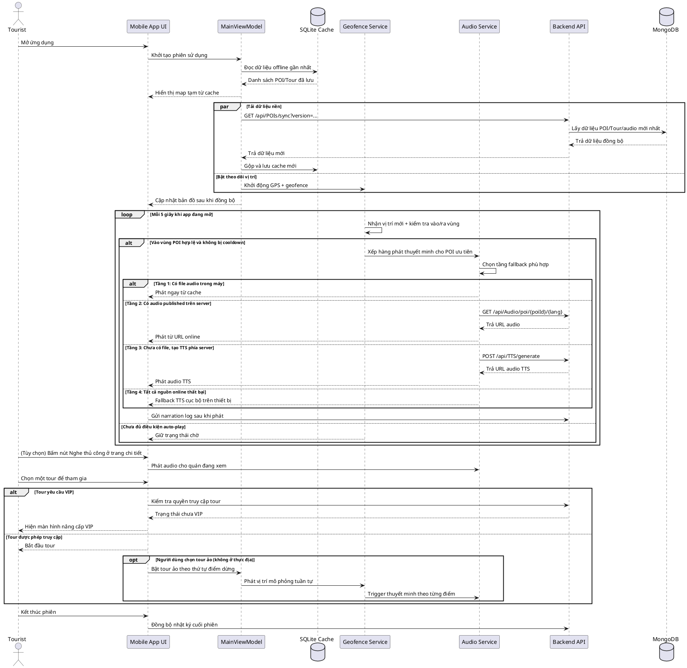

### End-to-End Web Portal (PRD)
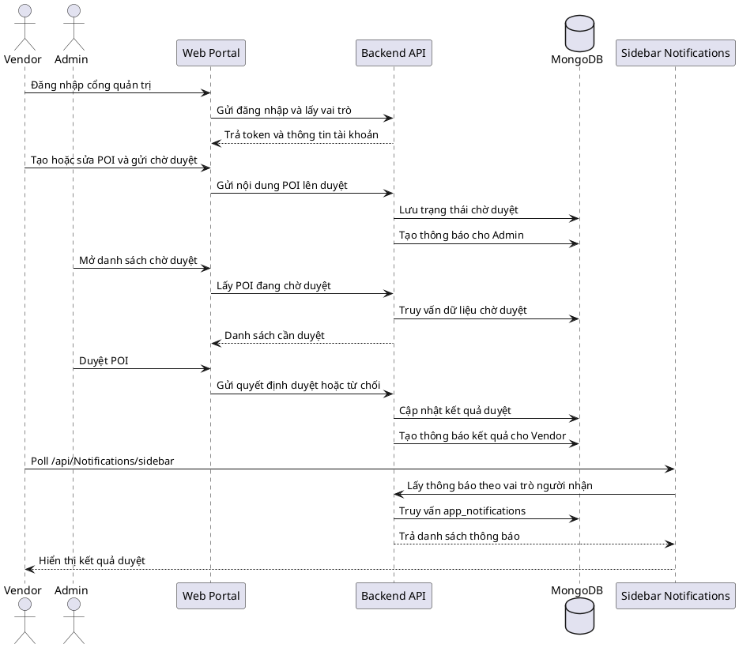

## Kết quả rà soát theo code hiện tại (đối chiếu PRD)

| Mục rà soát | Kết luận từ code hiện tại | Hành động trong tài liệu này |
|---|---|---|
| F8 Notification | Không có SignalR/Hub; web dùng polling `GET /api/Notifications/sidebar` (10s khi visible, 30s khi hidden) | Sửa F8 sang polling flow + sequence/activity mới |
| F12 QR | Landing page không còn auto-open deeplink; giờ hiển thị 2 lựa chọn: **Dùng Web ngay** + **Tải APK**. iOS auto-redirect sang web-app. Có `scanBehavior` flags trong API response. Deeplink chỉ trigger từ APK download page khi có `?dl=` | Đã cập nhật F12 thành flow 2 lựa chọn + iOS redirect + deeplink từ APK page |
| F16 Audio | Upload/replace audio thủ công đang tắt (`410`), luồng chính là TTS + moderation theo bộ 3 ngôn ngữ | Sửa F16 theo workflow thực tế Vendor/Admin |
| F20 Tour | Không dùng bảng `POI_Tour`; thứ tự stop nằm trong `Tour.PoiIds`; có rule chỉ 1 free tour active và POI vendor phải còn premium | Sửa F20 theo rule validate thực tế |
| F21 Menu | `DELETE /api/MenuItems/{id}` bị disable (`405`); nghiệp vụ chính là bật/tắt bán qua `isAvailable` | Sửa F21 theo hướng không xóa món |
| F23 Register | `POST /api/Auth/register` không nhận role; backend luôn gán role `Vendor`; VendorProfile tạo lazy ở `GET /api/Vendors/me` | Sửa F23 theo implementation thật |
| Tour access mobile | Mobile áp dụng free-first: non-VIP chỉ vào free tour; tour khác bị khóa/paywall | Sửa F24 và thêm F28 |
| Virtual Tour (không ở thực địa) | Mobile có `VirtualTourViewModel` + `SimulatedLocationService`, hỗ trợ mô phỏng vị trí theo stop của tour | Bổ sung rõ vào F24 (luồng thay thế + sequence + activity) |
| Audio focus mobile | `AudioService` có xử lý audio focus (mất focus thì pause/duck, có thể resume khi focus quay lại) | Bổ sung ghi chú vào F4 để bám code hiện tại |
| Payment/Subscription | Có 2 luồng riêng: `PaymentsController` (vendor thanh toán premium auto-approve, kích hoạt ngay) và `SubscriptionsController` (VIP theo device). Web PWA (`web-app.html`) có paywall 3 bước riêng với QR ngân hàng, transfer content tự sinh, 5 điểm VIP gate | Đã cập nhật F28 bổ sung Web PWA paywall + VIP gates |
| Payment admin mode app | Admin có thêm panel `payment-management?mode=app`, đọc dữ liệu từ `GET /api/Subscriptions/admin/subscriptions`. Trang có dropdown "Xem thêm" ở header với 3 mục legal (Điều khoản, Chính sách bảo mật, Chính sách hoàn tiền) hiện dưới dạng modal | Bổ sung F29 |
| Premium notifications | Khi vendor thanh toán premium thành công, backend có thể ghi nhận thông báo trạng thái premium ở luồng vendor (không cần vòng admin review) | Cập nhật F27 + liên kết F8 |
| QR campaign admin ops | Có `QrController` với `GET /api/Qr/admin/status` và `POST /api/Qr/admin/test-rotate`, lưu state ở `qr_campaign_states`. Response có thêm `scanBehavior` object (`openAppIfInstalled`, `fallbackToDownloadPageIfMissing`, `showExpiredWhenOutdated`) | Đã cập nhật F30 bổ sung scanBehavior |
| APK landing page | Trang `/apk-download.html` phục vụ tải APK + sao chép link. Nhận `?apk=` và `?dl=` từ QR landing (F12); nếu có `?dl=` hiện thêm nút "Mở ứng dụng" deeplink | Đã cập nhật F31 bổ sung deeplink từ QR |
| Web-app Settings + Legal | `web-app.html` tab Settings có: VIP status card, restore form, language selector (vi/en/zh), device ID, legal overlay (Điều khoản + Chính sách bảo mật). Mobile `SettingsPage` cũng có Legal section mở `LegalPage` modal | Ghi nhận, không cần flow riêng — nằm trong F28 (VIP) và mô tả chung |
| Web-app i18n | Full dictionary `T` object (vi/en/zh) + `applyI18n()` render toàn bộ UI theo ngôn ngữ. Audio player chỉ hiện tab cho ngôn ngữ có audio, không còn language pills cũ | Ghi nhận, phản ánh trong mô tả F4 và Settings |
| Onboarding mobile | `App.CreateWindow` + `WelcomePage` có flow first-run: chọn ngôn ngữ, xin quyền vị trí, cho phép tiếp tục không bật GPS, rồi mới vào map | Bổ sung F32 để tăng trọng số trải nghiệm Tourist |
| Offline data completion | `RunSimpleFlowAsync` và `DataSyncService` triển khai 2 pha: ưu tiên mở app nhanh, sau đó tự hoàn tất gói offline đầy đủ ở nền | Bổ sung F33 để mô tả chiến lược offline-first thực tế |
| Offline map fallback | `MainPage.Map` có nhánh fallback khi offline và không có tile cache (`CreateOfflineFallbackLayer`) thay vì crash/trắng bản đồ | Bổ sung F34 cho case thực địa mất mạng |
| PRD chênh lệch lớn | Một số hạng mục PRD vẫn chưa có trong code hiện tại: SSE progress audio task, AI Advisor, dynamic RBAC nhiều permission, offline map pack PMTiles | Giữ trong phần nhận xét chấm đồ án, không mô tả như tính năng đã hoàn thành |
| Contract cần sửa | Web API wrapper đang gọi `/Settings/me` (GET/PUT) nhưng backend chỉ có `GET/PUT /api/Settings/{deviceId}` | Đánh dấu mismatch mức cao, cần fix sớm bằng 1 trong 2 cách: thêm alias `/api/Settings/me` hoặc sửa wrapper truyền `deviceId` |

## Sự kiện 0: Use case tổng quan hệ thống (PRD)

### Đặc tả Use Case

| Trường | Nội dung |
|--------|---------|
| **Use Case ID** | F0 |
| **Tên** | Khám phá phố ẩm thực bằng ứng dụng |
| **Tác nhân chính** | Tourist |
| **Tác nhân phụ** | Admin (quản trị nội dung), Vendor (cung cấp thông tin POI) |
| **Kích hoạt** | Tourist mở ứng dụng Street Food Narrator |
| **Tiền điều kiện** | App đã cài đặt; API hoạt động; dữ liệu POI sẵn sàng |
| **Hậu điều kiện** | Tourist hoàn thành hành trình khám phá; dữ liệu sử dụng được ghi nhận vào hệ thống |
| **Quan hệ** | include: F1 (Sync dữ liệu), F2 (GPS/Geofence), F3 (Chi tiết POI), F4 (Phát audio), F7 (Review) |

**Luồng chính:**

| Bước | Tác nhân | Hành động |
|------|----------|-----------|
| 1 | Tourist | Mở app → hệ thống khởi động và tải dữ liệu (F1) |
| 2 | Hệ thống | GPS được kích hoạt, geofence bắt đầu theo dõi (F2) |
| 3 | Tourist | Di chuyển trên thực địa hoặc chọn Virtual Tour |
| 4 | Hệ thống | Khi vào zone POI → tự động phát thuyết minh audio (F4) |
| 5 | Tourist | Tap POI trên map → xem chi tiết thông tin (F3) |
| 6 | Tourist | (Tùy chọn) Gửi review và đánh giá (F7) |
| 7 | Hệ thống | Ghi nhận narration log, cập nhật analytics |

**Luồng thay thế — Virtual Tour (không ở thực địa):**

| Bước | Tác nhân | Hành động |
|------|----------|-----------|
| 3a | App | Phát hiện user > 1km khỏi trung tâm khu vực |
| 3b | App | Gợi ý tham gia Tour ảo |
| 3c | Tourist | Đồng ý → dùng simulated location theo thứ tự stop |

**Ngoại lệ:**
- GPS bị từ chối → vô hiệu hóa geofence, hiện thông báo yêu cầu quyền.
- API không khả dụng → app chạy offline từ SQLite cache.

### Use Case Diagram
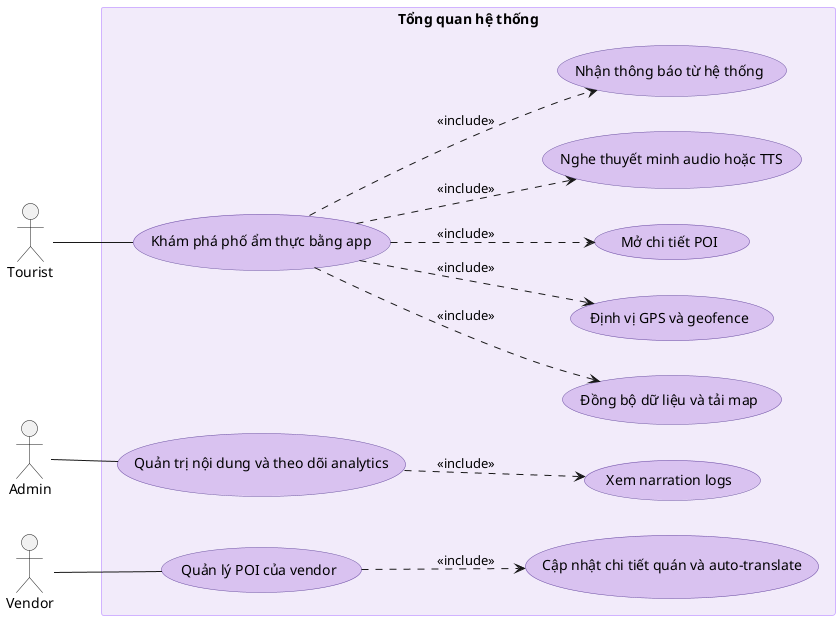

### Sequence Diagram
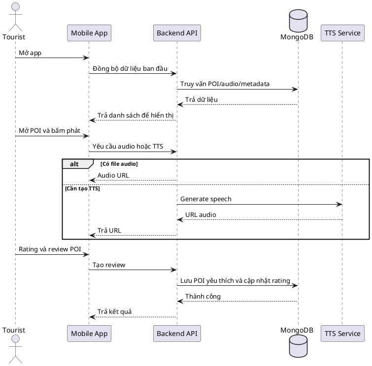

### Activity Diagram
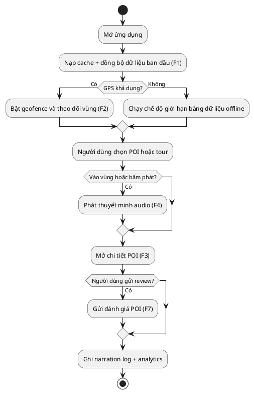

## Sự kiện 1: Khởi động app và đồng bộ dữ liệu (PRD)

### Đặc tả Use Case

| Trường | Nội dung |
|--------|---------|
| **Use Case ID** | F1 |
| **Tên** | Khởi động app và đồng bộ dữ liệu |
| **Tác nhân chính** | Tourist |
| **Tác nhân phụ** | Backend API (POIsController), SQLite local |
| **Kích hoạt** | Tourist mở ứng dụng |
| **Tiền điều kiện** | App đã cài đặt |
| **Hậu điều kiện** | Map hiển thị POI pins; dữ liệu local được cập nhật từ API hoặc dùng từ cache nếu offline |

**Luồng chính:**

| Bước | Tác nhân | Hành động |
|------|----------|-----------|
| 1 | Tourist | Mở app |
| 2 | MainViewModel | Load SQLite cache ngay lập tức → hiển thị map với POI cũ (0ms wait) |
| 3 | Hệ thống | Kiểm tra kết nối mạng |
| 4 | App | `GET /api/POIs/sync?version={lastVersion}` để lấy delta |
| 5 | API | Trả danh sách POI thay đổi từ version đó |
| 6 | App | Merge dữ liệu mới vào SQLite; cập nhật pins trên map |
| 7 | App | Khởi động GPS ForegroundService song song |

**Luồng thay thế — Mất mạng:**

| Bước | Tác nhân | Hành động |
|------|----------|-----------|
| 3a | Hệ thống | Không có kết nối mạng |
| 3b | App | Bỏ qua sync API; hiện badge "⚡ Offline — dữ liệu cũ" |
| 3c | App | Dùng toàn bộ dữ liệu từ SQLite cache |

**Luồng thay thế — Lần đầu cài đặt (cache rỗng):**

| Bước | Tác nhân | Hành động |
|------|----------|-----------|
| 2a | App | SQLite rỗng → hiện loading indicator |
| 4a | App | `GET /api/POIs` không kèm version → download toàn bộ |
| 6a | App | Lưu toàn bộ vào SQLite lần đầu |

**Ngoại lệ:**
- API trả lỗi 5xx → dùng cache, hiện thông báo "Không thể cập nhật dữ liệu".
- SQLite bị lỗi/corrupt → xóa cache, buộc download lại.

### Use Case Diagram
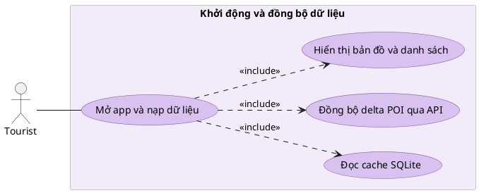

### Sequence Diagram
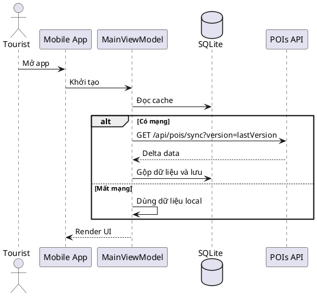

### Activity Diagram
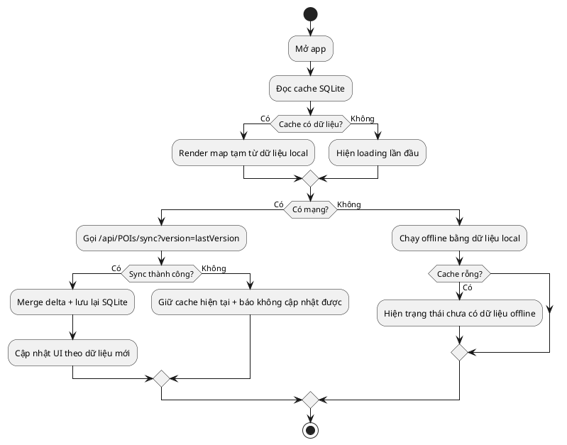

## Sự kiện 2: Cập nhật GPS và geofence (PRD)

### Đặc tả Use Case

| Trường | Nội dung |
|--------|---------|
| **Use Case ID** | F2 |
| **Tên** | Cập nhật GPS và phát hiện geofence |
| **Tác nhân chính** | Tourist (di chuyển vật lý) |
| **Tác nhân phụ** | GPS Sensor, LocationService, GeofenceService, `PoiConflictResolver` |
| **Kích hoạt** | Có location update từ GPS sensor |
| **Tiền điều kiện** | Quyền vị trí đã được cấp; danh sách POI đã load vào bộ nhớ |
| **Hậu điều kiện** | Active zones và primary zone được cập nhật; event ENTER_ZONE được emit nếu vào zone mới |

**Luồng chính:**

| Bước | Tác nhân | Hành động |
|------|----------|-----------|
| 1 | GPS Sensor | Cập nhật vị trí mới (throttle 5 giây) |
| 2 | LocationService | Nhận `OnLocationChangedAsync(lat, lng)` |
| 3 | GeofenceService | Heartbeat loop 1 giây: tính Haversine(user, poi) cho mỗi POI |
| 4 | GeofenceService | Phát hiện distance ≤ geofence_radius (30m) |
| 5 | GeofenceService | Debounce 3 giây: GPS phải confirm ENTER liên tục |
| 6 | GeofenceService | Kiểm tra cooldown 5 phút per zone |
| 7 | GeofenceService | Emit `OnActiveZonesChanged` + `OnPrimaryZoneChanged` |
| 8 | MainViewModel | Nhận event → trigger F4 (phát audio) |

**Luồng thay thế — Nhiều zone overlap:**

| Bước | Tác nhân | Hành động |
|------|----------|-----------|
| 4a | GeofenceService | Nhiều POI trong bán kính cùng lúc |
| 4b | `PoiConflictResolver` | `ResolvePrimary(overlappingPois, vendorPremiumMap, distanceMap)` — ưu tiên premium vendor → Priority → distance → TriggerRadius → POI_ID |
| 4c | GeofenceService | Chỉ emit event cho POI trả về từ `ResolvePrimary` |

**Luồng thay thế — Thoát khỏi zone:**

| Bước | Tác nhân | Hành động |
|------|----------|-----------|
| 4a | GeofenceService | distance > geofence_radius + hysteresis |
| 4b | GeofenceService | Emit `EXIT_ZONE` sau debounce |
| 4c | GeofenceService | Tính `dwellSeconds = thời điểm rời zone - thời điểm vào zone` và lưu cùng log `ExitZone` |
| 4d | App | Dừng audio đang phát cho zone đó |

**Ngoại lệ:**
- GPS signal mất → giữ nguyên vị trí cuối, không trigger zone mới.
- Accuracy GPS > 50m → bỏ qua update, log cảnh báo.
- Quyền vị trí bị thu hồi → dừng service, hiện thông báo yêu cầu quyền.

### Use Case Diagram
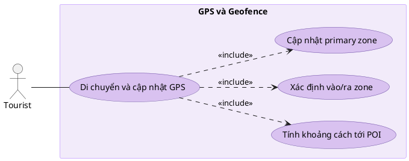

### Sequence Diagram
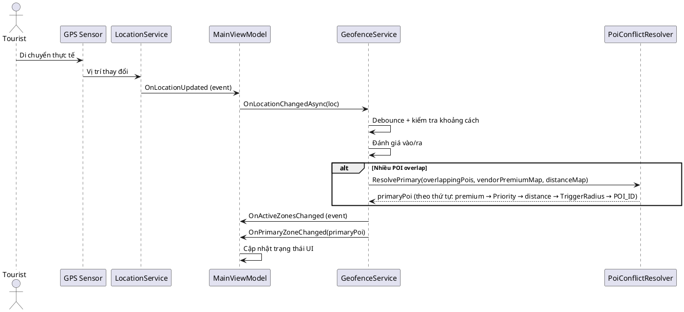

### Activity Diagram
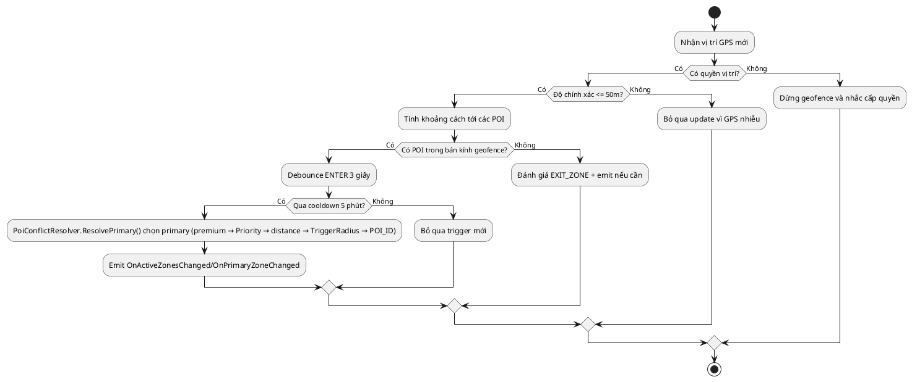

## Sự kiện 3: Mở chi tiết POI

### Đặc tả Use Case

| Trường | Nội dung |
|--------|---------|
| **Use Case ID** | F3 |
| **Tên** | Mở và xem chi tiết điểm ẩm thực (POI) |
| **Tác nhân chính** | Tourist |
| **Tác nhân phụ** | POIsController, MenuItemsController, SQLite cache cục bộ |
| **Kích hoạt** | Tourist tap vào POI pin trên map hoặc chọn từ danh sách |
| **Tiền điều kiện** | POI tồn tại trong hệ thống hoặc SQLite cache |
| **Hậu điều kiện** | Trang chi tiết hiển thị đầy đủ: tên, mô tả, menu, tab Fun Fact và nút phát audio |

**Luồng chính:**

| Bước | Tác nhân | Hành động |
|------|----------|-----------|
| 1 | Tourist | Tap vào POI pin hoặc item trong list |
| 2 | App | Navigate đến `POIDetailPage(poiId)` |
| 3 | POIDetailViewModel | Load nội dung POI localize + Fun Fact từ SQLite cache theo ngôn ngữ hiện tại |
| 4 | App | `GET /api/MenuItems?poiId={id}` để nạp menu (fallback local nếu lỗi/mất mạng) |
| 5 | App | Render: hình ảnh gallery, tên, mô tả localized, menu items, tab Fun Fact, điểm rating |
| 6 | Tourist | Chuyển tab Thông tin/Menu/Mẹo hay; tap ❤️ (yêu thích), 🎵 (nghe audio), 📤 (chia sẻ) |

**Luồng thay thế — Offline, không có cache:**

| Bước | Tác nhân | Hành động |
|------|----------|-----------|
| 3a | App | Không có dữ liệu trong cache và không có mạng |
| 3b | App | Hiện thông báo "Không thể tải chi tiết khi offline" |

**Ngoại lệ:**
- API lỗi khi load menu → giữ phần nội dung chính + Fun Fact từ cache, menu chuyển sang dữ liệu fallback.
- Hình ảnh không tải được → dùng placeholder image.

### Use Case Diagram
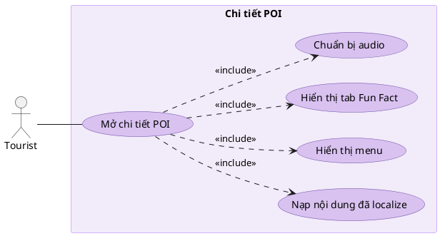

### Sequence Diagram
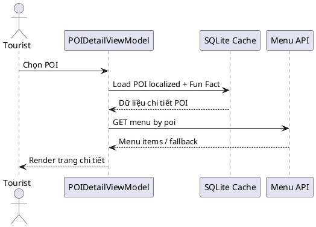

### Activity Diagram
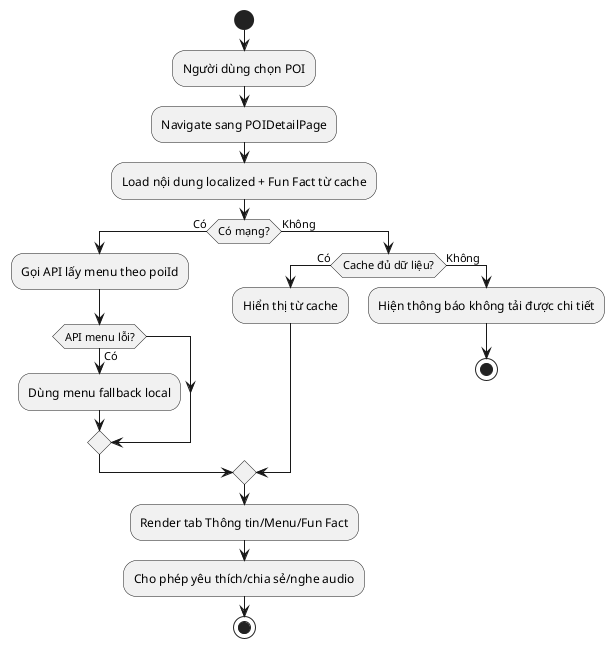

## Sự kiện 4: Phát audio với fallback nhiều tầng (PRD)

### Đặc tả Use Case

| Trường | Nội dung |
|--------|---------|
| **Use Case ID** | F4 |
| **Tên** | Phát thuyết minh audio với fallback 4 tầng |
| **Tác nhân chính** | Tourist (tap nút phát) hoặc Hệ thống (auto từ geofence F2) |
| **Tác nhân phụ** | AudioService, AudioCacheService, TTSController |
| **Kích hoạt** | Nhấn nút Phát **hoặc** sự kiện ENTER_ZONE từ geofence |
| **Tiền điều kiện** | Có POI ID và ngôn ngữ hiện tại của người dùng |
| **Hậu điều kiện** | Audio được phát thành công qua một trong 4 tầng; NarrationLog được ghi |

**Luồng chính — 4 tầng fallback:**

| Bước | Tác nhân | Hành động |
|------|----------|-----------|
| 1 | App | AudioService nhận yêu cầu phát (poiId, lang) |
| 2 | AudioCacheService | Kiểm tra file trong bộ nhớ cache local |
| **Tầng 1** | AudioCacheService | Có file cache → stream trực tiếp (0ms latency) ✅ |
| **Tầng 2** | AudioService | Không có cache → `GET /api/Audio/poi/{id}/{lang}` lấy published URL |
| **Tầng 3** | AudioService | Không có published audio → `POST /api/TTS/generate` với text POI |
| **Tầng 4** | AudioService | TTS API thất bại/offline → Native MAUI `TextToSpeech.SpeakAsync()` |
| 3 | App | Ghi NarrationLog sau khi phát xong |

**Luồng thay thế — Đang phát audio khác:**

| Bước | Tác nhân | Hành động |
|------|----------|-----------|
| 1a | AudioService | Phát hiện có audio đang chạy |
| 1b | AudioService | So sánh `audio_priority`: POI mới cao hơn? |
| 1c | Cao hơn | Dừng audio hiện tại → phát audio mới |
| 1d | Thấp hơn | Queue audio mới, đợi audio hiện tại kết thúc |

**Luồng thay thế — Mất audio focus từ hệ điều hành (call/app khác):**

| Bước | Tác nhân | Hành động |
|------|----------|-----------|
| 1e | Android AudioManager | Phát tín hiệu mất audio focus |
| 2e | AudioService | Tạm dừng hoặc giảm âm lượng phiên phát hiện tại |
| 3e | AudioService | Khi focus quay lại, resume hoặc phát lại theo trạng thái hàng chờ |

**Ngoại lệ:**
- Tất cả 4 tầng đều thất bại → log lỗi, hiện icon cảnh báo nhỏ, không crash app.
- File audio corrupt → xóa khỏi cache, thử lại từ Tầng 2.
- Audio focus mất kéo dài → kết thúc phiên phát hiện tại một cách an toàn, không crash app.

### Use Case Diagram
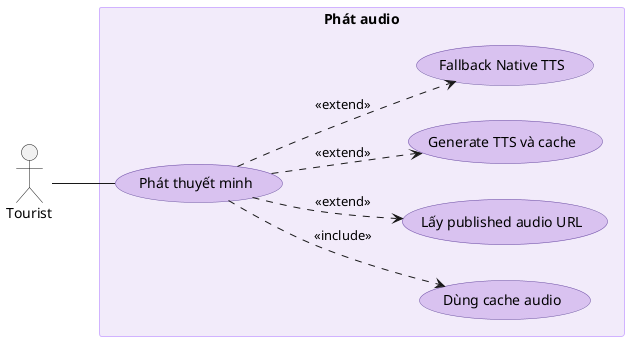

### Sequence Diagram
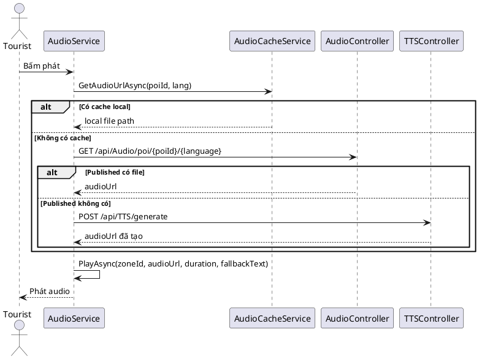

### Activity Diagram
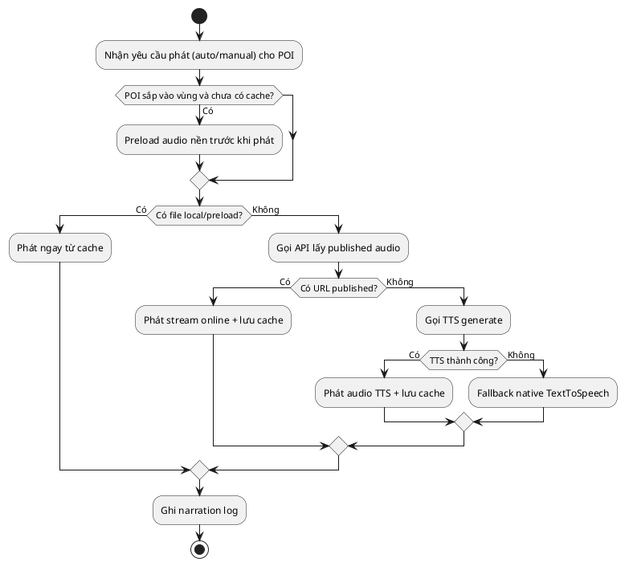

## Sự kiện 5: Generate TTS ở backend

### Đặc tả Use Case

| Trường | Nội dung |
|--------|---------|
| **Use Case ID** | F5 |
| **Tên** | Tạo file audio TTS từ văn bản tại backend |
| **Tác nhân chính** | Mobile App hoặc Web Admin/Vendor |
| **Tác nhân phụ** | TTSController, TtsTextPreprocessor, `NarrationQueueService`, tts_wrapper.py (Edge-TTS) |
| **Kích hoạt** | `POST /api/TTS/generate` được gọi |
| **Tiền điều kiện** | Text hợp lệ; Python runtime và edge-tts đã cài đặt |
| **Hậu điều kiện** | File MP3 được tạo trong `/uploads/audio/`; trả về audioUrl; kết quả được cache trong `NarrationQueueService._audioUrlCache` |

**Luồng chính:**

| Bước | Tác nhân | Hành động |
|------|----------|-----------|
| 1 | Client | `POST /api/TTS/generate` `{ text, language, voice? }` |
| 2 | TtsTextPreprocessor | Chuẩn hóa text: loại ký tự đặc biệt, số → chữ, viết tắt → đầy đủ |
| 3 | `NarrationQueueService` | `GetOrGenerateAudioAsync(poiId, lang, factory)` — kiểm tra `_audioUrlCache` |
| 4a | Cache HIT | Trả URL từ `_audioUrlCache` ngay, không lock |
| 4b | Cache MISS | Acquire `perPoiLock` (SemaphoreSlim per key) + `_globalSlot` (max 3 concurrent) |
| 4c | TTSController | Double-check cache sau khi vào lock; nếu vẫn miss → Kiểm tra file MD5 trên disk |
| 5 | Cache MISS disk | Gọi `tts_wrapper.py --text "..." --lang vi --voice {voice}` |
| 6 | tts_wrapper.py | Edge-TTS synthesize → xuất file MP3 tạm |
| 7 | TTSController | Move file về `/uploads/audio/`, lưu metadata |
| 8 | `NarrationQueueService` | Lưu `audioUrl` vào `_audioUrlCache[key]`; release locks |
| 9 | TTSController | Trả `{ audioUrl, duration, voice, cached: false }` |

**Luồng thay thế — Text quá dài:**

| Bước | Tác nhân | Hành động |
|------|----------|-----------|
| 2a | TtsTextPreprocessor | Text vượt giới hạn ký tự |
| 2b | TTSController | Tự động cắt thành các segment → tạo nhiều file → ghép lại |

**Ngoại lệ:**
- Python runtime không tìm thấy → `503 Service Unavailable`.
- Edge-TTS timeout → retry 1 lần → nếu vẫn lỗi → `500` với message rõ ràng.

### Use Case Diagram
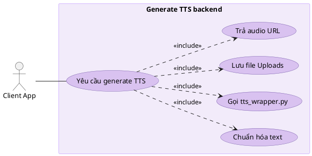

### Sequence Diagram
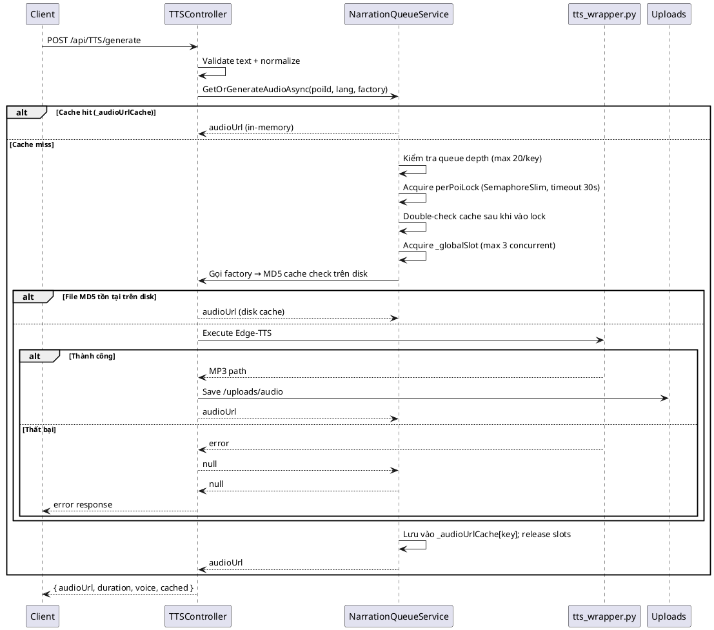

### Activity Diagram
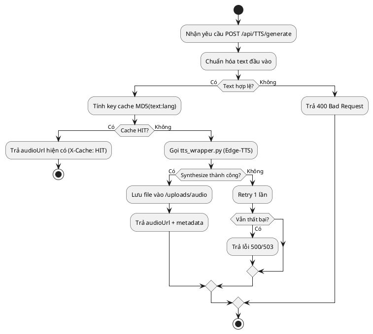

## Sự kiện 6: Đăng nhập và cấp JWT

### Đặc tả Use Case

| Trường | Nội dung |
|--------|---------|
| **Use Case ID** | F6 |
| **Tên** | Đăng nhập và cấp JWT token |
| **Tác nhân chính** | Admin, Vendor |
| **Tác nhân phụ** | AuthController, ASP.NET Identity, JWT Service |
| **Kích hoạt** | User submit form đăng nhập |
| **Tiền điều kiện** | Tài khoản đã tồn tại và không bị khóa |
| **Hậu điều kiện** | JWT token hợp lệ được cấp; client lưu token để dùng cho các API request tiếp theo |

**Luồng chính:**

| Bước | Tác nhân | Hành động |
|------|----------|-----------|
| 1 | User | Nhập email và password trên form đăng nhập |
| 2 | Client | `POST /api/Auth/login` `{ email, password }` |
| 3 | AuthController | Gọi `SignInManager.CheckPasswordSignInAsync()` |
| 4 | Identity | Verify credentials + kiểm tra tài khoản không bị lock |
| 5 | AuthController | Lấy roles của user từ Identity |
| 6 | TokenService | Tạo JWT có claims: userId, email, roles, expiry |
| 7 | AuthController | Trả `{ token, expiresIn, profile: { id, email, role } }` |
| 8 | Client Web | Lưu token vào cookie `auth_token` (httpOnly) |
| 8 | Client Mobile | Lưu token vào SecureStorage |

**Luồng thay thế — Sai mật khẩu:**

| Bước | Tác nhân | Hành động |
|------|----------|-----------|
| 4a | Identity | Credentials không khớp → `401 Unauthorized` |
| 4b | Client | Hiện thông báo "Email hoặc mật khẩu không đúng" |

**Luồng thay thế — Tài khoản bị khóa:**

| Bước | Tác nhân | Hành động |
|------|----------|-----------|
| 4a | Identity | Tài khoản bị lock → `403 Forbidden` |
| 4b | Client | Hiện thông báo "Tài khoản đã bị khóa, liên hệ Admin" |

**Ngoại lệ:**
- Token hết hạn khi đang dùng → `POST /api/Auth/refresh` để lấy token mới.

### Use Case Diagram
```plantuml
@startuml
left to right direction
skinparam actorStyle stick
skinparam usecase {
  BackgroundColor #D9C2F0
  BorderColor #6B4FA2
}
skinparam rectangle {
  BackgroundColor #F2EBFA
  BorderColor #D1B3FF
}

actor User

rectangle "Xác thực người dùng" {
  usecase "Đăng nhập" as UC1
  usecase "Kiểm tra mật khẩu" as UC2
  usecase "Cấp JWT và roles" as UC3
  usecase "Dùng token cho API call" as UC4
}

User -- UC1
UC1 ..> UC2 : <<include>>
UC1 ..> UC3 : <<include>>
UC1 ..> UC4 : <<include>>
@enduml
```

### Sequence Diagram
```plantuml
@startuml
actor User as U
participant Client as C
participant AuthController as Auth
participant Identity as Id
participant TokenService as JWT

U -> C: Nhập email và mật khẩu
C -> Auth: POST /api/auth/login
Auth -> Id: Verify credentials
alt Hợp lệ
  Id --> Auth: User + roles
  Auth -> JWT: Create token
  JWT --> Auth: Signed JWT
  Auth --> C: token + profile
else Không hợp lệ
  Auth --> C: 401
end
@enduml
```

### Activity Diagram
```plantuml
@startuml
start
:User nhập email/password;
:POST /api/Auth/login;
:Kiểm tra credential qua Identity;

if (Hợp lệ?) then (Có)
  if (Tài khoản bị khóa?) then (Có)
    :Trả 403 Forbidden;
  else (Không)
    :Lấy roles;
    :Tạo JWT + expiry;
    :Trả token + profile;
    :Client lưu token (cookie/SecureStorage);
  endif
else (Không)
  :Trả 401 Unauthorized;
endif

stop
@enduml
```

## Sự kiện 7: Gửi review và đánh giá POI (khong co lam cai nay)

### Đặc tả Use Case

| Trường | Nội dung |
|--------|---------|
| **Use Case ID** | F7 |
| **Tên** | Gửi review và cập nhật rating POI |
| **Tác nhân chính** | Tourist |
| **Tác nhân phụ** | ReviewsController, POIs DB, Reviews DB |
| **Kích hoạt** | Tourist submit form review trên POIDetailPage |
| **Tiền điều kiện** | POI tồn tại và hợp lệ |
| **Hậu điều kiện** | Review được lưu vào DB; avg_rating của POI được tính lại |
| **Ghi chú** | Chức năng này đã có model/controller nhưng chưa hoàn chỉnh UI mobile |

**Luồng chính:**

| Bước | Tác nhân | Hành động |
|------|----------|-----------|
| 1 | Tourist | Mở form review, chọn số sao (1–5), nhập nhận xét |
| 2 | App | `POST /api/Reviews` `{ poiId, rating, comment }` |
| 3 | ReviewsController | Validate POI tồn tại |
| 4 | ReviewsController | Lưu Review document vào Reviews collection |
| 5 | ReviewsController | Tính lại `avg_rating` và `num_reviews` cho POI |
| 6 | ReviewsController | Update POI document |
| 7 | API | Trả `201 Created` với review vừa tạo |
| 8 | App | Hiện thông báo "Cảm ơn đánh giá của bạn!" |

**Luồng thay thế — Chưa đăng nhập:**

| Bước | Tác nhân | Hành động |
|------|----------|-----------|
| 2a | API | Chưa có token → `401 Unauthorized` |
| 2b | App | Hiện dialog "Đăng nhập để gửi đánh giá" |

**Ngoại lệ:**
- Tourist đã review POI này trước đó → cho phép cập nhật review (update, không tạo mới).

### Use Case Diagram
```plantuml
@startuml
left to right direction
skinparam actorStyle stick
skinparam usecase {
  BackgroundColor #D9C2F0
  BorderColor #6B4FA2
}
skinparam rectangle {
  BackgroundColor #F2EBFA
  BorderColor #D1B3FF
}

actor Tourist

rectangle "Review POI" {
  usecase "Gửi review" as UC1
  usecase "Validate POI" as UC2
  usecase "Lưu review vào DB" as UC3
  usecase "Cập nhật điểm trung bình" as UC4
}

Tourist -- UC1
UC1 ..> UC2 : <<include>>
UC1 ..> UC3 : <<include>>
UC1 ..> UC4 : <<include>>
@enduml
```

### Sequence Diagram
```plantuml
@startuml
actor Tourist as U
participant App
participant ReviewsController as Rev
database POIs as POI
database Reviews as R

U -> App: Submit review
App -> Rev: POST /api/reviews
Rev -> POI: Check POI exists
Rev -> R: Insert review
Rev -> POI: Update avg rating + num reviews
Rev --> App: Created review
@enduml
```

### Activity Diagram
```plantuml
@startuml
start
:Người dùng nhập rating + comment;
:POST /api/Reviews;

if (Đã đăng nhập?) then (Có)
  :Validate POI tồn tại;
  if (POI hợp lệ?) then (Có)
    if (Đã có review trước đó?) then (Có)
      :Cập nhật review hiện có;
    else (Không)
      :Tạo review mới;
    endif
    :Tính lại avg_rating + num_reviews;
    :Trả thành công cho app;
  else (Không)
    :Trả lỗi POI không tồn tại;
  endif
else (Không)
  :Trả 401 + yêu cầu đăng nhập;
endif

stop
@enduml
```

## Sự kiện 8: Nhận thông báo theo polling sidebar

### Đặc tả Use Case

| Trường | Nội dung |
|--------|---------|
| **Use Case ID** | F8 |
| **Tên** | Nhận thông báo trong sidebar qua polling API |
| **Tác nhân chính** | Admin, Vendor (web portal) |
| **Tác nhân phụ** | `NotificationsController`, collection `app_notifications`, `sidebar.js` |
| **Kích hoạt** | Trang web khởi tạo sidebar hoặc đến chu kỳ poll kế tiếp |
| **Tiền điều kiện** | User đã đăng nhập, có JWT hợp lệ và role Admin/Vendor |
| **Hậu điều kiện** | Danh sách thông báo và badge sidebar được cập nhật theo role/vendor |

**Luồng chính:**

| Bước | Tác nhân | Hành động |
|------|----------|-----------|
| 1 | Admin/Vendor | Mở trang web có sidebar |
| 2 | `sidebar.js` | Gọi `GET /api/Notifications/sidebar?limit=20` |
| 3 | API | Xác định audience filter theo role (`admin`/`vendor`) và `AudienceVendorId` |
| 4 | API | Query `app_notifications`, sort giảm dần theo thời gian |
| 5 | API | Map dữ liệu về DTO hiển thị sidebar |
| 6 | Web | Render feed + badge unread |
| 7 | `sidebar.js` | Lên lịch poll tiếp: 10 giây (tab visible), 30 giây (tab hidden) |
| 8 | Web | Trigger refresh lại khi focus/online/manual refresh |

**Luồng thay thế — Refresh thủ công:**

| Bước | Tác nhân | Hành động |
|------|----------|-----------|
| 2a | User | Nhấn nút refresh trong panel thông báo |
| 2b | Web | Gọi lại `GET /api/Notifications/sidebar` ngay lập tức |

**Ngoại lệ:**
- API lỗi/mất mạng tạm thời → sidebar giữ dữ liệu cũ và hiển thị trạng thái "Không tải được thông báo".
- Vendor chưa bind được `VendorId` theo user hiện tại → chỉ nhận thông báo chung (không có `AudienceVendorId` cụ thể).

### Use Case Diagram
```plantuml
@startuml
left to right direction
skinparam actorStyle stick
skinparam usecase {
  BackgroundColor #D9C2F0
  BorderColor #6B4FA2
}
skinparam rectangle {
  BackgroundColor #F2EBFA
  BorderColor #D1B3FF
}

actor Admin
actor Vendor

rectangle "Polling thông báo sidebar" {
  usecase "Tải notifications từ API" as UC1
  usecase "Lọc theo role và vendor" as UC2
  usecase "Render feed + badge" as UC3
  usecase "Poll định kỳ 10s/30s" as UC4
}

Admin -- UC1
Vendor -- UC1
UC1 ..> UC2 : <<include>>
UC1 ..> UC3 : <<include>>
UC3 ..> UC4 : <<include>>
@enduml
```

### Sequence Diagram
```plantuml
@startuml
actor "Admin/Vendor" as U
participant "sidebar.js" as SB
participant NotificationsController as N
database "app_notifications" as DB

U -> SB: Mở panel thông báo
SB -> N: GET /api/Notifications/sidebar?limit=20
N -> N: Build audience filter
N -> DB: Query + sort desc
DB --> N: Notification docs
N --> SB: DTO list
SB -> SB: Render feed + unread badge

loop Poll định kỳ
  SB -> N: GET /api/Notifications/sidebar
  N -> DB: Query latest notifications
  DB --> N: Data
  N --> SB: DTO list
  SB -> SB: Cập nhật UI
end
@enduml
```

### Activity Diagram
```plantuml
@startuml
start
:Sidebar khởi tạo;
:Gọi GET /api/Notifications/sidebar;

if (API thành công?) then (Có)
  :Lọc theo audience role/vendor;
  :Render feed + unread badge;
else (Không)
  :Giữ dữ liệu cũ + báo lỗi tạm thời;
endif

if (Tab đang visible?) then (Có)
  :Đặt chu kỳ poll 10 giây;
else (Không)
  :Đặt chu kỳ poll 30 giây;
endif

if (User bấm refresh hoặc tab focus?) then (Có)
  :Poll ngay lập tức;
endif

stop
@enduml
```

## Sự kiện 9: Vendor quản lý danh sách POI

### Đặc tả Use Case

| Trường | Nội dung |
|--------|---------|
| **Use Case ID** | F9 |
| **Tên** | Vendor xem và lọc danh sách POI của mình |
| **Tác nhân chính** | Vendor |
| **Tác nhân phụ** | POIsController, VendorProfile DB |
| **Kích hoạt** | Vendor mở trang POI list trên web portal |
| **Tiền điều kiện** | Vendor đã đăng nhập; VendorProfile đã được Admin verify (status = approved) |
| **Hậu điều kiện** | Danh sách POI được lọc chính xác theo VendorId của người dùng |

**Luồng chính:**

| Bước | Tác nhân | Hành động |
|------|----------|-----------|
| 1 | Vendor | Mở `/poi-list.html` |
| 2 | Web | `GET /api/Vendors/me` để lấy thông tin VendorProfile |
| 3 | Web | `GET /api/POIs?vendorId={id}` lấy POI của vendor này |
| 4 | API | Tự động scope query theo VendorId từ JWT claims |
| 5 | Web | Render danh sách với filter reviewStatus (all/pending/approved) |
| 6 | Vendor | Click vào POI để xem chi tiết, sửa hoặc quản lý audio |

**Luồng thay thế — Vendor pending (chưa được duyệt):**

| Bước | Tác nhân | Hành động |
|------|----------|-----------|
| 2a | API | VendorProfile có status = pending |
| 2b | Web | Hiện banner "Hồ sơ của bạn đang chờ Admin xét duyệt" |
| 2c | Web | Ẩn nút "Tạo POI mới" |

**Ngoại lệ:**
- VendorProfile không tồn tại → redirect về trang tạo hồ sơ vendor.

### Use Case Diagram
```plantuml
@startuml
left to right direction
skinparam actorStyle stick
skinparam usecase {
  BackgroundColor #D9C2F0
  BorderColor #6B4FA2
}
skinparam rectangle {
  BackgroundColor #F2EBFA
  BorderColor #D1B3FF
}

actor Vendor

rectangle "Quản lý POI theo Vendor" {
  usecase "Xem POI của tôi" as UC1
  usecase "Kiểm tra role và vendor profile" as UC2
  usecase "Lọc POI theo VendorId" as UC3
  usecase "Lọc reviewStatus=pending" as UC4
}

Vendor -- UC1
UC1 ..> UC2 : <<include>>
UC1 ..> UC3 : <<include>>
UC1 ..> UC4 : <<extend>>
@enduml
```

### Sequence Diagram
```plantuml
@startuml
actor Vendor as V
participant "poi-list.html" as Web
participant POIsController as POI
database "VendorProfile DB" as VP
database "POIs DB" as DB

V -> Web: Open POI list
Web -> POI: GET /api/pois?reviewStatus=...
POI -> VP: Resolve profile by claims
POI -> DB: Query by VendorId + filters
DB --> POI: Result set
POI --> Web: Paginated POIs
@enduml
```

### Activity Diagram
```plantuml
@startuml
start
:Vendor mở POI list;
:Gọi Vendors/me để lấy profile;

if (Profile tồn tại?) then (Có)
  if (Status = pending?) then (Có)
    :Hiện banner chờ duyệt;
    :Ẩn tạo POI mới;
  else (Không)
    :Gọi API lấy POI theo VendorId;
    :Render list + filter reviewStatus;
    :Cho phép mở POI chi tiết/sửa;
  endif
else (Không)
  :Redirect sang trang tạo hồ sơ vendor;
endif

stop
@enduml
```

## Sự kiện 10: Auto-translate nội dung POI

### Đặc tả Use Case

| Trường | Nội dung |
|--------|---------|
| **Use Case ID** | F10 |
| **Tên** | Tự động dịch nội dung POI sang nhiều ngôn ngữ |
| **Tác nhân chính** | Admin, Vendor |
| **Tác nhân phụ** | AutoTranslateController, Translation Engine |
| **Kích hoạt** | Nhấn nút "Auto-translate" trên form POI edit |
| **Tiền điều kiện** | POI có nội dung text nguồn (tiếng Việt) hợp lệ |
| **Hậu điều kiện** | Map `{language: translatedText}` được trả về, có thể áp dụng vào form |

**Luồng chính:**

| Bước | Tác nhân | Hành động |
|------|----------|-----------|
| 1 | User | Click "Auto-translate" trên POI form |
| 2 | Web | `POST /api/AutoTranslate` `{ sourceText, targetLanguages: ["en","zh","ja","ko"] }` |
| 3 | AutoTranslateController | Validate input; loop qua từng ngôn ngữ đích |
| 4 | Controller | Gọi translation service cho mỗi ngôn ngữ |
| 5 | Controller | Trả `{ "en": "...", "zh": "...", "ja": "...", "ko": "..." }` |
| 6 | Web | Điền kết quả vào các field ngôn ngữ tương ứng |
| 7 | User | Review và điều chỉnh thủ công nếu cần trước khi lưu |

**Ngoại lệ:**
- Translation service lỗi cho 1 ngôn ngữ → trả partial result, báo lỗi riêng từng ngôn ngữ.

### Use Case Diagram
```plantuml
@startuml
left to right direction
skinparam actorStyle stick
skinparam usecase {
  BackgroundColor #D9C2F0
  BorderColor #6B4FA2
}
skinparam rectangle {
  BackgroundColor #F2EBFA
  BorderColor #D1B3FF
}

actor "Admin hoặc Vendor" as User

rectangle "Auto-translate nội dung" {
  usecase "Yêu cầu auto-translate" as UC1
  usecase "Duyệt target languages" as UC2
  usecase "Gọi dịch vụ dịch" as UC3
  usecase "Trả kết quả theo ngôn ngữ" as UC4
}

User -- UC1
UC1 ..> UC2 : <<include>>
UC1 ..> UC3 : <<include>>
UC1 ..> UC4 : <<include>>
@enduml
```

### Sequence Diagram
```plantuml
@startuml
actor "Admin hoặc Vendor" as U
participant "Web Client" as C
participant AutoTranslateController as AT
participant "Translate Endpoint" as GT

U -> C: Click auto-translate
C -> AT: POST /api/autotranslate
loop Mỗi ngôn ngữ đích
  AT -> GT: Translate text
  GT --> AT: Translated text
end
AT --> C: Map language -> text
@enduml
```

### Activity Diagram
```plantuml
@startuml
start
:User bấm Auto-translate;
:Nhập source text + chọn target languages;

if (Input hợp lệ?) then (Có)
  :Loop qua từng ngôn ngữ đích;
  :Gọi translation service;
  if (Có lỗi từng ngôn ngữ?) then (Có)
    :Gắn cờ partial result cho ngôn ngữ lỗi;
  endif
  :Trả map language -> translatedText;
  :Điền kết quả lên form để user review;
else (Không)
  :Trả lỗi validation;
endif

stop
@enduml
```

## Sự kiện 11: Xem analytics narration logs

### Đặc tả Use Case

| Trường | Nội dung |
|--------|---------|
| **Use Case ID** | F11 |
| **Tên** | Xem và phân tích narration logs |
| **Tác nhân chính** | Admin |
| **Tác nhân phụ** | AnalyticsController, NarrationLogs DB, POIs DB |
| **Kích hoạt** | Admin mở trang analytics |
| **Tiền điều kiện** | Admin đã đăng nhập; có dữ liệu narration logs trong hệ thống |
| **Hậu điều kiện** | Dữ liệu logs được hiển thị theo filter với tên POI đã map, hỗ trợ phân trang |

**Luồng chính:**

| Bước | Tác nhân | Hành động |
|------|----------|-----------|
| 1 | Admin | Mở trang analytics, chọn filter (POI, ngày, ngôn ngữ) |
| 2 | Web | `GET /api/Analytics/narration-logs?poiId=&dateFrom=&dateTo=&page=` |
| 3 | AnalyticsController | Query NarrationLogs DB với filter + pagination |
| 4 | AnalyticsController | Resolve POI names từ POIs DB |
| 5 | API | Trả DTO list đầy đủ |
| 6 | Web | Render bảng dữ liệu và biểu đồ thống kê |

**Ngoại lệ:**
- Không có dữ liệu cho filter đó → hiện "Không có dữ liệu trong khoảng thời gian này".

### Use Case Diagram
```plantuml
@startuml
left to right direction
skinparam actorStyle stick
skinparam usecase {
  BackgroundColor #D9C2F0
  BorderColor #6B4FA2
}
skinparam rectangle {
  BackgroundColor #F2EBFA
  BorderColor #D1B3FF
}

actor Admin

rectangle "Analytics narration" {
  usecase "Xem narration logs" as UC1
  usecase "Lọc theo POI/user/date" as UC2
  usecase "Map thêm tên POI" as UC3
  usecase "Hiển thị bảng và chart" as UC4
}

Admin -- UC1
UC1 ..> UC2 : <<include>>
UC1 ..> UC3 : <<include>>
UC1 ..> UC4 : <<include>>
@enduml
```

### Sequence Diagram
```plantuml
@startuml
actor Admin as A
participant "dashboard.html" as D
participant AnalyticsController as An
database "NarrationLogs DB" as L
database "POIs DB" as P

A -> D: Open analytics page
D -> An: GET /api/analytics/narration-logs
An -> L: Query filters + paging
An -> P: Resolve POI names
An --> D: DTO list
D --> A: Render table/charts
@enduml
```

### Activity Diagram
```plantuml
@startuml
start
:Admin mở trang analytics;
:Chọn filter POI/ngày/ngôn ngữ;
:Gọi API narration-logs;

if (Có dữ liệu?) then (Có)
  :Map tên POI;
  :Render bảng + biểu đồ;
else (Không)
  :Hiện trạng thái không có dữ liệu;
endif

if (Admin đổi filter hoặc page?) then (Có)
  :Gọi API lại với tham số mới;
endif

stop
@enduml
```

## Sự kiện 12: Xử lý QR landing + 2 lựa chọn trải nghiệm (PRD)

### Đặc tả Use Case

| Trường | Nội dung |
|--------|---------|
| **Use Case ID** | F12 |
| **Tên** | Quét QR → landing page với 2 lựa chọn: Web App hoặc Tải APK |
| **Tác nhân chính** | Tourist |
| **Tác nhân phụ** | `Program.cs` (`/qr/{**deepPath}`), `QrDeepLinkManager`, MainActivity, `apk-download.html`, `web-app.html` |
| **Kích hoạt** | Tourist quét QR link dạng `https://<host>/qr/...` |
| **Tiền điều kiện** | Backend đang chạy; QR code chưa hết hạn |
| **Hậu điều kiện** | Tourist được chuyển đến web-app PWA (dùng ngay) hoặc trang tải APK (cài app native) |

**Luồng chính — Landing page với 2 lựa chọn:**

| Bước | Tác nhân | Hành động |
|------|----------|-----------|
| 1 | Tourist | Quét QR bằng camera điện thoại |
| 2 | Browser | Mở URL `GET /qr/{deepPath}?entry=...&cycle=...&exp=...&api=...` |
| 3 | Backend | Kiểm tra `exp` (Unix timestamp) → còn hạn hay hết hạn |
| 4 | Backend | Build `streetfood://qr/...` deeplink + resolve `web-app` URL + APK URL |
| 5 | Backend | Trả HTML landing card với tiêu đề "Chọn cách trải nghiệm" |
| 6 | Landing | Hiển thị 2 nút: **🌐 Dùng trên Web ngay** (primary) và **📥 Tải ứng dụng Android** (secondary) |
| 7a | Tourist | Chọn **Dùng trên Web ngay** → mở `web-app.html` kèm query params QR |
| 7b | Tourist | Chọn **Tải ứng dụng Android** → mở `apk-download.html` kèm `?apk=...&dl=...` |

**Luồng thay thế — iOS/iPadOS (auto-redirect):**

| Bước | Tác nhân | Hành động |
|------|----------|-----------|
| 5a | Landing JS | Phát hiện iOS/iPadOS qua user-agent |
| 5b | Landing JS | Tự động `window.location.replace(webAppUrl)` ngay trước khi body render |
| 5c | Tourist | Không thấy landing page, vào thẳng web-app PWA |

**Luồng thay thế — QR hết hạn:**

| Bước | Tác nhân | Hành động |
|------|----------|-----------|
| 3a | Backend | `exp` < thời gian hiện tại → QR đã hết hạn |
| 3b | Landing | Ẩn nút chọn, hiện banner đỏ "QR này đã hết hạn" |
| 3c | Tourist | Quét lại mã mới tại điểm đến |

**Luồng thay thế — Deeplink vào app đã cài (từ APK download page):**

| Bước | Tác nhân | Hành động |
|------|----------|-----------|
| 8 | APK page | Nếu URL có `?dl=streetfood://...` → hiện thêm nút "Mở ứng dụng" |
| 9 | Tourist | Nhấn mở → Android Intent chuyển vào MainActivity |
| 10 | QrDeepLinkManager | `SavePending(rawUrl)` → parse payload (`poiId`/`tourId`/`main`) |
| 11 | MainPage | `ConsumePending()` khi app ready → navigate đúng màn hình |

**Ngoại lệ:**
- File APK chưa publish → nút tải bị disabled (`disabled` class).
- Web-app URL không resolve được → nút web bị disabled.
- Landing page có countdown timer tự động; khi hết hạn real-time → chuyển sang trạng thái expired.
- App chưa load xong khi nhận deeplink → payload được queue trong Preferences, xử lý sau khi MainPage ready.

### Use Case Diagram
```plantuml
@startuml
left to right direction
skinparam actorStyle stick
skinparam usecase {
  BackgroundColor #D9C2F0
  BorderColor #6B4FA2
}
skinparam rectangle {
  BackgroundColor #F2EBFA
  BorderColor #D1B3FF
}

actor Tourist

rectangle "QR Landing + 2 lựa chọn" {
  usecase "Quét QR mở landing" as UC1
  usecase "Kiểm tra hạn QR" as UC2
  usecase "Chọn Dùng Web ngay" as UC3
  usecase "Chọn Tải APK Android" as UC4
  usecase "Auto-redirect iOS → Web" as UC5
  usecase "Deeplink vào app đã cài" as UC6
}

Tourist -- UC1
UC1 ..> UC2 : <<include>>
UC1 ..> UC3 : <<extend>>
UC1 ..> UC4 : <<extend>>
UC1 ..> UC5 : <<extend>>
UC4 ..> UC6 : <<extend>>
@enduml
```

### Sequence Diagram
```plantuml
@startuml
actor Tourist as U
participant Browser as B
participant "Program.cs /qr" as QR
participant "Landing Page" as LP
participant "web-app.html" as WA
participant "apk-download.html" as APK
participant MainActivity as MA
participant QrDeepLinkManager as Q

U -> B: Quét QR
B -> QR: GET /qr/{deepPath}?exp=...&api=...
QR -> QR: Check expiry + build URLs
QR --> B: HTML landing (2 nút chọn)

alt iOS / iPadOS
  LP -> B: Auto redirect web-app.html
  B -> WA: Mở web-app PWA
else QR còn hạn (Android)
  alt Tourist chọn "Dùng trên Web ngay"
    U -> LP: Click nút Web
    LP -> WA: Navigate web-app.html + query params
  else Tourist chọn "Tải ứng dụng Android"
    U -> LP: Click nút APK
    LP -> APK: Navigate apk-download.html?apk=...&dl=streetfood://...
    opt App đã cài — mở deeplink
      U -> APK: Nhấn "Mở ứng dụng"
      APK -> MA: Launch streetfood://qr/...
      MA -> Q: SavePending(rawUrl)
    end
  end
else QR hết hạn
  LP -> LP: Hiện banner expired + ẩn nút chọn
end
@enduml
```

### Activity Diagram
```plantuml
@startuml
start
:Tourist quét QR;
:Browser mở /qr/{deepPath};
:Backend kiểm tra hạn QR;

if (QR còn hạn?) then (Có)
  if (iOS / iPadOS?) then (Có)
    :Auto-redirect sang web-app.html;
  else (Không — Android)
    :Hiển thị landing card với 2 lựa chọn;
    if (Chọn "Dùng trên Web ngay"?) then (Có)
      :Mở web-app.html kèm query QR;
    else (Chọn "Tải ứng dụng Android")
      :Mở apk-download.html;
      if (App đã cài + có deeplink?) then (Có)
        :Mở app qua Intent deeplink;
        :Navigate tới POI/Tour/Main;
      else (Chưa cài)
        :Tải APK và cài đặt;
      endif
    endif
  endif
else (Không)
  :Hiện banner "QR đã hết hạn";
endif

stop
@enduml
```

## Sự kiện 13: Admin đăng nhập web và truy cập trang bảo vệ

### Đặc tả Use Case

| Trường | Nội dung |
|--------|---------|
| **Use Case ID** | F13 |
| **Tên** | Admin đăng nhập web portal và truy cập trang bảo vệ |
| **Tác nhân chính** | Admin |
| **Tác nhân phụ** | AuthController, Auth Middleware (cookie guard trong Program.cs) |
| **Kích hoạt** | Admin truy cập URL trang quản trị hoặc submit form đăng nhập |
| **Tiền điều kiện** | Tài khoản Admin hợp lệ, không bị khóa |
| **Hậu điều kiện** | Cookie `auth_token` được set; Admin truy cập được dashboard và các trang bảo vệ |

**Luồng chính:**

| Bước | Tác nhân | Hành động |
|------|----------|-----------|
| 1 | Admin | Truy cập `/admin-dashboard.html` lần đầu |
| 2 | Auth Middleware | Kiểm tra cookie `auth_token` — chưa có → redirect về `/index.html` (login) |
| 3 | Admin | Nhập email/password tại trang đăng nhập |
| 4 | Web JS | `POST /api/Auth/login` |
| 5 | AuthController | Verify credentials; kiểm tra role = Admin |
| 6 | Web JS | Nhận JWT; `document.cookie = "auth_token=..."` (7 ngày) |
| 7 | Admin | Truy cập lại `/admin-dashboard.html` |
| 8 | Auth Middleware | Validate cookie JWT → cho phép serve HTML |

**Ngoại lệ:**
- Token hết hạn khi đang dùng web → `api.js` tự động gọi `POST /api/Auth/refresh`.
- Role không phải Admin → middleware chặn, redirect về login.

### Use Case Diagram
```plantuml
@startuml
left to right direction
skinparam actorStyle stick
skinparam usecase {
  BackgroundColor #D9C2F0
  BorderColor #6B4FA2
}
skinparam rectangle {
  BackgroundColor #F2EBFA
  BorderColor #D1B3FF
}

actor Admin

rectangle "Đăng nhập web Admin" {
  usecase "Đăng nhập web portal" as UC1
  usecase "Nhận JWT và lưu auth cookie" as UC2
  usecase "Truy cập admin-dashboard" as UC3
  usecase "Middleware validate token" as UC4
}

Admin -- UC1
UC1 ..> UC2 : <<include>>
UC1 ..> UC3 : <<include>>
UC3 ..> UC4 : <<include>>
@enduml
```

### Sequence Diagram
```plantuml
@startuml
actor Admin as A
participant "Login Page" as Web
participant AuthController as Auth
participant Identity as Id
participant "Auth Middleware" as MW

A -> Web: Submit email/password
Web -> Auth: POST /api/auth/login
Auth -> Id: Verify credentials + role
Id --> Auth: Valid admin
Auth --> Web: JWT token
Web -> Web: Set auth_token cookie
A -> Web: Open /admin-dashboard
Web -> MW: Request protected html
MW --> Web: Allow access
@enduml
```

### Activity Diagram
```plantuml
@startuml
start
:Admin truy cập trang bảo vệ;

if (Có auth_token hợp lệ?) then (Có)
  :Cho phép vào dashboard;
  stop
else (Không)
  :Redirect về login;
endif

:Admin nhập email/password;
:POST /api/Auth/login;

if (Thông tin hợp lệ và role Admin?) then (Có)
  :Set cookie auth_token;
  :Truy cập lại trang bảo vệ;
  :Middleware cho phép truy cập;
else (Không)
  :Hiển thị lỗi đăng nhập/không đủ quyền;
endif

stop
@enduml
```

## Sự kiện 14: Admin duyệt hồ sơ Vendor

### Đặc tả Use Case

| Trường | Nội dung |
|--------|---------|
| **Use Case ID** | F14 |
| **Tên** | Admin kiểm duyệt hồ sơ đăng ký Vendor |
| **Tác nhân chính** | Admin |
| **Tác nhân phụ** | VendorsController, NotificationService |
| **Kích hoạt** | Admin mở trang duyệt vendor trên `/vendors-list.html` |
| **Tiền điều kiện** | Admin đã đăng nhập; có ít nhất 1 VendorProfile trạng thái pending |
| **Hậu điều kiện** | Hồ sơ vendor được approve (có thể tạo POI) hoặc reject; Vendor nhận thông báo |

**Luồng chính:**

| Bước | Tác nhân | Hành động |
|------|----------|-----------|
| 1 | Admin | Mở `/vendors-list.html`, lọc status = pending |
| 2 | Web | `GET /api/Vendors?status=pending` |
| 3 | API | Trả danh sách VendorProfile chờ duyệt |
| 4 | Admin | Xem chi tiết hồ sơ (tên, mô tả quán, liên hệ) |
| 5 | Admin | Nhấn Approve hoặc Reject |
| 6 | Web | `PUT /api/Vendors/{vendorId}/status` `{ status: "approved"/"rejected" }` |
| 7 | API | Cập nhật `isVerified` trong VendorProfile |
| 8 | NotificationService | Gửi thông báo kết quả cho Vendor |

**Ngoại lệ:**
- Vendor đã xóa tài khoản → API trả `404`; web hiện "Hồ sơ không còn tồn tại".

### Use Case Diagram
```plantuml
@startuml
left to right direction
skinparam actorStyle stick
skinparam usecase {
  BackgroundColor #D9C2F0
  BorderColor #6B4FA2
}
skinparam rectangle {
  BackgroundColor #F2EBFA
  BorderColor #D1B3FF
}

actor Admin

rectangle "Duyệt hồ sơ Vendor" {
  usecase "Xem danh sách vendor pending" as UC1
  usecase "Xem chi tiết hồ sơ vendor" as UC2
  usecase "Approve hoặc reject" as UC3
  usecase "Cập nhật verification status" as UC4
}

Admin -- UC1
UC1 ..> UC2 : <<include>>
UC1 ..> UC3 : <<include>>
UC3 ..> UC4 : <<include>>
@enduml
```

### Sequence Diagram
```plantuml
@startuml
actor Admin as A
participant "vendors-list.html" as Web
participant VendorsController as VC
database "VendorProfile DB" as DB
participant NotificationService as N

A -> Web: Open vendor approvals
Web -> VC: GET vendors pending list
VC -> DB: Query pending profiles
DB --> VC: Pending vendors
VC --> Web: Render list
A -> Web: Approve/Reject vendor
Web -> VC: Update verification status
VC -> DB: Save status
VC -> N: Trigger vendor notification
@enduml
```

### Activity Diagram
```plantuml
@startuml
start
:Admin mở danh sách vendor pending;
:Tải hồ sơ chờ duyệt;

if (Có hồ sơ pending?) then (Có)
  :Mở chi tiết hồ sơ;
  if (Admin approve?) then (Có)
    :Set approved/isVerified=true;
    :Gửi thông báo chấp thuận cho Vendor;
  else (Không)
    :Set rejected;
    :Gửi thông báo từ chối cho Vendor;
  endif
else (Không)
  :Hiển thị trạng thái không có hồ sơ chờ duyệt;
endif

if (Hồ sơ đã bị xóa?) then (Có)
  :Trả 404 và loại item khỏi danh sách;
endif

stop
@enduml
```

## Sự kiện 15: Admin duyệt nội dung POI pending

### Đặc tả Use Case

| Trường | Nội dung |
|--------|---------|
| **Use Case ID** | F15 |
| **Tên** | Admin kiểm duyệt nội dung POI từ Vendor |
| **Tác nhân chính** | Admin |
| **Tác nhân phụ** | `POIsController`, `VendorProfiles`, `ServiceSubmissions` |
| **Kích hoạt** | Admin lọc POI có `reviewStatus = pending` trên trang POI list |
| **Tiền điều kiện** | Admin đã đăng nhập; có POI đang chờ duyệt |
| **Hậu điều kiện** | POI được publish (active) hoặc reject; Vendor nhận thông báo kết quả |

**Luồng chính:**

| Bước | Tác nhân | Hành động |
|------|----------|-----------|
| 1 | Admin | Mở `/poi-list.html`, chọn tab "Chờ duyệt" |
| 2 | Web | `GET /api/POIs?reviewStatus=pending` |
| 3 | Web | Hiển thị danh sách POI pending kèm preview nội dung |
| 4 | Admin | Xem chi tiết, so sánh nội dung mới với nội dung cũ |
| 5 | Admin | Nhấn Approve hoặc Reject |
| 6 | Web | `POST /api/POIs/{id}/review` `{ approve: true/false, reason? }` |
| 7 | API | Cập nhật `reviewStatus`, `isActive` của POI |
| 8 | NotificationService | Notify Vendor kết quả duyệt |

**Luồng thay thế — Reject với lý do:**

| Bước | Tác nhân | Hành động |
|------|----------|-----------|
| 5a | Admin | Nhấn Reject, nhập lý do từ chối |
| 6a | Web | Gửi kèm `{ reason: "Nội dung không phù hợp..." }` |
| 8a | NotificationService | Notify Vendor kèm lý do từ chối |

**Ngoại lệ:**
- POI không còn tồn tại → `404`; web xóa item khỏi danh sách pending.

### Use Case Diagram
```plantuml
@startuml
left to right direction
skinparam actorStyle stick
skinparam usecase {
  BackgroundColor #D9C2F0
  BorderColor #6B4FA2
}
skinparam rectangle {
  BackgroundColor #F2EBFA
  BorderColor #D1B3FF
}

actor Admin

rectangle "Duyệt nội dung POI" {
  usecase "Xem POI pending review" as UC1
  usecase "So sánh nội dung cũ/mới" as UC2
  usecase "Approve publish hoặc reject" as UC3
  usecase "Ghi nhận kết quả duyệt" as UC4
}

Admin -- UC1
UC1 ..> UC2 : <<include>>
UC1 ..> UC3 : <<include>>
UC3 ..> UC4 : <<include>>
@enduml
```

### Sequence Diagram
```plantuml
@startuml
actor Admin as A
participant "poi-list.html (Admin)" as Web
participant POIsController as POI
database "POIs DB" as DB
participant NotificationService as N

A -> Web: Open pending POI tab
Web -> POI: GET /api/pois?reviewStatus=pending
POI -> DB: Query pending POIs
DB --> POI: Pending list
POI --> Web: Return list
A -> Web: Approve/Reject POI
Web -> POI: Submit moderation decision
POI -> DB: Update status and content
POI -> N: Notify vendor result
@enduml
```

### Activity Diagram
```plantuml
@startuml
start
:Admin mở tab POI chờ duyệt;
:Tải danh sách reviewStatus=pending;
:Xem nội dung và quyết định;

if (Approve?) then (Có)
  :Set reviewStatus=approved + publish POI;
  :Notify Vendor kết quả duyệt;
else (Không)
  :Nhập reason từ chối;
  :Set reviewStatus=rejected;
  :Notify Vendor bị từ chối (kèm reason);
endif
stop
@enduml
```

## Sự kiện 16: Vendor tạo bộ audio TTS, Admin duyệt 3 ngôn ngữ

### Đặc tả Use Case

| Trường | Nội dung |
|--------|---------|
| **Use Case ID** | F16 |
| **Tên** | Tạo audio từ text và duyệt theo bộ 3 ngôn ngữ (workflow TTS-only) |
| **Tác nhân chính** | Vendor (tạo/gửi duyệt), Admin (duyệt/từ chối) |
| **Tác nhân phụ** | `AudioController`, `AudioContent`, `app_notifications` |
| **Kích hoạt** | Vendor thao tác ở `audio-list`/`audio-bulk-generate`, Admin duyệt tại `audio-list` |
| **Tiền điều kiện** | Vendor đã đăng nhập và còn premium; POI có text để TTS; luồng upload/replace file thủ công đang bị tắt |
| **Hậu điều kiện** | Bộ audio vi/en/zh ở trạng thái `approved` hoặc `rejected`; vendor/admin nhận thông báo tương ứng |

**Luồng chính — Vendor bulk generate + submit duyệt:**

| Bước | Tác nhân | Hành động |
|------|----------|-----------|
| 1 | Vendor | Mở trang bulk generate, chọn POI và ngôn ngữ (mặc định vi/en/zh) |
| 2 | Web | `POST /api/Audio/bulk-generate` `{ poiIds, language, voice }` |
| 3 | API | Tạo/cập nhật AudioContent theo POI+language, sinh file TTS |
| 4 | API | Vendor records ở `draft` (Admin tạo trực tiếp thì auto `approved`) |
| 5 | Vendor | Gửi duyệt: `POST /api/Audio/{id}/submit` |
| 6 | API | Validate đủ 3 ngôn ngữ + có file audio; set cả bộ sang `pending` |
| 7 | API | Tạo thông báo cho Admin trong `app_notifications` |

Ghi chú triển khai: workflow audio hiện tại là **TTS-only**; API upload/replace file thủ công trả `410` nên không phải luồng vận hành chính.

**Luồng chính — Admin duyệt hoặc từ chối:**

| Bước | Tác nhân | Hành động |
|------|----------|-----------|
| 1a | Admin | Mở danh sách audio pending theo POI |
| 2a | Admin | Duyệt: `POST /api/Audio/{id}/approve` hoặc từ chối: `POST /api/Audio/{id}/reject` |
| 3a | API | Cập nhật trạng thái cả bộ 3 ngôn ngữ và gửi thông báo cho Vendor |

**Luồng thay thế — Upload/replace thủ công:**

| Bước | Tác nhân | Hành động |
|------|----------|-----------|
| 2b | Web | Gọi `POST /api/Audio/upload` hoặc `POST /api/Audio/{id}/replace-file` |
| 3b | API | Trả `410 Gone` (luồng upload thủ công đã tắt) |

**Ngoại lệ:**
- Thiếu 1 trong 3 ngôn ngữ vi/en/zh hoặc thiếu file ở bất kỳ ngôn ngữ nào -> không cho submit duyệt.
- Vendor sửa/xóa bản ghi đã `approved` -> API từ chối.

### Use Case Diagram
```plantuml
@startuml
left to right direction
skinparam actorStyle stick
skinparam usecase {
  BackgroundColor #D9C2F0
  BorderColor #6B4FA2
}
skinparam rectangle {
  BackgroundColor #F2EBFA
  BorderColor #D1B3FF
}

actor Vendor
actor Admin

rectangle "Quản lý audio" {
  usecase "Generate bộ audio vi/en/zh" as UC1
  usecase "Gửi duyệt bộ audio" as UC2
  usecase "Admin duyệt hoặc từ chối" as UC3
  usecase "Gửi thông báo moderation" as UC4
}

Vendor -- UC1
Vendor -- UC2
Admin -- UC3
UC2 ..> UC4 : <<include>>
UC3 ..> UC4 : <<include>>
@enduml
```

### Sequence Diagram
```plantuml
@startuml
actor Vendor as V
actor Admin as A
participant "audio-list.html" as Web
participant AudioController as AC
database "AudioContent DB" as DB
database "app_notifications" as N

V -> Web: Bulk generate audio cho POIs
Web -> AC: POST /api/Audio/bulk-generate
AC -> DB: Upsert AudioContent + generate file
AC --> Web: created/skipped/failed

V -> Web: Submit bộ audio
Web -> AC: POST /api/Audio/{id}/submit
AC -> DB: Set status=pending (cả bộ 3 ngôn ngữ)
AC -> N: Insert admin notification
AC --> Web: Submit OK

A -> Web: Approve hoặc Reject
Web -> AC: POST /api/Audio/{id}/approve|reject
AC -> DB: Update status theo quyết định
AC -> N: Insert vendor notification
AC --> Web: Moderation result
@enduml
```

### Activity Diagram
```plantuml
@startuml
start
:Vendor bulk-generate audio;
:Tạo bản ghi draft + file TTS;

if (Đủ 3 ngôn ngữ vi/en/zh và đủ file?) then (Có)
  :Vendor submit duyệt;
  :Set pending cho cả bộ;
  :Notify Admin;
  if (Admin approve?) then (Có)
    :Set approved cho cả bộ;
    :Notify Vendor đã duyệt;
  else (Không)
    :Set rejected + reason;
    :Notify Vendor bị từ chối;
  endif
else (Không)
  :Giữ draft và yêu cầu bổ sung ngôn ngữ/file;
endif

if (Gọi upload/replace thủ công?) then (Có)
  :Trả 410 Gone;
endif

stop
@enduml
```

## Sự kiện 17: Vendor tạo hoặc cập nhật POI gửi chờ duyệt (PRD)

### Đặc tả Use Case

| Trường | Nội dung |
|--------|---------|
| **Use Case ID** | F17 |
| **Tên** | Vendor tạo mới hoặc cập nhật POI gửi Admin duyệt |
| **Tác nhân chính** | Vendor |
| **Tác nhân phụ** | POIsController, NotificationService |
| **Kích hoạt** | Vendor submit form tạo/sửa POI trên web portal |
| **Tiền điều kiện** | Vendor đã verify `approved`; khi tạo mới phải còn premium; có quyền với POI (VendorId match) |
| **Hậu điều kiện** | POI được lưu với trạng thái moderation phù hợp (`pending/approved/rejected` theo nghiệp vụ hiện tại) |

**Luồng chính:**

| Bước | Tác nhân | Hành động |
|------|----------|-----------|
| 1 | Vendor | Mở form tạo POI (`/poi-create.html`) hoặc sửa (`/poi-edit.html`) |
| 2 | Vendor | Điền tên, mô tả (đa ngôn ngữ), tọa độ GPS, giờ mở cửa, giá |
| 3 | Vendor | Upload ảnh: `POST /api/POIs/upload-image` |
| 4 | Vendor | Submit form |
| 5 | Web | `POST /api/POIs` (tạo mới) hoặc `PUT /api/POIs/{id}` (cập nhật) |
| 6 | API | Validate VendorId từ JWT claims match với POI |
| 7 | API | Tạo mới: set `reviewStatus = pending`, `isActive = false` và lưu DB |
| 8 | API | Cập nhật: kiểm tra ownership + trạng thái verify; lưu thay đổi theo rule hiện hành |
| 9 | Vendor | Theo dõi trạng thái qua danh sách POI và chờ Admin xử lý ở F15 |

**Luồng thay thế — Trùng dữ liệu POI khi tạo mới:**

| Bước | Tác nhân | Hành động |
|------|----------|-----------|
| 6a | API | Phát hiện POI tương tự (tên/địa chỉ/vị trí) trong cùng vendor |
| 6b | API | Trả `409 Conflict` với mã `DUPLICATE_POI_SUSPECTED` |

**Ngoại lệ:**
- Vendor cố sửa POI của vendor khác → `403 Forbidden`.
- Vendor chưa verify hoặc chưa có premium khi tạo mới -> `403`/`400` theo rule API.

### Use Case Diagram
```plantuml
@startuml
left to right direction
skinparam actorStyle stick
skinparam usecase {
  BackgroundColor #D9C2F0
  BorderColor #6B4FA2
}
skinparam rectangle {
  BackgroundColor #F2EBFA
  BorderColor #D1B3FF
}

actor Vendor

rectangle "Vendor gửi nội dung POI" {
  usecase "Tạo mới hoặc sửa POI" as UC1
  usecase "Gửi nội dung và media" as UC2
  usecase "Đặt trạng thái pending review" as UC3
  usecase "Theo dõi kết quả duyệt" as UC4
}

Vendor -- UC1
UC1 ..> UC2 : <<include>>
UC1 ..> UC3 : <<include>>
UC1 ..> UC4 : <<include>>
@enduml
```

### Sequence Diagram
```plantuml
@startuml
actor Vendor as V
participant "poi-create.html / poi-edit.html" as Web
participant POIsController as POI
database "POIs DB" as DB
database "VendorProfiles + ServiceSubmissions" as V

V -> Web: Submit create/update POI
Web -> POI: POST hoặc PUT /api/pois
POI -> V: Validate ownership + verify + premium rule
POI -> DB: Save POI theo VendorId + moderation status
DB --> POI: Saved
POI --> Web: Return pending result
@enduml
```

### Activity Diagram
```plantuml
@startuml
start
:Vendor tạo/sửa POI và submit;
:API validate ownership + verify + premium rule;

if (Dữ liệu hợp lệ?) then (Có)
  :Lưu POI trạng thái pending;
  :Tạo thông báo cho Admin;
  :Admin mở danh sách chờ duyệt;
  if (Admin approve?) then (Có)
    :Set approved + publish POI;
    :Notify Vendor đã duyệt;
  else (Không)
    :Set rejected + reason;
    :Notify Vendor bị từ chối;
  endif
else (Không)
  :Trả lỗi 400/403 cho Vendor;
endif

stop
@enduml
```

## Sự kiện 18: Admin xem heatmap tương tác và focus theo POI

### Đặc tả Use Case

| Trường | Nội dung |
|--------|---------|
| **Use Case ID** | F18 |
| **Tên** | Xem heatmap tương tác và focus bản đồ theo POI |
| **Tác nhân chính** | Admin |
| **Tác nhân phụ** | users.html dashboard, AnalyticsController, POIsController, NarrationLogs DB |
| **Kích hoạt** | Admin mở trang thống kê và theo dõi card Heatmap tương tác |
| **Tiền điều kiện** | Admin đã đăng nhập; có dữ liệu narration logs trong hệ thống |
| **Hậu điều kiện** | Heatmap hiển thị theo dữ liệu logs; admin có thể focus map theo POI cụ thể |

**Luồng chính:**

| Bước | Tác nhân | Hành động |
|------|----------|-----------|
| 1 | Admin | Mở trang thống kê người dùng, vào card Heatmap tương tác |
| 2 | Web | Nạp dữ liệu: `GET /api/Analytics/narration-logs` và `GET /api/POIs` (theo range dashboard đang áp dụng) |
| 3 | AnalyticsController | Trả log tọa độ tương tác từ NarrationLogs |
| 4 | POIsController | Trả danh sách POI có tọa độ để gắn marker/focus |
| 5 | Web | Bucket hóa cường độ + render heat layer + marker POI + dropdown `Focus theo POI` |
| 6 | Admin | Chọn một POI trong dropdown hoặc bấm `Focus map` |
| 7 | Web | FlyTo/FitBounds bản đồ theo điểm focus, cho phép bật/tắt marker để đọc heat layer rõ hơn |

**Ngoại lệ:**
- Không có log/POI hợp lệ → map giữ viewport mặc định, badge hiển thị 0 log.
- POI focus không có tọa độ hợp lệ → bỏ qua thao tác focus, giữ trạng thái hiện tại.

### Use Case Diagram
```plantuml
@startuml
left to right direction
skinparam actorStyle stick
skinparam usecase {
  BackgroundColor #D9C2F0
  BorderColor #6B4FA2
}
skinparam rectangle {
  BackgroundColor #F2EBFA
  BorderColor #D1B3FF
}

actor Admin

rectangle "Heatmap hành vi du khách" {
  usecase "Mở dashboard thống kê" as UC1
  usecase "Nạp và render heatmap + marker POI" as UC2
  usecase "Focus map theo POI" as UC3
  usecase "Bật/tắt marker POI" as UC4
}

Admin -- UC1
UC1 ..> UC2 : <<include>>
UC1 ..> UC3 : <<include>>
UC1 ..> UC4 : <<include>>
@enduml
```

### Sequence Diagram
```plantuml
@startuml
actor Admin as A
participant "Users Dashboard" as Web
participant AnalyticsController as An
participant POIsController as Poi
database "NarrationLogs DB" as L
database "POIs DB" as P

A -> Web: Mở dashboard thống kê
Web -> An: GET narration-logs (range đang áp dụng)
An -> L: Truy vấn logs theo khoảng đã tính sẵn
L --> An: Logs tương tác (lat, lng, poiId)
An --> Web: Trả dữ liệu logs
Web -> Poi: GET danh sách POI active
Poi -> P: Đọc POI có tọa độ
P --> Poi: Dữ liệu POI
Poi --> Web: Trả POI list
Web --> A: Render heatmap + dropdown Focus theo POI
A -> Web: Chọn POI cần focus
Web -> Web: FlyTo/FitBounds + cập nhật marker
@enduml
```

### Activity Diagram
```plantuml
@startuml
start
:Admin mở dashboard heatmap;
:Tải narration logs + danh sách POI;

if (Có dữ liệu hợp lệ?) then (Có)
  :Render heat layer + marker + dropdown focus;
  if (Admin chọn POI focus?) then (Có)
    :FlyTo/FitBounds theo POI;
  endif
  if (Admin bật/tắt marker?) then (Có)
    :Cập nhật lớp hiển thị map;
  endif
else (Không)
  :Giữ viewport mặc định + badge 0 log;
endif

stop
@enduml
```

## Sự kiện 19: Admin xem thống kê tổng quan và báo cáo theo thời gian

### Đặc tả Use Case

| Trường | Nội dung |
|--------|---------|
| **Use Case ID** | F19 |
| **Tên** | Xem thống kê KPI tổng quan và báo cáo theo thời gian |
| **Tác nhân chính** | Admin |
| **Tác nhân phụ** | AnalyticsController (`/overview`, `/top-pois`) |
| **Kích hoạt** | Admin mở trang thống kê tổng quan trong dashboard |
| **Tiền điều kiện** | Admin đã đăng nhập; có dữ liệu logs, reviews, POI, tour |
| **Hậu điều kiện** | Dashboard hiển thị KPI cards, biểu đồ line/bar theo ngày/tuần/tháng và bảng top POI |

**Luồng chính:**

| Bước | Tác nhân | Hành động |
|------|----------|-----------|
| 1 | Admin | Mở `/dashboard.html`; chọn khoảng thời gian |
| 2 | Web | Song song: `GET /api/Analytics/overview` + `GET /api/Analytics/top-pois` |
| 3 | API | Tổng hợp: tổng lượt nghe, POI phổ biến, avg rating, tour completion rate |
| 4 | API | Trả KPI summary + time-series data cho biểu đồ |
| 5 | Web | Render KPI cards + line chart + bar chart + bảng top POI |

**Ngoại lệ:**
- Khoảng thời gian quá rộng (> 1 năm) → API tự giới hạn, gợi ý thu hẹp filter.

### Use Case Diagram
```plantuml
@startuml
left to right direction
skinparam actorStyle stick
skinparam usecase {
  BackgroundColor #D9C2F0
  BorderColor #6B4FA2
}
skinparam rectangle {
  BackgroundColor #F2EBFA
  BorderColor #D1B3FF
}

actor Admin

rectangle "Thống kê tổng quan" {
  usecase "Mở dashboard KPI" as UC1
  usecase "Lọc theo mốc thời gian" as UC2
  usecase "Tính toán chỉ số tổng hợp" as UC3
  usecase "Hiển thị biểu đồ/báo cáo" as UC4
}

Admin -- UC1
UC1 ..> UC2 : <<include>>
UC1 ..> UC3 : <<include>>
UC1 ..> UC4 : <<include>>
@enduml
```

### Sequence Diagram
```plantuml
@startuml
actor Admin as A
participant "Analytics Dashboard" as Web
participant AnalyticsController as An
database "NarrationLogs DB" as L
database "Reviews DB" as R
database "Tours DB" as T

A -> Web: Chọn khoảng thời gian báo cáo
Web -> An: Yêu cầu dữ liệu thống kê tổng quan
An -> L: Tổng hợp lượt nghe và POI phổ biến
An -> R: Tổng hợp điểm đánh giá trung bình
An -> T: Tổng hợp dữ liệu tour
An --> Web: Trả KPI và dữ liệu biểu đồ
Web --> A: Hiển thị dashboard thống kê
@enduml
```

### Activity Diagram
```plantuml
@startuml
start
:Admin mở dashboard KPI;
:Chọn khoảng thời gian;
:Gọi overview + top-pois;

if (API trả dữ liệu?) then (Có)
  :Tổng hợp KPI cards;
  :Render line/bar chart + bảng top POI;
else (Không)
  :Hiện thông báo không tải được thống kê;
endif

if (Khoảng thời gian quá rộng?) then (Có)
  :Gợi ý thu hẹp filter;
endif

stop
@enduml
```

## Sự kiện 20: Admin quản lý tour và thứ tự điểm dừng (PRD)

### Đặc tả Use Case

| Trường | Nội dung |
|--------|---------|
| **Use Case ID** | F20 |
| **Tên** | Quản lý tour với ràng buộc free tour và premium POI |
| **Tác nhân chính** | Admin |
| **Tác nhân phụ** | `ToursController`, `POIsController`, `Tours`, `VendorProfiles`, `ServiceSubmissions` |
| **Kích hoạt** | Admin thao tác trên trang `/tour.html` |
| **Tiền điều kiện** | Admin đã đăng nhập; POI tồn tại và đủ điều kiện đưa vào tour |
| **Hậu điều kiện** | Tour lưu thành công với `PoiIds` theo đúng thứ tự; rule free tour/premium được đảm bảo |

**Luồng chính:**

| Bước | Tác nhân | Hành động |
|------|----------|-----------|
| 1 | Admin | Mở `/tour.html`, chọn tạo mới hoặc chỉnh sửa tour |
| 2 | Web | Tải danh sách POI đủ điều kiện qua `GET /api/POIs?tourEligible=true` |
| 3 | Admin | Chọn stop, kéo-thả thứ tự, cấu hình `isFreeTour`, route geometry |
| 4 | Web | Gửi `POST /api/Tours` hoặc `PUT /api/Tours/{id}` với danh sách `PoiIds` đã sắp thứ tự |
| 5 | API | Validate: POI tồn tại/chưa xóa + POI vendor phải thuộc vendor premium còn hạn |
| 6 | API | Validate rule "chỉ 1 free tour active" trong hệ thống |
| 7 | API | Lưu trực tiếp thứ tự stop trong document `Tour.PoiIds` |
| 8 | Web | Hiển thị kết quả cập nhật hoặc lỗi conflict |

**Luồng thay thế — Xóa tour:**

| Bước | Tác nhân | Hành động |
|------|----------|-----------|
| 1a | Admin | Chọn tour → nhấn Xóa |
| 1b | Web | Confirm dialog xác nhận xóa |
| 1c | Web | `DELETE /api/Tours/{id}` |
| 1d | API | Xóa document tour khỏi collection `tours` |

**Ngoại lệ:**
- Kích hoạt free tour khi đã có free tour active khác -> `409 Conflict` kèm payload tour hiện tại.
- Chọn POI của vendor không còn premium -> `400 Bad Request` với danh sách POI không hợp lệ.

### Use Case Diagram
```plantuml
@startuml
left to right direction
skinparam actorStyle stick
skinparam usecase {
  BackgroundColor #D9C2F0
  BorderColor #6B4FA2
}
skinparam rectangle {
  BackgroundColor #F2EBFA
  BorderColor #D1B3FF
}

actor Admin

rectangle "Quản lý tour" {
  usecase "Tạo/Sửa/Xóa tour" as UC1
  usecase "Chọn POI đủ điều kiện" as UC2
  usecase "Sắp xếp thứ tự bằng PoiIds" as UC3
  usecase "Đảm bảo chỉ 1 free tour active" as UC4
}

Admin -- UC1
UC1 ..> UC2 : <<include>>
UC1 ..> UC3 : <<include>>
UC1 ..> UC4 : <<include>>
@enduml
```

### Sequence Diagram
```plantuml
@startuml
actor Admin as A
participant "tour.html" as Web
participant POIsController as POI
participant ToursController as Tour
database "Tours DB" as T
database "VendorProfiles/ServiceSubmissions" as V

A -> Web: Tạo hoặc chỉnh sửa tour
Web -> POI: GET /api/POIs?tourEligible=true
POI --> Web: POI đủ điều kiện
Web -> Tour: POST/PUT tour với PoiIds theo thứ tự
Tour -> V: Validate vendor premium (nếu POI thuộc vendor)
Tour -> T: Validate free tour active + save Tour
Tour --> Web: Trả kết quả cập nhật
Web --> A: Hiển thị tour đã cập nhật
@enduml
```

### Activity Diagram
```plantuml
@startuml
start
:Admin tạo/sửa tour;
:Chọn POI và sắp thứ tự PoiIds;
:Gửi POST/PUT /api/Tours;

if (POI hợp lệ và vendor còn premium?) then (Có)
  if (Vi phạm rule chỉ 1 free tour active?) then (Có)
    :Trả 409 Conflict;
    :Yêu cầu chỉnh lại cấu hình free tour;
  else (Không)
    :Lưu tour thành công;
  endif
else (Không)
  :Trả 400 Bad Request + danh sách POI lỗi;
endif

stop
@enduml
```

## Sự kiện 21: Vendor quản lý menu item theo POI

### Đặc tả Use Case

| Trường | Nội dung |
|--------|---------|
| **Use Case ID** | F21 |
| **Tên** | Quản lý menu item theo POI (ngừng bán theo trạng thái, không xóa món) |
| **Tác nhân chính** | Vendor |
| **Tác nhân phụ** | MenuItemsController, MenuItems DB |
| **Kích hoạt** | Vendor mở trang quản lý menu của một POI |
| **Tiền điều kiện** | Vendor đã đăng nhập; có quyền sở hữu POI tương ứng (VendorId match) |
| **Hậu điều kiện** | Menu items được tạo/cập nhật hoặc chuyển trạng thái ngừng bán đúng quyền; mobile app hiển thị theo trạng thái mới |

**Luồng chính:**

| Bước | Tác nhân | Hành động |
|------|----------|-----------|
| 1 | Vendor | Mở trang chi tiết POI → tab "Thực đơn" |
| 2 | Web | `GET /api/MenuItems?poiId={id}` |
| 3 | Web | Hiển thị danh sách menu items hiện có |
| 4 | Vendor | Nhấn "Thêm món", sửa món hoặc ngừng bán món |
| 5 | Web | `POST /api/MenuItems` hoặc `PUT /api/MenuItems/{id}` (khi ngừng bán thì `isAvailable=false`) |
| 6 | API | Validate ownership với POI/MenuItem; lưu thay đổi |
| 7 | Web | Cập nhật danh sách ngay lập tức |

**Luồng thay thế — Ngừng bán món ăn (không xóa):**

| Bước | Tác nhân | Hành động |
|------|----------|-----------|
| 4a | Vendor | Chọn item -> chuyển sang ngừng bán |
| 5a | Web | `PUT /api/MenuItems/{id}` với `isAvailable=false` |
| 6a | API | Cập nhật trạng thái bán của món; không xóa record |

**Luồng thay thế — Admin can thiệp menu:**

| Bước | Tác nhân | Hành động |
|------|----------|-----------|
| 4b | Admin | Chỉ đổi trạng thái bán (`isAvailable`) |
| 5b | API | Nếu Admin sửa thông tin món (name/price/desc...) -> trả `403` |

**Ngoại lệ:**
- Vendor thao tác menu item của POI vendor khác -> `403 Forbidden`.
- Gọi `DELETE /api/MenuItems/{id}` -> `405 Method Not Allowed` (đã disable, không dùng nghiệp vụ xóa).

### Use Case Diagram
```plantuml
@startuml
left to right direction
skinparam actorStyle stick
skinparam usecase {
  BackgroundColor #D9C2F0
  BorderColor #6B4FA2
}
skinparam rectangle {
  BackgroundColor #F2EBFA
  BorderColor #D1B3FF
}

actor Vendor

rectangle "Quản lý menu theo POI" {
  usecase "Xem danh sách menu item" as UC1
  usecase "Tạo/Cập nhật menu item" as UC2
  usecase "Ngưng bán món có trong menu item" as UC3
  usecase "Kiểm tra quyền theo POI" as UC4
}

Vendor -- UC1
UC1 ..> UC2 : <<include>>
UC1 ..> UC3 : <<include>>
UC2 ..> UC4 : <<include>>
UC3 ..> UC4 : <<include>>
@enduml
```

### Sequence Diagram
```plantuml
@startuml
actor Vendor as V
participant "poi-edit.html (menu section)" as Web
participant MenuItemsController as Menu
database "MenuItems DB" as M
database "POIs DB" as P

V -> Web: Mở menu của một POI
Web -> Menu: Yêu cầu danh sách menu item
Menu --> Web: Danh sách menu item
alt Tạo hoặc sửa menu item
  V -> Web: Nhập thông tin món
  Web -> Menu: POST/PUT /api/MenuItems
else Ngừng bán món
  V -> Web: Chọn "Ngừng bán"
  Web -> Menu: PUT /api/MenuItems/{id} (isAvailable=false)
end
Menu -> P: Validate ownership theo POI
Menu -> M: Lưu thay đổi thực đơn
M --> Menu: Thành công
Menu --> Web: Trả kết quả cập nhật
@enduml
```

### Activity Diagram
```plantuml
@startuml
start
:Vendor mở tab thực đơn theo POI;
:Tải danh sách menu;
:Chọn thêm/sửa/ngừng bán món;

if (Gọi DELETE endpoint?) then (Có)
  :Trả 405 Method Not Allowed;
  stop
endif

:Gửi POST/PUT MenuItems;
if (Ownership hợp lệ?) then (Có)
  :Lưu thay đổi menu item;
  :Refresh danh sách ngay trên UI;
else (Không)
  :Trả 403 Forbidden;
endif

stop
@enduml
```

## Sự kiện 22: Admin quản lý tài khoản và phân quyền

### Đặc tả Use Case

| Trường | Nội dung |
|--------|---------|
| **Use Case ID** | F22 |
| **Tên** | Admin quản lý vòng đời tài khoản và phân quyền |
| **Tác nhân chính** | Admin |
| **Tác nhân phụ** | UsersController, ASP.NET Identity, Users DB |
| **Kích hoạt** | Admin mở trang `/users.html` |
| **Tiền điều kiện** | Admin có role = Admin; tài khoản cần quản lý tồn tại |
| **Hậu điều kiện** | Tài khoản được khóa/mở khóa hoặc đổi role; thay đổi có hiệu lực ngay lập tức |

**Luồng chính:**

| Bước | Tác nhân | Hành động |
|------|----------|-----------|
| 1 | Admin | Mở danh sách users; tìm kiếm theo email/role |
| 2 | Web | `GET /api/Users` (chỉ Admin mới được gọi) |
| 3 | Admin | Chọn user muốn thao tác |
| 4a | (Khóa) | Web: `POST /api/Users/{id}/lock` |
| 4b | (Mở khóa) | Web: `POST /api/Users/{id}/unlock` |
| 4c | (Đổi role) | Web: `PUT /api/Users/{id}` với role mới |
| 5 | API | Cập nhật Identity user; revoke token nếu khóa |
| 6 | Web | Cập nhật UI; hiện thông báo thành công |

**Ngoại lệ:**
- Admin cố khóa chính tài khoản mình → `400 Bad Request` "Không thể khóa chính mình".
- User không tồn tại → `404 Not Found`.

### Use Case Diagram
```plantuml
@startuml
left to right direction
skinparam actorStyle stick
skinparam usecase {
  BackgroundColor #D9C2F0
  BorderColor #6B4FA2
}
skinparam rectangle {
  BackgroundColor #F2EBFA
  BorderColor #D1B3FF
}

actor Admin

rectangle "Quản lý tài khoản và phân quyền" {
  usecase "Xem danh sách người dùng" as UC1
  usecase "Khóa/Mở khóa tài khoản" as UC2
  usecase "Gán hoặc thay đổi role" as UC3
  usecase "Lưu lịch sử thao tác quản trị" as UC4
}

Admin -- UC1
UC1 ..> UC2 : <<include>>
UC1 ..> UC3 : <<include>>
UC1 ..> UC4 : <<include>>
@enduml
```

### Sequence Diagram
```plantuml
@startuml
actor Admin as A
participant "users.html" as Web
participant UsersController as Uc
database "Users DB" as U

A -> Web: Mở trang người dùng và chọn tài khoản
Web -> Uc: Yêu cầu danh sách người dùng
Uc --> Web: Danh sách người dùng
A -> Web: Chọn thao tác khóa/mở khóa hoặc đổi quyền
Web -> Uc: Gửi yêu cầu cập nhật trạng thái/quyền
Uc -> U: Cập nhật trạng thái hoặc role
U --> Uc: Thành công
Uc --> Web: Trả kết quả
@enduml
```

### Activity Diagram
```plantuml
@startuml
start
:Admin mở trang users;
:Tải danh sách tài khoản;
:Chọn user và thao tác lock/unlock/đổi role;

if (Mục tiêu là chính tài khoản Admin?) then (Có)
  :Chặn thao tác tự khóa;
  stop
endif

if (User tồn tại?) then (Có)
  :Cập nhật Identity + revoke token nếu lock;
  :Cập nhật UI thành công;
else (Không)
  :Trả 404 Not Found;
endif

stop
@enduml
```

## Sự kiện 23: Đăng ký tài khoản web (mặc định role Vendor)

### Đặc tả Use Case

| Trường | Nội dung |
|--------|---------|
| **Use Case ID** | F23 |
| **Tên** | Đăng ký tài khoản qua web register |
| **Tác nhân chính** | Guest user |
| **Tác nhân phụ** | `AuthController`, ASP.NET Identity |
| **Kích hoạt** | Người dùng chọn "Đăng ký" trên web portal |
| **Tiền điều kiện** | Email chưa tồn tại trong hệ thống |
| **Hậu điều kiện** | Tài khoản được tạo và được gán role `Vendor` mặc định |
| **Mức độ ưu tiên** | P0 — Critical |

**Luồng chính:**

| Bước | Tác nhân | Hành động |
|------|----------|-----------|
| 1 | User | Truy cập `/register.html`, điền form (email, password, họ tên, số điện thoại) |
| 2 | Web | `POST /api/Auth/register` với thông tin đăng ký |
| 3 | API | Validate dữ liệu, kiểm tra email trùng |
| 4 | API | Tạo `ApplicationUser` qua ASP.NET Identity |
| 5 | API | Gán role mặc định `Vendor` (`AddToRoleAsync(user, "Vendor")`) |
| 6 | API | Trả `200 OK` + `userId` |
| 7 | User | Web chuyển hướng về trang đăng nhập |

**Luồng thay thế — Tạo VendorProfile sau đăng nhập (lazy create):**

| Bước | Tác nhân | Hành động |
|------|----------|-----------|
| 7a | Vendor | Đăng nhập thành công |
| 7b | Web | Gọi `GET /api/Vendors/me` |
| 7c | API | Nếu chưa có VendorProfile thì tự tạo mới |

**Luồng thay thế — Email đã tồn tại:**

| Bước | Tác nhân | Hành động |
|------|----------|-----------|
| 3a | API | Email trùng → trả `400 Bad Request` với thông báo lỗi |
| 3b | Web | Hiển thị "Email đã được sử dụng" |

**Ngoại lệ:**
- Dữ liệu đầu vào không hợp lệ (password quá ngắn) → `400` với chi tiết lỗi từng trường.
- API không khả dụng → hiện thông báo lỗi kết nối.

### Use Case Diagram

```plantuml
@startuml
left to right direction
skinparam actorStyle stick
skinparam usecase {
  BackgroundColor #D9C2F0
  BorderColor #6B4FA2
}
skinparam rectangle {
  BackgroundColor #F2EBFA
  BorderColor #D1B3FF
}

actor "Guest User" as Guest

rectangle "Đăng ký tài khoản" {
  usecase "Điền form đăng ký" as UC1
  usecase "Validate dữ liệu" as UC2
  usecase "Tạo ApplicationUser" as UC3
  usecase "Gán role Vendor mặc định" as UC4
  usecase "Tạo VendorProfile lazy khi gọi Vendors/me" as UC5
}

Guest -- UC1
UC1 ..> UC2 : <<include>>
UC1 ..> UC3 : <<include>>
UC3 ..> UC4 : <<include>>
UC4 ..> UC5 : <<extend>>

note right of UC5 : Tạo profile sau lần đăng nhập đầu
@enduml
```

### Sequence Diagram

```plantuml
@startuml
actor User as U
participant "register.html" as Web
participant AuthController as Auth
participant "Identity Service" as Id
database "Users DB" as UDB

U -> Web: Điền form đăng ký
Web -> Auth: POST /api/Auth/register
Auth -> Auth: Validate input
alt Email đã tồn tại
  Auth --> Web: 400 - Email đã được sử dụng
else Email hợp lệ
  Auth -> Id: CreateAsync(ApplicationUser)
  Id -> UDB: Lưu user
  Id --> Auth: IdentityResult.Succeeded
  Auth -> Id: AddToRoleAsync("Vendor")
  Auth --> Web: 200 OK + userId
  Web --> U: Chuyển hướng đăng nhập
end
@enduml
```

### Activity Diagram
```plantuml
@startuml
start
:Guest mở form đăng ký;
:Nhập email/password/thông tin cá nhân;
:POST /api/Auth/register;

if (Input hợp lệ?) then (Có)
  if (Email đã tồn tại?) then (Có)
    :Trả lỗi email đã dùng;
  else (Không)
    :Tạo ApplicationUser;
    :Gán role mặc định Vendor;
    :Trả thành công và chuyển hướng đăng nhập;
  endif
else (Không)
  :Trả validation error từng trường;
endif

stop
@enduml
```

---

## Sự kiện 35: Tương tác tab Thư viện (Library) trên Mobile App (PRD)

### Đặc tả Use Case

| Trường | Nội dung |
|--------|---------|
| **Use Case ID** | F35 |
| **Tên** | Tourist tương tác tab Thư viện gồm 2 phân đoạn: Danh sách tour và Đã lưu |
| **Tác nhân chính** | Tourist |
| **Tác nhân phụ** | `SavedPage`, `TabMenuView`, `TabSavedView`, `MainViewModel`, `LocalDatabaseService`, `Preferences`, `PremiumTourPaywallPage`, `POIDetailPage`, `TourDetailPopupPage` |
| **Kích hoạt** | Tourist mở tab `Thư viện` trong app |
| **Tiền điều kiện** | App đã tải dữ liệu local; tab Thư viện khả dụng |
| **Hậu điều kiện** | Người dùng có thể chuyển qua lại giữa danh sách tour và danh sách đã lưu; thao tác lưu/bỏ lưu phản ánh ngay trên UI và được lưu local |
| **Mức độ ưu tiên** | P1 |

**Luồng chính:**

| Bước | Tác nhân | Hành động |
|------|----------|-----------|
| 1 | Tourist | Mở tab `Thư viện` (`SavedPage`) |
| 2 | App | Hiển thị 2 segment trong tab Thư viện: `Danh sách tour` và `Đã lưu` |
| 3 | MainViewModel | Warmup dữ liệu: nạp `AllTours` (cache-first) và `SavedPOIs`/`SavedTours` từ local |
| 4 | Tourist | Chuyển segment giữa `Danh sách tour` (`TabMenuView`) và `Đã lưu` (`TabSavedView`) |
| 5 | Tourist | Chọn item tour/POI để xem chi tiết |
| 6 | App | Nếu item được phép truy cập theo policy hiện tại -> mở `TourDetailPopupPage` hoặc `POIDetailPage` |
| 7 | Tourist | Nhấn tim để lưu/bỏ lưu tour hoặc POI |
| 8 | MainViewModel | Cập nhật local state và refresh danh sách hiển thị ngay |

**Luồng thay thế — item bị khóa theo subscription:**

| Bước | Tác nhân | Hành động |
|------|----------|-----------|
| 6a | App | Item không đủ quyền truy cập (free-first/VIP policy) |
| 6b | App | Mở `PremiumTourPaywallPage` thay vì mở chi tiết |
| 6c | Tourist | Đóng paywall, quay lại tab Thư viện |

**Ngoại lệ:**
- Segment `Danh sách tour` chưa có dữ liệu -> hiển thị trạng thái rỗng tương ứng.
- Segment `Đã lưu` chưa có dữ liệu -> hiển thị EmptyView cho tour đã lưu hoặc quán đã lưu.

### Use Case Diagram
```plantuml
@startuml
left to right direction
skinparam actorStyle stick
skinparam usecase {
  BackgroundColor #D9C2F0
  BorderColor #6B4FA2
}
skinparam rectangle {
  BackgroundColor #F2EBFA
  BorderColor #D1B3FF
}

actor Tourist

rectangle "Library tab interactions" {
  usecase "Mở tab Thư viện" as UC1
  usecase "Xem segment Danh sách tour" as UC2
  usecase "Xem segment Đã lưu" as UC3
  usecase "Mở chi tiết tour/POI" as UC4
  usecase "Mở paywall khi item bị khóa" as UC5
  usecase "Lưu hoặc bỏ lưu tour/POI" as UC6
}

Tourist -- UC1
UC1 ..> UC2 : <<include>>
UC1 ..> UC3 : <<include>>
Tourist -- UC4
Tourist -- UC6
UC4 ..> UC5 : <<extend>>
@enduml
```

### Sequence Diagram
```plantuml
@startuml
actor Tourist as U
participant "SavedPage (Library)" as Lib
participant "TabMenuView" as Menu
participant "TabSavedView" as Saved
participant "MainViewModel" as VM
database "LocalDatabaseService / Preferences" as Local
participant "PremiumTourPaywallPage" as PW
participant "POIDetailPage / TourDetailPopupPage" as Detail

U -> Lib: Mở tab Thư viện
Lib -> Lib: EnsureSavedDataWarmupAsync()
Lib -> VM: LoadToursAsync(forceSyncNow: false)
VM -> Local: Load AllTours + SavedTours + SavedPOIs
Local --> VM: Dữ liệu local/cache
VM --> Lib: Bind dữ liệu cho 2 segment

U -> Lib: Chuyển sang "Danh sách tour"
Lib -> Menu: Hiển thị TabMenuView

U -> Lib: Chuyển sang "Đã lưu"
Lib -> Saved: Hiển thị TabSavedView

U -> Saved: Chọn item tour/POI
alt Item được phép truy cập
  Saved -> Detail: Mở TourDetailPopupPage/POIDetailPage
else Item bị khóa theo subscription
  Saved -> PW: Show PremiumTourPaywallPage
end

U -> Saved: Nhấn tim bỏ lưu
Saved -> VM: ToggleSaveTourCommand/ToggleSavePOICommand
VM -> Local: Persist trạng thái lưu/bỏ lưu
VM --> Saved: Cập nhật danh sách ngay
@enduml
```

### Activity Diagram
```plantuml
@startuml
start
:Mở tab Thư viện;
:Nạp AllTours + SavedTours + SavedPOIs từ local/cache;

if (Người dùng chọn segment Danh sách tour?) then (Có)
  :Hiển thị TabMenuView;
else (Không)
  :Hiển thị TabSavedView (Đã lưu);
endif

if (User chọn item?) then (Có)
  if (Item được phép truy cập?) then (Có)
    :Mở trang chi tiết tương ứng;
  else (Không)
    :Hiển thị paywall VIP;
  endif
endif

if (User nhấn tim bỏ lưu?) then (Có)
  :Cập nhật trạng thái lưu local;
  :Refresh danh sách trong segment hiện tại;
endif

stop
@enduml
```

---

## Sự kiện 24: Xem và tham gia Tour từ Mobile App theo chính sách Free-first/VIP + Tour ảo (PRD)

### Đặc tả Use Case

| Trường | Nội dung |
|--------|---------|
| **Use Case ID** | F24 |
| **Tên** | Truy cập tour và POI theo trạng thái VIP, hỗ trợ cả tour ảo khi không ở thực địa |
| **Tác nhân chính** | Tourist |
| **Tác nhân phụ** | `ToursController`, `MainViewModel`, `PremiumTourPaywallPage`, `SubscriptionsController`, `VirtualTourViewModel`, `SimulatedLocationService`, `GeofenceService` |
| **Kích hoạt** | Tourist chọn một tour từ danh sách hoặc nhận deeplink |
| **Tiền điều kiện** | Có ít nhất 1 tour đã publish, POI data đã load |
| **Hậu điều kiện** | Tour/POI được mở đúng theo quyền (free hoặc VIP); trạng thái VIP được đồng bộ theo thiết bị; nếu chọn tour ảo thì narration chạy theo stop mô phỏng |
| **Mức độ ưu tiên** | P1 |

**Luồng chính:**

| Bước | Tác nhân | Hành động |
|------|----------|-----------|
| 1 | App | Tải danh sách tour active: `GET /api/Tours?page=1&pageSize=100&isActive=true` |
| 2 | App | Xác định free tour (`isFreeTour` do Admin chỉ định hoặc fallback tour đầu tiên) |
| 3 | Tourist | Chọn tour muốn tham gia |
| 4 | App | Kiểm tra quyền: non-VIP chỉ được vào free tour, VIP được vào mọi tour |
| 5a | Nếu được phép | `StartTourNowAsync` + set tour override + mở map/tour flow |
| 5b | Nếu bị khóa | Hiện paywall (`PremiumTourPaywallPage`) |
| 6 | App | Đồng bộ trạng thái VIP định kỳ: `GET /api/Subscriptions/status?deviceId=...` |
| 7 | Tourist | Khi đã có VIP hợp lệ, mở lại tour/POI và phát audio như luồng chính |

**Luồng thay thế — Gia hạn VIP trong paywall:**

| Bước | Tác nhân | Hành động |
|------|----------|-----------|
| 5b1 | Tourist | Xác nhận đã chuyển khoản trên paywall |
| 5b2 | App | `POST /api/Subscriptions/confirm-device-payment` |
| 5b3 | API | Trả `isVip`, `invoice`, `expiresAt`, `recoveryCode` |
| 5b4 | App | Cập nhật local VIP state, badge và mở khóa tính năng |

**Luồng thay thế — Khôi phục VIP từ recovery code:**

| Bước | Tác nhân | Hành động |
|------|----------|-----------|
| 5c1 | Tourist | Nhập recovery code trên paywall |
| 5c2 | App | `POST /api/Subscriptions/restore-device-vip` |
| 5c3 | API | Nếu code hợp lệ còn hạn -> trả VIP active cho thiết bị hiện tại |

**Luồng thay thế — Tour ảo (không cần ở đúng vị trí thực tế):**

| Bước | Tác nhân | Hành động |
|------|----------|-----------|
| 5v1 | Tourist | Chọn bắt đầu tour ảo |
| 5v2 | App | Bật `SimulatedLocationService` theo thứ tự stop của tour |
| 5v3 | GeofenceService | Nhận vị trí mô phỏng và phát event vùng theo từng POI |
| 5v4 | App/AudioService | Tự phát narration theo stop, ghi log như luồng thường |
| 5v5 | Tourist | Có thể dừng/thoát tour ảo bất kỳ lúc nào |

**Ngoại lệ:**
- VIP đã hết hạn -> app prompt gia hạn trước khi mở tour/POI bị khóa.
- API status lỗi/mất mạng -> app giữ trạng thái VIP local gần nhất.
- Route/stop của tour ảo thiếu dữ liệu -> fallback về chế độ xem tour thường.

### Use Case Diagram

```plantuml
@startuml
left to right direction
skinparam actorStyle stick
skinparam usecase {
  BackgroundColor #D9C2F0
  BorderColor #6B4FA2
}
skinparam rectangle {
  BackgroundColor #F2EBFA
  BorderColor #D1B3FF
}

actor Tourist

rectangle "Tham gia Tour" {
  usecase "Tải tour active" as UC1
  usecase "Áp chính sách free-first/VIP" as UC2
  usecase "Mở paywall khi tour bị khóa" as UC3
  usecase "Xác nhận/khôi phục VIP theo device" as UC4
  usecase "Bắt đầu tour và phát audio" as UC5
}

Tourist -- UC1
UC1 ..> UC2 : <<include>>
UC2 ..> UC3 : <<extend>>
UC3 ..> UC4 : <<include>>
UC2 ..> UC5 : <<include>>
@enduml
```

### Sequence Diagram

```plantuml
@startuml
actor Tourist as T
participant "MainViewModel" as VM
participant "VirtualTourViewModel" as VT
participant "SimulatedLocationService" as Sim
participant "GeofenceService" as Geo
participant "TabTourView / TourDetailPopupPage" as UI
participant "PremiumTourPaywallPage" as PW
participant "SubscriptionsController" as Sub
participant "ToursController" as TC
participant "AudioService" as AS
database "Local Preferences" as Pref

VM -> TC: GET /api/Tours?isActive=true
TC --> VM: Danh sách tour active
VM -> VM: Resolve free tour policy

T -> UI: Chọn tour
UI -> VM: StartTourNow(tour)

alt Tour được phép (free hoặc VIP)
  VM -> UI: Mở tour + stop list
  Geo -> AS: PlayAsync(zone.Id, audioUrl, duration)
  opt Người dùng bật tour ảo
    UI -> VT: StartVirtualTourSession(tour)
    VT -> Sim: Start theo thứ tự PoiIds
    loop Mỗi điểm dừng tour ảo
      Sim -> Geo: Emit vị trí mô phỏng
      Geo -> VM: OnPrimaryZoneChanged(stopPoi)
      VM -> UI: Cập nhật điểm dừng hiện tại
      Geo -> AS: PlayAsync(zone.Id, audioUrl, duration)
    end
  end
else Tour bị khóa
  UI -> PW: Mở paywall
  T -> PW: Xác nhận thanh toán
  PW -> Sub: POST /api/Subscriptions/confirm-device-payment
  Sub --> PW: isVip + expiresAt + recoveryCode
  PW -> VM: ApplyVipSubscriptionFromServer(...)
  VM -> Pref: Persist VIP status
  VM -> UI: Mở lại tour đã chọn
end

loop Đồng bộ VIP định kỳ
  VM -> Sub: GET /api/Subscriptions/status?deviceId=...
  Sub --> VM: isVip + expiresAt
  VM -> Pref: Cập nhật trạng thái local
end
@enduml
```

### Activity Diagram
```plantuml
@startuml
start
:Load tour active từ API;
:Xác định free tour;
:Người dùng chọn tour;

if (Tour được phép theo subscription?) then (Có)
  :Bắt đầu tour;
  if (Người dùng chọn tour ảo?) then (Có)
    :Bật simulated GPS theo thứ tự stop;
    :Trigger geofence và phát audio từng điểm;
  else (Không)
    :Dùng GPS thực tế, vào geofence thì auto-play audio;
  endif
else (Không)
  :Mở paywall;
  if (Xác nhận thanh toán hoặc restore thành công?) then (Có)
    :Cập nhật VIP local;
    :Mở khóa và bắt đầu tour;
  else (Không)
    :Giữ trạng thái bị khóa;
  endif
endif

:Sync VIP status định kỳ;
stop
@enduml
```

---

## Sự kiện 25: Quản lý bản dịch nội dung (Translations)

### Đặc tả Use Case

| Trường | Nội dung |
|--------|---------|
| **Use Case ID** | F25 |
| **Tên** | Quản lý bản dịch nội dung POI |
| **Tác nhân chính** | Admin |
| **Tác nhân phụ** | TranslationsController, AutoTranslateController |
| **Kích hoạt** | Admin mở trang `/translation.html` |
| **Tiền điều kiện** | Admin đã đăng nhập; POI có nội dung gốc tiếng Việt |
| **Hậu điều kiện** | Bản dịch được lưu/cập nhật trong collection `translations` hoặc `poi_translations` |
| **Mức độ ưu tiên** | P1 |

**Luồng chính:**

| Bước | Tác nhân | Hành động |
|------|----------|-----------|
| 1 | Admin | Mở trang quản lý bản dịch |
| 2 | Web | `GET /api/Translations` lấy danh sách bản dịch hiện có |
| 3 | Admin | Chọn POI và ngôn ngữ cần dịch |
| 4 | Admin | Nhập bản dịch thủ công **hoặc** nhấn Auto-translate |
| 5a (Thủ công) | Web | `POST/PUT /api/Translations` với nội dung đã nhập |
| 5b (Auto) | Web | `POST /api/AutoTranslate` → nhận bản dịch từ engine |
| 6 | API | Lưu vào `translations` hoặc `poi_translations` |
| 7 | Web | Hiển thị danh sách bản dịch đã cập nhật |

**Luồng thay thế — Sửa bản dịch sẵn có:**

| Bước | Tác nhân | Hành động |
|------|----------|-----------|
| 3a | Admin | Chọn bản dịch đã có trong danh sách |
| 4a | Admin | Sửa nội dung → `PUT /api/Translations/{id}` |

**Ngoại lệ:**
- Auto-translate thất bại (mạng, quota) → hiện thông báo, cho phép nhập thủ công.
- Ngôn ngữ không hỗ trợ → validation error.

### Use Case Diagram

```plantuml
@startuml
left to right direction
skinparam actorStyle stick
skinparam usecase {
  BackgroundColor #D9C2F0
  BorderColor #6B4FA2
}
skinparam rectangle {
  BackgroundColor #F2EBFA
  BorderColor #D1B3FF
}

actor Admin

rectangle "Quản lý bản dịch" {
  usecase "Xem danh sách bản dịch" as UC1
  usecase "Thêm bản dịch thủ công" as UC2
  usecase "Sửa bản dịch" as UC3
  usecase "Xóa bản dịch" as UC4
  usecase "Auto-translate nội dung" as UC5
  usecase "Xem thống kê bản dịch" as UC6
}

Admin -- UC1
UC1 ..> UC2 : <<include>>
UC1 ..> UC3 : <<include>>
UC1 ..> UC4 : <<include>>
UC2 ..> UC5 : <<extend>>
Admin -- UC6
@enduml
```

### Sequence Diagram

```plantuml
@startuml
actor Admin as A
participant "translation.html" as Web
participant TranslationsController as TC
participant AutoTranslateController as AT
database "Translations DB" as TDB

A -> Web: Mở trang bản dịch
Web -> TC: GET /api/Translations
TC --> Web: Danh sách bản dịch hiện có

A -> Web: Chọn POI + ngôn ngữ
alt Nhập thủ công
  A -> Web: Điền nội dung dịch
  Web -> TC: POST /api/Translations
  TC -> TDB: Lưu bản dịch mới
else Dùng Auto-translate
  Web -> AT: POST /api/AutoTranslate
  loop Mỗi ngôn ngữ đích
    AT --> Web: Bản dịch tự động
  end
  Web -> TC: POST /api/Translations (auto result)
  TC -> TDB: Lưu bản dịch
end
TC --> Web: 200 OK
Web --> A: Cập nhật danh sách
@enduml
```

### Activity Diagram
```plantuml
@startuml
start
:Admin mở trang translations;
:Tải danh sách bản dịch hiện có;
:Chọn POI + ngôn ngữ;

if (Chọn auto-translate?) then (Có)
  :Gọi AutoTranslate API;
  if (Auto thành công?) then (Có)
    :Nhận text dịch và cho phép chỉnh sửa;
  else (Không)
    :Thông báo lỗi và chuyển sang nhập tay;
  endif
else (Không)
  :Nhập bản dịch thủ công;
endif

:Lưu POST/PUT Translation;
:Refresh danh sách sau khi lưu;
stop
@enduml
```

---

## Sự kiện 26: Theo dõi thiết bị và lịch sử truy cập

### Đặc tả Use Case

| Trường | Nội dung |
|--------|---------|
| **Use Case ID** | F26 |
| **Tên** | Theo dõi thiết bị và lịch sử truy cập |
| **Tác nhân chính** | Admin |
| **Tác nhân phụ** | AnalyticsController, Mobile App (gửi log) |
| **Kích hoạt** | Admin mở trang quản lý thiết bị / Mobile App tự động đăng ký |
| **Tiền điều kiện** | Mobile App đã gửi device registration; Admin đã đăng nhập |
| **Hậu điều kiện** | Admin thấy danh sách thiết bị, lịch sử sử dụng và narration log |
| **Mức độ ưu tiên** | P2 |

**Luồng chính — Mobile tự đăng ký thiết bị:**

| Bước | Tác nhân | Hành động |
|------|----------|-----------|
| 1 | Mobile App | Khởi động, gọi `POST /api/Analytics/devices/register` với device info |
| 2 | API | Upsert `DeviceInfo` vào collection `devices` |
| 3 | Mobile App | Khi nghe audio → `POST /api/Analytics/narration-logs/mobile` |
| 4 | API | Lưu `NarrationLog` vào collection `narration_logs` |

**Luồng chính — Admin xem thống kê thiết bị:**

| Bước | Tác nhân | Hành động |
|------|----------|-----------|
| 1 | Admin | Mở trang analytics / history |
| 2 | Web | `GET /api/Analytics/devices` → danh sách thiết bị |
| 3 | Web | `GET /api/Analytics/narration-logs` → lịch sử narration |
| 4 | Admin | Lọc theo ngày, thiết bị, POI |
| 5 | Admin | Xem chart / export nếu cần |

**Ngoại lệ:**
- Device registration thất bại → App retry tự động, không block flow chính.
- Admin lọc với khoảng thời gian quá lớn → API tự giới hạn kết quả trả về (pagination).

### Use Case Diagram

```plantuml
@startuml
left to right direction
skinparam actorStyle stick
skinparam usecase {
  BackgroundColor #D9C2F0
  BorderColor #6B4FA2
}
skinparam rectangle {
  BackgroundColor #F2EBFA
  BorderColor #D1B3FF
}

actor Admin
actor "Mobile App" as App

rectangle "Theo dõi thiết bị" {
  usecase "Đăng ký thiết bị tự động" as UC1
  usecase "Ghi log narration" as UC2
  usecase "Xem danh sách thiết bị" as UC3
  usecase "Xem lịch sử narration theo thiết bị" as UC4
  usecase "Lọc và phân trang kết quả" as UC5
}

App -- UC1
App -- UC2
Admin -- UC3
Admin -- UC4
UC3 ..> UC5 : <<include>>
UC4 ..> UC5 : <<include>>
@enduml
```

### Sequence Diagram

```plantuml
@startuml
actor "Mobile App" as App
actor Admin as A
participant AnalyticsController as An
database "Devices DB" as D
database "NarrationLogs DB" as L

== Mobile tự động đăng ký ==
App -> An: POST /api/Analytics/devices/register
An -> D: Upsert DeviceInfo
D --> An: OK
App -> An: POST /api/Analytics/narration-logs/mobile (sau khi nghe)
An -> L: Insert NarrationLog
L --> An: OK

== Admin xem thống kê ==
A -> An: GET /api/Analytics/devices
An -> D: Query devices
D --> An: Device list
An --> A: Danh sách thiết bị

A -> An: GET /api/Analytics/narration-logs?deviceId=...
An -> L: Query logs + filter
An --> A: NarrationLog list + paging
@enduml
```

### Activity Diagram
```plantuml
@startuml
start
fork
  :Mobile khởi động app;
  :Gửi đăng ký thiết bị;
  if (Đăng ký thất bại?) then (Có)
    :Retry nền, không chặn user flow;
  endif
fork again
  :Admin mở trang theo dõi thiết bị;
  :Tải devices + narration logs;
  :Lọc theo ngày/thiết bị/POI;
  :Hiển thị bảng + biểu đồ;
end fork

stop
@enduml
```

---

## Sự kiện 27: Vendor thanh toán premium và kích hoạt ngay (PRD)

### Đặc tả Use Case

| Trường | Nội dung |
|--------|---------|
| **Use Case ID** | F27 |
| **Tên** | Vendor thanh toán premium 1 năm và kích hoạt ngay |
| **Tác nhân chính** | Vendor |
| **Tác nhân phụ** | `PaymentsController`, `ServiceSubmissions`, `VendorProfiles` |
| **Kích hoạt** | Vendor thao tác tại `payment-management` và bấm thanh toán mô phỏng |
| **Tiền điều kiện** | Vendor đã verify `approved`; chưa có premium còn hạn |
| **Hậu điều kiện** | Premium được kích hoạt ngay; `ServiceSubmission` được ghi nhận trạng thái `approved` tự động |

**Luồng chính:**

| Bước | Tác nhân | Hành động |
|------|----------|-----------|
| 1 | Vendor | Nhấn thanh toán: `POST /api/Payments/simulate-premium` |
| 2 | API | Validate vendor đã verify và chưa có gói premium active |
| 3 | API | Tạo `ServiceSubmission` với `status=approved`, `reviewedBy=system-auto` |
| 4 | API | Cập nhật `VendorProfile.ServicePlan=premium`, set `PremiumExpiresAt` (1 năm) |
| 5 | API | Trả kết quả thanh toán thành công, premium kích hoạt ngay |
| 6 | Vendor | Kiểm tra trạng thái premium qua `GET /api/Payments/me/premium-status` |

**Luồng thay thế — Tạo gói sắp hết hạn để test:**

| Bước | Tác nhân | Hành động |
|------|----------|-----------|
| 1a | Vendor | Gọi `POST /api/Payments/simulate-premium-expiring` |
| 2a | API | Tạo bản ghi approved với `expiresAt` gần để test cảnh báo/gia hạn |

**Luồng thay thế — Premium hết hiệu lực:**

| Bước | Tác nhân | Hành động |
|------|----------|-----------|
| 1e | Hệ thống nền | `PremiumExpiryMonitorService` quét vendor premium đã hết hạn |
| 2e | API | Reset `VendorProfile.ServicePlan` và `PremiumExpiresAt` về rỗng |
| 3e | API | Tự động đặt `IsActive=false` cho POI đang active của vendor hết hạn premium |
| 4e | Vendor | Khi mở `payment-management`, `GET /api/Payments/me/premium-status` trả `isPremiumActive=false` |
| 5e | Vendor | Vendor cần thanh toán lại để kích hoạt premium mới |

**Ngoại lệ:**
- Vendor chưa verify -> từ chối thanh toán premium.
- Vendor đã có premium còn hạn -> trả conflict, không tạo gói chồng.
- Premium vừa hết hạn trong lúc đang thao tác web -> các chức năng cần premium bị khóa theo trạng thái mới nhất.

### Use Case Diagram
```plantuml
@startuml
left to right direction
skinparam actorStyle stick
skinparam usecase {
  BackgroundColor #D9C2F0
  BorderColor #6B4FA2
}
skinparam rectangle {
  BackgroundColor #F2EBFA
  BorderColor #D1B3FF
}

actor Vendor

rectangle "Premium payment workflow" {
  usecase "Thanh toán premium" as UC1
  usecase "Kích hoạt premium ngay" as UC2
  usecase "Theo dõi trạng thái premium" as UC3
}

Vendor -- UC1
UC1 ..> UC2 : <<include>>
Vendor -- UC3
UC1 ..> UC3 : <<extend>>
@enduml
```

### Sequence Diagram
```plantuml
@startuml
actor Vendor as V
participant "payment-management.html" as Web
participant PaymentsController as Pay
database "ServiceSubmissions" as S
database "VendorProfiles" as VP

V -> Web: Bấm thanh toán premium
Web -> Pay: POST /api/Payments/simulate-premium
Pay -> Pay: Validate verify + premium active
Pay -> S: Insert submission (approved, system-auto)
Pay -> VP: Set ServicePlan=premium + PremiumExpiresAt
Pay --> Web: Payment success + premium active

V -> Web: Xem trạng thái premium
Web -> Pay: GET /api/Payments/me/premium-status
Pay --> Web: isPremiumActive + expiresAt

opt Premium đã hết hạn
  Pay -> VP: Clear ServicePlan + PremiumExpiresAt
  Pay -> VP: Deactivate POIs IsActive=false của vendor hết hạn
  Pay --> Web: isPremiumActive=false
end
@enduml
```

### Activity Diagram
```plantuml
@startuml
start
:Vendor bấm thanh toán premium;

if (Vendor đã verify?) then (Có)
  if (Đang có premium active?) then (Không)
    :Tạo submission approved tự động;
    :Set ServicePlan=premium;
    :Set PremiumExpiresAt +1 năm;
    :Trả kết quả kích hoạt ngay;
  else (Có)
    :Trả conflict đã có premium;
  endif
else (Không)
  :Từ chối thanh toán premium;
endif

:Vendor kiểm tra premium-status;
if (Premium đã hết hạn?) then (Có)
  :Hệ thống tự gỡ premium;
  :Khóa POI active của vendor hết hạn;
  :Yêu cầu thanh toán lại để mở premium;
endif
stop
@enduml
```

---
## Sự kiện 28: Xác nhận VIP theo thiết bị và khôi phục bằng recovery code

### Đặc tả Use Case

| Trường | Nội dung |
|--------|---------|
| **Use Case ID** | F28 |
| **Tên** | Quản lý VIP subscription theo `deviceId` (Mobile + Web PWA) |
| **Tác nhân chính** | Tourist (mobile user hoặc web-app user) |
| **Tác nhân phụ** | `PremiumTourPaywallPage` (mobile), `pwOverlay` (web-app), `MainViewModel`, `SubscriptionsController` |
| **Kích hoạt** | User mở paywall do tour/POI bị khóa hoặc chủ động gia hạn |
| **Tiền điều kiện** | Thiết bị có `deviceId` local (`d-{UUID}` mobile, `w-{UUID}` web); API subscription khả dụng |
| **Hậu điều kiện** | VIP được kích hoạt/khôi phục theo thiết bị; app/web lưu trạng thái VIP local |

**Luồng chính — Mobile: Xác nhận thanh toán thiết bị:**

| Bước | Tác nhân | Hành động |
|------|----------|-----------|
| 1 | User | Bấm "Xác nhận đã chuyển khoản" trên paywall |
| 2 | App | `POST /api/Subscriptions/confirm-device-payment` kèm device info |
| 3 | API | Tạo `DeviceSubscription`, sinh `invoiceNumber` + `recoveryCode` |
| 4 | API | Trả `isVip=true`, `invoiceCreatedAtUtc`, `expiresAtUtc` |
| 5 | App | `ApplyVipSubscriptionFromServer(...)` + lưu Preferences |
| 6 | App | Mở khóa tính năng tour/POI cho user |

**Luồng chính — Web PWA: Paywall 3 bước:**

| Bước | Tác nhân | Hành động |
|------|----------|-----------|
| 1 | Web | Mở `pwOverlay` (paywall modal) với thông báo mô tả |
| 2 | User | **Bước 1:** Chọn "Đăng ký VIP" (hoặc "Khôi phục" → Settings, hoặc "Để sau" → đóng) |
| 3 | Web | **Bước 2:** Hiển thị thông tin chuyển khoản + QR ngân hàng tự tạo theo `transferContent` |
| 4 | User | Chuyển khoản xong, nhấn "Tôi đã chuyển khoản" |
| 5 | Web | `POST /api/Subscriptions/confirm-device-payment` với `deviceId` (dạng `w-{UUID}`) |
| 6 | API | Tạo subscription + invoice + recovery code |
| 7 | Web | **Bước 3:** Hiển thị thành công + recovery code (có nút sao chép) + invoice number |
| 8 | Web | Cập nhật `vip` state + `sessionChoice="vip"` → `renderAll()` mở khóa nội dung |

**Luồng thay thế — Khôi phục VIP bằng recovery code:**

| Bước | Tác nhân | Hành động |
|------|----------|-----------|
| 1a | User | Nhập recovery code trên paywall (mobile) hoặc Settings (web) |
| 2a | App/Web | `POST /api/Subscriptions/restore-device-vip` |
| 3a | API | Nếu code còn hạn: restore VIP cho thiết bị hiện tại |
| 4a | App/Web | Cập nhật trạng thái VIP local và tiếp tục hành trình |

**Luồng phụ — Đồng bộ trạng thái:**

| Bước | Tác nhân | Hành động |
|------|----------|-----------|
| 1b | App/Web | Khi khởi động: `GET /api/Subscriptions/status?deviceId=...` |
| 2b | API | Trả trạng thái VIP hiện tại (có thể auto-expire) |
| 3b | App/Web | Đồng bộ badge/quyền truy cập |

**Web-app VIP gates (5 điểm khóa):**
1. **Welcome popup**: Hiện nếu `sessionChoice == null` và chưa VIP → chọn Free hoặc VIP
2. **Saved list**: VIP-only gate panel nếu không `isVipMode()`
3. **POI Detail (non-free)**: Khóa nếu `!isVipMode() && poiId != freePoiId`
4. **Audio play**: Khóa nếu `!canPlayAudio(hasAudio, poiId)` → mở paywall
5. **Premium tours**: Khóa nếu `!isVipMode() && !isFreeTour` → paywall với tên tour

**Ngoại lệ:**
- Recovery code không tồn tại hoặc đã hết hạn → không mở khóa VIP.
- API lỗi tạm thời → app/web giữ trạng thái local gần nhất, retry sau.
- Web paywall QR: nội dung chuyển khoản (`transferContent`) có thể chỉnh sửa, QR tự regenerate theo giá trị mới.

### Use Case Diagram
```plantuml
@startuml
left to right direction
skinparam actorStyle stick
skinparam usecase {
  BackgroundColor #D9C2F0
  BorderColor #6B4FA2
}
skinparam rectangle {
  BackgroundColor #F2EBFA
  BorderColor #D1B3FF
}

actor Tourist

rectangle "VIP by device (Mobile + Web)" {
  usecase "Xác nhận thanh toán (Mobile)" as UC1
  usecase "Paywall 3 bước (Web PWA)" as UC5
  usecase "Nhận recovery code" as UC2
  usecase "Khôi phục VIP" as UC3
  usecase "Đồng bộ status khi khởi động" as UC4
}

Tourist -- UC1
Tourist -- UC5
UC1 ..> UC2 : <<include>>
UC5 ..> UC2 : <<include>>
Tourist -- UC3
UC1 ..> UC4 : <<include>>
UC5 ..> UC4 : <<include>>
UC3 ..> UC4 : <<include>>
@enduml
```

### Sequence Diagram
```plantuml
@startuml
actor Tourist as T
participant "PremiumTourPaywallPage" as MPW
participant "Web PWA Paywall (pwOverlay)" as WPW
participant SubscriptionsController as Sub
database "DeviceSubscriptions" as DS

== Mobile Flow ==
T -> MPW: Xác nhận đã chuyển khoản
MPW -> Sub: POST /api/Subscriptions/confirm-device-payment (deviceId=d-...)
Sub -> DS: Insert subscription + invoice + recovery code
Sub --> MPW: isVip + expiresAt + recoveryCode
MPW -> VM: ApplyVipSubscriptionFromServer(isVip, invoiceCreatedAtUtc, expiresAtUtc)

== Web PWA Flow ==
T -> WPW: Step 1: Chọn "Đăng ký VIP"
WPW -> WPW: Step 2: Hiện QR + thông tin chuyển khoản
T -> WPW: Nhấn "Tôi đã chuyển khoản"
WPW -> Sub: POST /api/Subscriptions/confirm-device-payment (deviceId=w-...)
Sub -> DS: Insert subscription + invoice + recovery code
Sub --> WPW: isVip + expiresAt + recoveryCode
WPW -> WPW: Step 3: Hiện thành công + recovery code
WPW -> WPW: Cập nhật vip state + renderAll()

== Khôi phục VIP ==
opt Nhập recovery code
  T -> Sub: POST /api/Subscriptions/restore-device-vip
  Sub --> T: Restored status + isVip
end

== Đồng bộ ==
loop Khi khởi động app/web
  T -> Sub: GET /api/Subscriptions/status?deviceId=...
  Sub --> T: { isVip, expiresAtUtc, recoveryCode, invoiceNumber }
end
@enduml
```

### Activity Diagram
```plantuml
@startuml
start
:Mở paywall (Mobile hoặc Web);

if (Nền tảng?) then (Mobile)
  :Hiển thị PremiumTourPaywallPage;
  if (Xác nhận đã chuyển khoản?) then (Có)
    :POST confirm-device-payment;
    :Nhận invoice + recovery code;
    :Cập nhật VIP local (Preferences);
  endif
else (Web PWA)
  :Step 1: Giới thiệu VIP;
  if (Chọn "Đăng ký VIP"?) then (Có)
    :Step 2: Hiện QR + thông tin chuyển khoản;
    :User chuyển khoản rồi nhấn xác nhận;
    :POST confirm-device-payment;
    :Step 3: Hiện thành công + recovery code;
    :Cập nhật vip state + sessionChoice;
    :renderAll() mở khóa nội dung;
  else (Chọn "Để sau")
    :Đóng paywall;
  endif
endif

if (Nhập recovery code?) then (Có)
  :POST restore-device-vip;
  if (Code hợp lệ?) then (Có)
    :Cập nhật VIP local;
  else (Không)
    :Thông báo restore thất bại;
  endif
endif

:Đồng bộ status VIP khi khởi động;
stop
@enduml
```

---

## Sự kiện 29: Admin quản lý thanh toán user app theo thiết bị

### Đặc tả Use Case

| Trường | Nội dung |
|--------|---------|
| **Use Case ID** | F29 |
| **Tên** | Admin theo dõi thanh toán user app (VIP theo thiết bị) |
| **Tác nhân chính** | Admin |
| **Tác nhân phụ** | `payment-management.html`, `api.js`, `SubscriptionsController` |
| **Kích hoạt** | Admin mở trang `payment-management?mode=app` |
| **Tiền điều kiện** | Admin đã đăng nhập; API có dữ liệu `device_subscriptions` |
| **Hậu điều kiện** | Admin xem được KPI active/expired và danh sách subscription theo bộ lọc |

**Luồng chính:**

| Bước | Tác nhân | Hành động |
|------|----------|-----------|
| 1 | Admin | Chọn menu "Quản lý thanh toán" -> "Thanh toán user app" |
| 2 | Web | Mở panel app mode trên `payment-management` |
| 3 | Web | Gọi `GET /api/Subscriptions/admin/subscriptions` |
| 4 | API | Trả dữ liệu `device_subscriptions` đã normalize status (`active/expired`) |
| 5 | Web | Lọc theo status/platform/search/date + sort |
| 6 | Web | Render KPI cards và bảng thanh toán user app |

**Luồng thay thế — chuyển mode vendor/app trong cùng trang:**

| Bước | Tác nhân | Hành động |
|------|----------|-----------|
| 2a | Admin | Chuyển query `mode=vendor` hoặc `mode=app` |
| 2b | Web | Ẩn/hiện panel tương ứng và tải lại nguồn dữ liệu đúng controller |

**Ngoại lệ:**
- Token hết hạn hoặc role không đúng -> API trả `401/403`, web không hiển thị dữ liệu.
- Process API chạy bản cũ thiếu endpoint -> có thể gặp `404` cho `/api/Subscriptions/admin/subscriptions`.

### Use Case Diagram
```plantuml
@startuml
left to right direction
skinparam actorStyle stick
skinparam usecase {
  BackgroundColor #D9C2F0
  BorderColor #6B4FA2
}
skinparam rectangle {
  BackgroundColor #F2EBFA
  BorderColor #D1B3FF
}

actor Admin

rectangle "Thanh toán user app" {
  usecase "Chuyển mode quản lý thanh toán" as UC1
  usecase "Tải danh sách app subscriptions" as UC2
  usecase "Lọc/sort theo status-platform-date" as UC3
  usecase "Xem KPI active/expired" as UC4
}

Admin -- UC1
UC1 ..> UC2 : <<include>>
UC2 ..> UC3 : <<include>>
UC2 ..> UC4 : <<include>>
@enduml
```

### Sequence Diagram
```plantuml
@startuml
actor Admin as A
participant "payment-management.html" as Web
participant "api.js / PaymentApi" as Api
participant SubscriptionsController as Sub
database "device_subscriptions" as DS

A -> Web: Mở payment-management?mode=app
Web -> Api: PaymentApi.listAppSubscriptions(...)
Api -> Sub: GET /api/Subscriptions/admin/subscriptions
Sub -> DS: Query + normalize status
DS --> Sub: Rows
Sub --> Api: data[]
Api --> Web: data[]
Web -> Web: Filter/sort + render KPI/table
@enduml
```

### Activity Diagram
```plantuml
@startuml
start
:Admin mở payment-management?mode=app;
:Gọi API danh sách app subscriptions;

if (API trả 404 endpoint cũ?) then (Có)
  :Hiện cảnh báo process API chưa cập nhật;
  stop
endif

if (API thành công?) then (Có)
  :Normalize status active/expired;
  :Filter/sort theo status/platform/date/search;
  :Render KPI + bảng kết quả;
else (Không)
  :Hiện lỗi 401/403 hoặc lỗi tải dữ liệu;
endif

stop
@enduml
```

---

## Sự kiện 30: Admin vận hành QR campaign công cộng

### Đặc tả Use Case

| Trường | Nội dung |
|--------|---------|
| **Use Case ID** | F30 |
| **Tên** | Theo dõi và test vòng quay QR chiến dịch |
| **Tác nhân chính** | Admin |
| **Tác nhân phụ** | `dashboard.html`, `QrController`, `qr_campaign_states`, route `/qr/{**deepPath}` |
| **Kích hoạt** | Admin mở dashboard và thao tác khối QR admin |
| **Tiền điều kiện** | Admin đã đăng nhập; `QrApi` khả dụng |
| **Hậu điều kiện** | Dashboard hiển thị QR hiện hành, hạn còn lại, link QR có thể chia sẻ và cấu hình `scanBehavior` |

**Luồng chính:**

| Bước | Tác nhân | Hành động |
|------|----------|-----------|
| 1 | Admin | Mở dashboard |
| 2 | Web | Gọi `GET /api/Qr/admin/status` |
| 3 | API | Đọc/tạo state campaign trong `qr_campaign_states` |
| 4 | API | Build `mode`, `cycleCode`, `expiresAt`, `qrRelativeUrl`, `qrAbsoluteUrl` |
| 5 | API | Đính kèm `scanBehavior`: `openAppIfInstalled`, `fallbackToDownloadPageIfMissing`, `showExpiredWhenOutdated` |
| 6 | Web | Render QR preview + metadata còn hạn |
| 7 | Admin | Nhấn "Test đổi QR 3 phút" |
| 8 | Web | `POST /api/Qr/admin/test-rotate` rồi refresh status |

**Luồng thay thế — chu kỳ production:**

| Bước | Tác nhân | Hành động |
|------|----------|-----------|
| 3a | API | Không có test active -> dùng cycle production 5 ngày theo anchor |
| 3b | API | Trả `mode=normal` và QR code `prod-{index}` |

**Ngoại lệ:**
- Không resolve được public host phù hợp -> vẫn trả relative URL, admin cần cấu hình `QrCampaign:PublicBaseUrl`.
- Trạng thái test đã hết hạn -> tự fallback về mode production khi gọi status.

### Use Case Diagram
```plantuml
@startuml
left to right direction
skinparam actorStyle stick
skinparam usecase {
  BackgroundColor #D9C2F0
  BorderColor #6B4FA2
}
skinparam rectangle {
  BackgroundColor #F2EBFA
  BorderColor #D1B3FF
}

actor Admin

rectangle "QR campaign admin" {
  usecase "Xem trạng thái QR hiện hành" as UC1
  usecase "Test rotate 3 phút" as UC2
  usecase "Lấy link QR tuyệt đối để chia sẻ" as UC3
}

Admin -- UC1
Admin -- UC2
UC1 ..> UC3 : <<include>>
UC2 ..> UC1 : <<include>>
@enduml
```

### Sequence Diagram
```plantuml
@startuml
actor Admin as A
participant Dashboard as Web
participant QrController as QR
database "qr_campaign_states" as QDB

A -> Web: Mở dashboard QR section
Web -> QR: GET /api/Qr/admin/status
QR -> QDB: GetOrCreate state
QDB --> QR: State
QR --> Web: mode + expires + qrAbsoluteUrl
Web -> Web: Render QR

A -> Web: Bấm test rotate 3 phút
Web -> QR: POST /api/Qr/admin/test-rotate
QR -> QDB: Update test_code + test_expires_at
QR --> Web: Status mới
Web -> Web: Cập nhật UI
@enduml
```

### Activity Diagram
```plantuml
@startuml
start
:Tải trạng thái QR từ API;

if (Mode test còn hạn?) then (Có)
  :Hiển thị QR test + countdown;
else (Không)
  :Hiển thị QR production 5 ngày;
endif

if (Admin bấm test rotate?) then (Có)
  :POST test-rotate;
  :Reload status;
endif

stop
@enduml
```

---

## Sự kiện 31: Trang tải APK công khai và fallback từ QR (PRD)

### Đặc tả Use Case

| Trường | Nội dung |
|--------|---------|
| **Use Case ID** | F31 |
| **Tên** | Người dùng tải APK Android từ landing page |
| **Tác nhân chính** | Android User |
| **Tác nhân phụ** | `apk-download.html`, static `/uploads/*.apk`, QR landing page (F12) |
| **Kích hoạt** | User mở `/apk-download.html` trực tiếp hoặc chọn "Tải ứng dụng Android" từ QR landing (F12) |
| **Tiền điều kiện** | File APK đã publish ở `/uploads/streetfood-narrator.apk` |
| **Hậu điều kiện** | User tải được APK, sao chép link, hoặc mở app đã cài qua deeplink |

**Luồng chính:**

| Bước | Tác nhân | Hành động |
|------|----------|-----------|
| 1 | User | Mở trang tải APK (trực tiếp hoặc từ QR landing) |
| 2 | Web | Đọc query params: `?apk=` (URL APK) và `?dl=` (deeplink app) |
| 3 | Web | Tính `apkUrl` = param `apk` hoặc `origin + /uploads/streetfood-narrator.apk` |
| 4 | Web | Gắn href cho nút tải và hiển thị URL download |
| 5 | User | Nhấn "Tải APK ngay" |
| 6 | Browser | Bắt đầu tải file APK |

**Luồng thay thế — chia sẻ link:**

| Bước | Tác nhân | Hành động |
|------|----------|-----------|
| 5a | User | Nhấn "Sao chép link" |
| 5b | Web | Ghi URL APK vào clipboard |
| 5c | User | Gửi link cho thiết bị Android khác |

**Luồng thay thế — Mở app đã cài (có deeplink từ QR):**

| Bước | Tác nhân | Hành động |
|------|----------|-----------|
| 2a | Web | Phát hiện query `?dl=streetfood://...` |
| 2b | Web | Hiển thị thêm nút "Mở ứng dụng" |
| 5d | User | Nhấn "Mở ứng dụng" |
| 5e | Browser | Launch Intent `streetfood://qr/...` → app mở đúng màn hình |

**Ngoại lệ:**
- File APK chưa có trên server → tải thất bại (`404`).
- Trình duyệt không hỗ trợ clipboard → hiển thị thông báo không sao chép được.
- Deeplink không có (truy cập trực tiếp, không qua QR) → không hiện nút "Mở ứng dụng".

### Use Case Diagram
```plantuml
@startuml
left to right direction
skinparam actorStyle stick
skinparam usecase {
  BackgroundColor #D9C2F0
  BorderColor #6B4FA2
}
skinparam rectangle {
  BackgroundColor #F2EBFA
  BorderColor #D1B3FF
}

actor "Android User" as U

rectangle "Tải APK" {
  usecase "Mở landing tải APK" as UC1
  usecase "Tải file APK" as UC2
  usecase "Sao chép link tải" as UC3
}

U -- UC1
UC1 ..> UC2 : <<include>>
UC1 ..> UC3 : <<extend>>
@enduml
```

### Sequence Diagram
```plantuml
@startuml
actor User as U
participant "apk-download.html" as Web
participant Browser as B
participant "Static /uploads" as FS
participant "MainActivity" as MA

U -> B: Mở /apk-download.html?apk=...&dl=streetfood://...
B -> Web: Load page
Web -> Web: Resolve apkUrl từ query ?apk= hoặc origin

U -> Web: Nhấn Tải APK ngay
Web -> FS: GET /uploads/streetfood-narrator.apk
FS --> B: APK binary
B --> U: Download completed

opt Sao chép link
  U -> Web: Nhấn Sao chép link
  Web -> B: navigator.clipboard.writeText(apkUrl)
end

opt App đã cài + có deeplink
  U -> Web: Nhấn Mở ứng dụng
  Web -> MA: Launch streetfood://qr/...
  MA -> MA: Navigate tới POI/Tour/Main
end
@enduml
```

### Activity Diagram
```plantuml
@startuml
start
:User mở trang apk-download;
:Đọc query params: ?apk= và ?dl=;
:Resolve apkUrl;

if (Có deeplink ?dl=...?) then (Có)
  :Hiển thị thêm nút "Mở ứng dụng";
endif

if (User bấm Tải APK?) then (Có)
  :Request file /uploads/streetfood-narrator.apk;
  if (File tồn tại?) then (Có)
    :Bắt đầu tải APK;
  else (Không)
    :Hiện lỗi 404 file chưa publish;
  endif
endif

if (User bấm Mở ứng dụng?) then (Có)
  :Launch deeplink streetfood://...;
  :App mở đúng màn hình;
endif

if (User bấm Sao chép link?) then (Có)
  if (Clipboard khả dụng?) then (Có)
    :Copy apkUrl vào clipboard;
  else (Không)
    :Thông báo không thể sao chép;
  endif
endif

stop
@enduml
```

---

## Sự kiện 32: Onboarding lần đầu với chọn ngôn ngữ và quyền vị trí (PRD)

### Đặc tả Use Case

| Trường | Nội dung |
|--------|---------|
| **Use Case ID** | F32 |
| **Tên** | Người dùng lần đầu vào app: chọn ngôn ngữ, xử lý quyền vị trí, vào bản đồ |
| **Tác nhân chính** | Tourist |
| **Tác nhân phụ** | `App.CreateWindow`, `WelcomePage`, `LanguageService`, `Permissions.LocationWhenInUse`, `Shell` |
| **Kích hoạt** | Tourist mở app khi chưa hoàn tất onboarding |
| **Tiền điều kiện** | `has_onboarded = false` trong Preferences |
| **Hậu điều kiện** | Ngôn ngữ được áp dụng theo lựa chọn; app đánh dấu đã onboarding và chuyển vào `//MapPage` |
| **Subsystem bị tác động** | App lifecycle (`CreateWindow`), Localization (`LanguageService`), Permission pipeline (`Permissions`), Navigation (`Shell`) |
| **Ảnh hưởng hệ thống khi tương tác** | Gate vào hệ thống cho 100% user mới; quyết định khả dụng GPS cho F2/F4; ghi trạng thái bền vững (`has_onboarded`, `LanguagePrefKey`) ảnh hưởng các phiên sau |
| **Mức độ ưu tiên** | P1 |

**Luồng chính:**

| Bước | Tác nhân | Hành động |
|------|----------|-----------|
| 1 | App | `CreateWindow()` kiểm tra `has_onboarded`; với user mới thì mở `AppShell(isOnboarding: true)` |
| 2 | WelcomePage | Áp dụng ngôn ngữ đã lưu (`LanguagePrefKey`) và tải dữ liệu nền cần thiết |
| 3 | Tourist | (Tuỳ chọn) bấm nút ngôn ngữ trên header để đổi ngôn ngữ hiển thị |
| 4 | Tourist | Bấm "Bắt đầu" |
| 5 | WelcomePage | Kiểm tra trạng thái offline lần đầu để hiện thông tin hướng dẫn nếu cần |
| 6 | WelcomePage | Chạy `EnsureLocationPermissionFlowAsync()` để xin quyền vị trí |
| 7 | App | Nếu được cấp quyền hoặc user chọn tiếp tục không dùng vị trí -> gọi `NavigateToMapAsync()` |
| 8 | App | `App.CompleteOnboarding()` và `Shell.GoToAsync("//MapPage")` |

**Luồng thay thế — Từ chối quyền vị trí nhưng vẫn tiếp tục:**

| Bước | Tác nhân | Hành động |
|------|----------|-----------|
| 6a | Hệ thống | Quyền vị trí bị từ chối |
| 6b | App | Hiện lựa chọn "Bật lại" hoặc "Tiếp tục không dùng vị trí" |
| 6c | Tourist | Chọn tiếp tục không dùng vị trí |
| 6d | App | Vẫn cho vào map, geofence tự động có thể không hoạt động đầy đủ |

**Luồng thay thế — User cũ quay lại app:**

| Bước | Tác nhân | Hành động |
|------|----------|-----------|
| 1a | App | `has_onboarded = true` hoặc được migrate từ marker cũ |
| 1b | App | Bỏ qua WelcomePage, mở `StartupLoadingPage` rồi vào shell chính |

**Ngoại lệ:**
- Gọi permission API lỗi -> app ghi log và cho phép tiếp tục để tránh chặn hành trình vào app.
- Điều hướng `GoToAsync("//MapPage")` lỗi -> hiển thị alert lỗi mở bản đồ.

### Use Case Diagram
```plantuml
@startuml
left to right direction
skinparam actorStyle stick
skinparam usecase {
  BackgroundColor #D9C2F0
  BorderColor #6B4FA2
}
skinparam rectangle {
  BackgroundColor #F2EBFA
  BorderColor #D1B3FF
}

actor Tourist

rectangle "Onboarding lần đầu" {
  usecase "Mở app lần đầu" as UC1
  usecase "Chọn ngôn ngữ hiển thị" as UC2
  usecase "Xin quyền vị trí" as UC3
  usecase "Tiếp tục không dùng vị trí" as UC4
  usecase "Hoàn tất onboarding và vào map" as UC5
}

Tourist -- UC1
UC1 ..> UC2 : <<extend>>
UC1 ..> UC3 : <<include>>
UC3 ..> UC4 : <<extend>>
UC1 ..> UC5 : <<include>>
@enduml
```

### Sequence Diagram
```plantuml
@startuml
actor Tourist as U
participant App
participant "WelcomePage" as W
participant "LanguageService" as Lang
participant "MAUI Permissions" as Perm
participant AppShell

U -> App: Mở ứng dụng
App -> App: CreateWindow() kiểm tra has_onboarded

alt User mới
  App -> W: Mở onboarding
  W -> Lang: Restore/Apply ngôn ngữ đã lưu
  U -> W: (Tuỳ chọn) đổi ngôn ngữ
  W -> Lang: Save + Apply ngôn ngữ mới

  U -> W: Bấm Bắt đầu
  W -> Perm: Permissions.RequestAsync<LocationWhenInUse>()

  alt Được cấp quyền
    W -> App: App.CompleteOnboarding()
    W -> AppShell: Shell.Current.GoToAsync("//MapPage")
  else Từ chối quyền
    W -> U: Hỏi Bật lại hay Tiếp tục không dùng vị trí
    alt Tiếp tục không dùng vị trí
      W -> App: App.CompleteOnboarding()
      W -> AppShell: Shell.Current.GoToAsync("//MapPage")
    else Mở cài đặt
      W -> U: Mở Settings của hệ điều hành
    end
  end
else User cũ
  App -> App: Bỏ qua onboarding, vào StartupLoadingPage
end
@enduml
```

### Activity Diagram
```plantuml
@startuml
start
:Mở app;

if (Đã onboarding?) then (Rồi)
  :Đi vào startup loading;
  stop
else (Chưa)
  :Hiển thị WelcomePage;
  :Khôi phục ngôn ngữ đã lưu;
endif

if (Người dùng đổi ngôn ngữ?) then (Có)
  :Lưu LanguagePref + cập nhật UI;
endif

:Bấm Bắt đầu;
if (Offline lần đầu và chưa có full gói?) then (Có)
  :Hiện thông tin dùng dữ liệu đóng gói sẵn;
endif

:Xin quyền vị trí;
if (Được cấp quyền?) then (Có)
  :Đánh dấu has_onboarded;
  :Đi vào MapPage;
else (Không)
  if (Chọn tiếp tục không vị trí?) then (Có)
    :Đánh dấu has_onboarded;
    :Đi vào MapPage;
  else (Không)
    :Mở màn hình Settings;
  endif
endif

stop
@enduml
```

---

## Sự kiện 33: Hoàn tất dữ liệu offline theo 2 pha (PRD)

### Đặc tả Use Case

| Trường | Nội dung |
|--------|---------|
| **Use Case ID** | F33 |
| **Tên** | Chuẩn bị dữ liệu offline nhanh để vào app và hoàn thiện đầy đủ ở nền |
| **Tác nhân chính** | Tourist |
| **Tác nhân phụ** | `WelcomePage`, `DataSyncService`, `IZoneRepository`, `AudioCacheService`, Preferences |
| **Kích hoạt** | App vào trạng thái sẵn sàng hoặc user chủ động bấm cập nhật offline |
| **Tiền điều kiện** | App có thể truy cập cache local; có hoặc không có kết nối mạng |
| **Hậu điều kiện** | User vào map nhanh bằng dữ liệu local/thiết yếu; hệ thống tự đồng bộ gói offline đầy đủ khi có mạng |
| **Subsystem bị tác động** | Sync pipeline (`IZoneRepository`), storage/cache (SQLite, audio/image/map/route cache), background concurrency (`SemaphoreSlim`), trạng thái hệ thống (Preferences) |
| **Ảnh hưởng hệ thống khi tương tác** | Điều phối tải nền và chiến lược offline-first toàn app; ảnh hưởng latency khởi động, độ sẵn sàng offline, tải API, và tính nhất quán dữ liệu giữa local và server |
| **Mức độ ưu tiên** | P1 |

**Luồng chính:**

| Bước | Tác nhân | Hành động |
|------|----------|-----------|
| 1 | WelcomePage | `RunSimpleFlowAsync()` nạp dữ liệu SQLite local trước |
| 2 | Hệ thống | Nếu chưa seed thì sync POI từ API rồi reload local |
| 3 | WelcomePage | Hiển thị trạng thái ready và bật nút Start |
| 4 | WelcomePage | Khi online, gọi `_dataSyncService.EnsureDeferredOfflineCompletionAsync()` (không chặn UI) |
| 5 | DataSyncService | Acquire lock nền rồi chạy `DownloadAllDataCoreAsync()` |
| 6 | DataSyncService | Đồng bộ menu, audio, ảnh, map tiles và route snapshots |
| 7 | DataSyncService | Ghi cờ offline đầy đủ vào Preferences (`has_full_offline`, version, size, last_sync) |
| 8 | Tourist | Tiếp tục dùng app bình thường trong khi đồng bộ nền chạy |

**Luồng thay thế — User cập nhật thủ công từ Welcome:**

| Bước | Tác nhân | Hành động |
|------|----------|-----------|
| 1a | Tourist | Bấm nút cập nhật/tải offline |
| 1b | WelcomePage | Hiển thị overlay tiến độ |
| 1c | DataSyncService | Chạy `DownloadAllDataAsync()` (full update) hoặc `PrimeEssentialOfflineDataAsync()` (gói thiết yếu) |
| 1d | App | Cập nhật nhãn nguồn dữ liệu và cho vào map |

**Luồng thay thế — Mất mạng:**

| Bước | Tác nhân | Hành động |
|------|----------|-----------|
| 4a | Hệ thống | Không có Internet |
| 4b | WelcomePage | Bỏ qua deferred completion, tiếp tục bằng local/bundled data |
| 4c | App | Khi có mạng lại, user có thể tải/cập nhật ở lần sau |

**Ngoại lệ:**
- Đồng bộ nền lỗi giữa chừng -> chỉ ghi log, không crash, user vẫn dùng dữ liệu hiện có.
- Mất mạng trong lúc tải -> giữ phần đã cache thành công, cho phép retry ở lần sau.

### Use Case Diagram
```plantuml
@startuml
left to right direction
skinparam actorStyle stick
skinparam usecase {
  BackgroundColor #D9C2F0
  BorderColor #6B4FA2
}
skinparam rectangle {
  BackgroundColor #F2EBFA
  BorderColor #D1B3FF
}

actor Tourist

rectangle "Offline data 2 pha" {
  usecase "Nạp local trước để vào app nhanh" as UC1
  usecase "Tải gói thiết yếu" as UC2
  usecase "Hoàn thiện full offline nền" as UC3
  usecase "Cập nhật thủ công có progress" as UC4
}

Tourist -- UC1
UC1 ..> UC2 : <<include>>
UC2 ..> UC3 : <<extend>>
Tourist -- UC4
@enduml
```

### Sequence Diagram
```plantuml
@startuml
actor Tourist as U
participant "WelcomePage" as W
participant "DataSyncService" as DS
participant "ZoneRepository" as Repo
participant "AudioCacheService" as Audio
database "Preferences" as Pref

U -> W: Mở app / vào Welcome
W -> Repo: LoadLocalAsync()

alt Chưa có seed
  W -> Repo: SyncFromMongoAsync()
  W -> Repo: LoadLocalAsync()
end

W --> U: Hiện trạng thái Ready

opt Có mạng
  W -> DS: EnsureDeferredOfflineCompletionAsync()
  DS -> DS: DownloadAllDataCoreAsync()
  DS -> Repo: SyncFromMongoAsync() + LoadLocalAsync()
  DS -> Audio: PreloadAllAsync()
  DS -> DS: Preload images/map/route
  DS -> Pref: Set has_full_offline/version/last_sync
end

opt User bấm cập nhật thủ công
  U -> W: Chọn update/download
  W -> DS: DownloadAllDataAsync() hoặc PrimeEssentialOfflineDataAsync()
  DS --> W: Progress callback
  W --> U: Hoàn tất + cập nhật UI
end
@enduml
```

### Activity Diagram
```plantuml
@startuml
start
:Load local SQLite;

if (Đã có dữ liệu seed?) then (Có)
  :Hiển thị trạng thái sẵn sàng;
else (Không)
  if (Có mạng?) then (Có)
    :Sync seed từ API;
    :Reload local;
  else (Không)
    :Dùng dữ liệu đóng gói mặc định;
  endif
endif

:Bật Start button;

if (Có mạng?) then (Có)
  :Chạy deferred offline completion ở nền;
  :Tải menu/audio/ảnh/map/route;
  :Ghi cờ has_full_offline;
else (Không)
  :Giữ chế độ local hiện tại;
endif

if (User bấm cập nhật thủ công?) then (Có)
  :Hiện overlay tiến độ;
  :Chạy full update hoặc prime essential;
endif

stop
@enduml
```

---

## Sự kiện 34: Bản đồ fallback khi offline và không có tile cache (PRD)

### Đặc tả Use Case

| Trường | Nội dung |
|--------|---------|
| **Use Case ID** | F34 |
| **Tên** | Đảm bảo bản đồ vẫn dùng được khi mất mạng và chưa có cache tile |
| **Tác nhân chính** | Tourist |
| **Tác nhân phụ** | `MainPage.Map`, `SimpleTileCache`, `Connectivity`, MapsUI layer fallback |
| **Kích hoạt** | Tourist mở tab Map hoặc điều hướng vào `MapPage` |
| **Tiền điều kiện** | Map view được khởi tạo; có thể online hoặc offline |
| **Hậu điều kiện** | Nếu không tải được tile online thì app vẫn render fallback grid và giữ trải nghiệm điều hướng cơ bản |
| **Subsystem bị tác động** | Map rendering pipeline (tile source + layer stack), connectivity handling, tile cache validation, route/pin overlay runtime |
| **Ảnh hưởng hệ thống khi tương tác** | Cơ chế fail-safe chống trắng bản đồ/crash khi mất mạng; duy trì khả năng tương tác map để các flow phụ thuộc (định vị, điều hướng, tour) vẫn tiếp tục hoạt động |
| **Mức độ ưu tiên** | P1 |

**Luồng chính:**

| Bước | Tác nhân | Hành động |
|------|----------|-----------|
| 1 | MainPage.Map | Tạo tile source với persistent cache tại `map_cache/tiles.db` |
| 2 | App | Kiểm tra `HasUsableTileCache(cacheDb)` và trạng thái mạng |
| 3 | App | Nếu có mạng hoặc đã có tile cache hợp lệ -> dùng base map bình thường |
| 4 | App | Nếu offline và không có tile cache -> thêm `CreateOfflineFallbackLayer()` |
| 5 | App | Hiển thị thông báo người dùng đang dùng bản đồ ngoại tuyến cơ bản |
| 6 | App | Vẫn add overlay/route/pin để tiếp tục dẫn hướng và tương tác POI |

**Luồng thay thế — Lỗi tile source runtime:**

| Bước | Tác nhân | Hành động |
|------|----------|-----------|
| 1a | Maps SDK | Ném exception khi tạo/lấy tile |
| 1b | App | Bắt exception và ép bật fallback layer |
| 1c | App | Giữ app tiếp tục chạy, không crash trang map |

**Ngoại lệ:**
- Cache tile file lỗi/nhỏ bất thường -> coi như cache không hợp lệ và chuyển fallback.
- Trạng thái mạng dao động nhanh -> app ưu tiên an toàn hiển thị fallback trước, tránh trắng bản đồ.

### Use Case Diagram
```plantuml
@startuml
left to right direction
skinparam actorStyle stick
skinparam usecase {
  BackgroundColor #D9C2F0
  BorderColor #6B4FA2
}
skinparam rectangle {
  BackgroundColor #F2EBFA
  BorderColor #D1B3FF
}

actor Tourist

rectangle "Map resilience offline" {
  usecase "Mở bản đồ" as UC1
  usecase "Dùng tile online/cache" as UC2
  usecase "Fallback grid khi offline" as UC3
  usecase "Thông báo chế độ ngoại tuyến" as UC4
}

Tourist -- UC1
UC1 ..> UC2 : <<include>>
UC1 ..> UC3 : <<extend>>
UC3 ..> UC4 : <<include>>
@enduml
```

### Sequence Diagram
```plantuml
@startuml
actor Tourist as U
participant "MainPage.Map.cs" as Map
participant "SimpleTileCache" as Cache
participant Connectivity as Net
participant "MapView (Mapsui)" as View
participant "CustomAlert" as Alert

U -> Map: Mở MapPage
Map -> Cache: HasUsableTileCache(cacheDb)
Map -> Net: Connectivity.Current.NetworkAccess

alt Offline và không có tile cache
  Map -> View: Add CreateOfflineFallbackLayer() (MemoryLayer)
  Map -> Alert: CustomAlert.ShowAsync("Bản đồ ngoại tuyến")
else Có mạng hoặc có cache
  Map -> Cache: new SimpleTileCache(cacheDb)
  Map -> View: Add CartoCDN tile layer + SimpleTileCache
end

opt Exception khi tạo tile source
  Map -> View: Add CreateOfflineFallbackLayer()
end

Map -> View: Add dark overlay + route layer + pin layer
@enduml
```

### Activity Diagram
```plantuml
@startuml
start
:Khởi tạo MapPage;
:Tạo tile source + cache path;

if (Offline và không có cache hợp lệ?) then (Có)
  :Bật fallback grid layer;
  :Hiện thông báo dùng bản đồ ngoại tuyến cơ bản;
else (Không)
  :Dùng base map online hoặc tile cache;
endif

if (Phát sinh lỗi tile runtime?) then (Có)
  :Catch exception;
  :Bật fallback grid layer;
endif

:Thêm overlay + route + POI pins;
stop
@enduml
```

---


