# StreetFoodNarrator - Use Case + Sequence Theo Sự Kiện Chức Năng (PlantUML)

Ghi chú: Tài liệu này dùng PlantUML cho toàn bộ sơ đồ Use Case và Sequence.

## Bảng đánh dấu flow (tra nhanh)

| Flow ID | Sự kiện | Nhóm | Flow này làm gì |
|---|---|---|---|
| F0 | Sự kiện 0 | Tổng quan | Mô tả hành trình tổng thể hệ thống |
| F1 | Sự kiện 1 | User App | Khởi động app, đọc cache, đồng bộ dữ liệu |
| F2 | Sự kiện 2 | User App | Cập nhật GPS và geofence vào/ra vùng |
| F3 | Sự kiện 3 | User App | Mở chi tiết POI và nạp dữ liệu |
| F4 | Sự kiện 4 | User App | Phát audio với fallback nhiều tầng |
| F5 | Sự kiện 5 | API | Tạo TTS ở backend và trả audio URL |
| F6 | Sự kiện 6 | Auth | Đăng nhập và cấp JWT |
| F7 | Sự kiện 7 | User App | Gửi review và cập nhật rating POI |
| F8 | Sự kiện 8 | Web + App | Nhận thông báo realtime qua SignalR |
| F9 | Sự kiện 9 | Web Vendor | Vendor xem và lọc POI của mình |
| F10 | Sự kiện 10 | Web Vendor/Admin | Auto-translate nội dung POI |
| F11 | Sự kiện 11 | Web Admin | Xem analytics narration logs |
| F12 | Sự kiện 12 | User App | Xử lý QR deeplink vào POI/Tour |
| F13 | Sự kiện 13 | Web Admin | Admin đăng nhập web và vào trang bảo vệ |
| F14 | Sự kiện 14 | Web Admin | Duyệt hồ sơ Vendor pending |
| F15 | Sự kiện 15 | Web Admin | Duyệt nội dung POI pending |
| F16 | Sự kiện 16 | Web Admin | Quản lý audio và bulk TTS |
| F17 | Sự kiện 17 | Web Vendor | Vendor tạo/sửa POI gửi duyệt |
| F18 | Sự kiện 18 | Web Admin | Xem heatmap hành vi du khách |
| F19 | Sự kiện 19 | Web Admin | Xem thống kê tổng quan và báo cáo theo thời gian |
| F20 | Sự kiện 20 | Web Admin | Quản lý tour và thứ tự điểm dừng |
| F21 | Sự kiện 21 | Web Vendor | Quản lý menu item theo POI |
| F22 | Sự kiện 22 | Web Admin | Quản lý tài khoản và phân quyền |

## Sự kiện 0: Use case tổng quan hệ thống

### Đặc tả Use Case
- Mục tiêu: Hỗ trợ du khách khám phá ẩm thực, nghe thuyết minh theo vị trí và tương tác POI.
- Tác nhân chính: Tourist.
- Tác nhân phụ: Admin, Vendor.
- Kích hoạt: Tourist mở app.
- Tiền điều kiện: API hoạt động; dữ liệu POI sẵn sàng.
- Hậu điều kiện: Người dùng hoàn thành hành trình khám phá; dữ liệu sử dụng được ghi nhận.

### Use Case Diagram
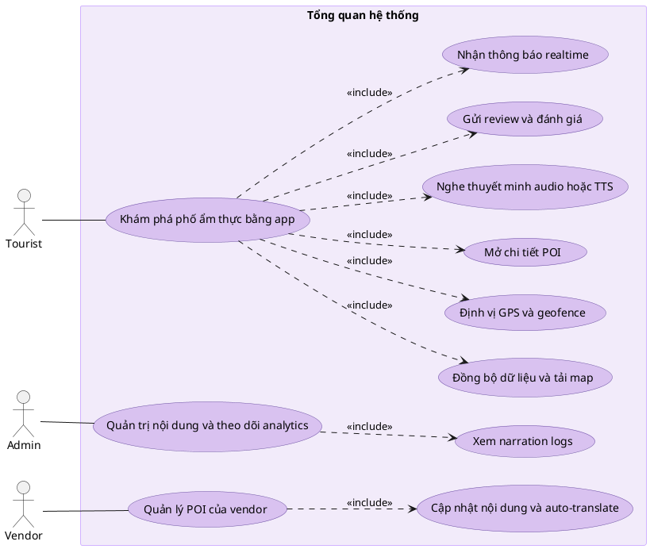

### Sequence Diagram
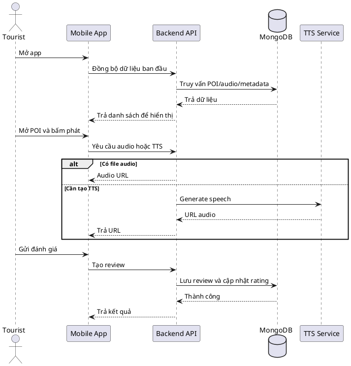

## Sự kiện 1: Khởi động app và đồng bộ dữ liệu

### Đặc tả Use Case
- Mục tiêu: Tải dữ liệu nhanh từ local và đồng bộ khi có mạng.
- Tác nhân chính: Tourist.
- Kích hoạt: Mở ứng dụng.
- Tiền điều kiện: App đã cài đặt.
- Hậu điều kiện: Map/list hiển thị, dữ liệu local được cập nhật.

### Use Case Diagram
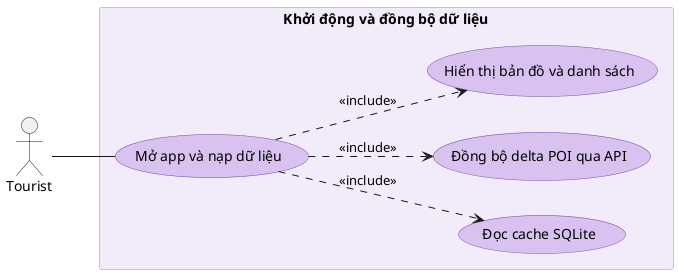

### Sequence Diagram
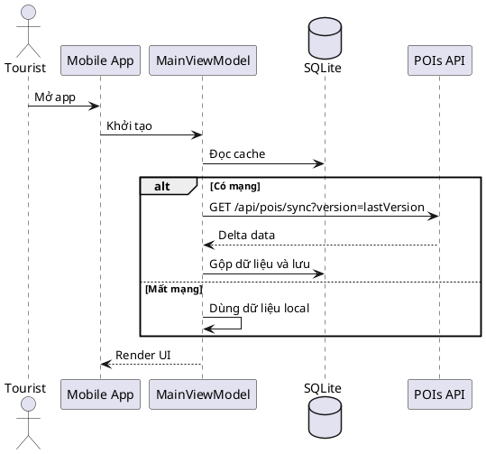

## Sự kiện 2: Cập nhật GPS và geofence

### Đặc tả Use Case
- Mục tiêu: Xác định vùng đang vào/ra theo vị trí thực.
- Tác nhân chính: Tourist.
- Kích hoạt: Có location update.
- Tiền điều kiện: Đã cấp quyền vị trí.
- Hậu điều kiện: Active zones và primary zone được cập nhật.

### Use Case Diagram
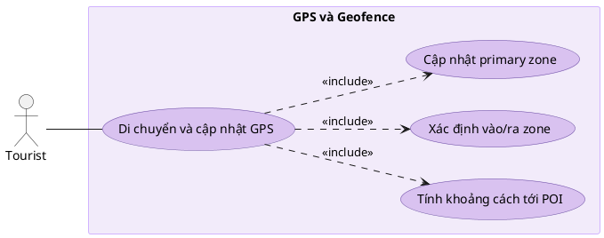

### Sequence Diagram
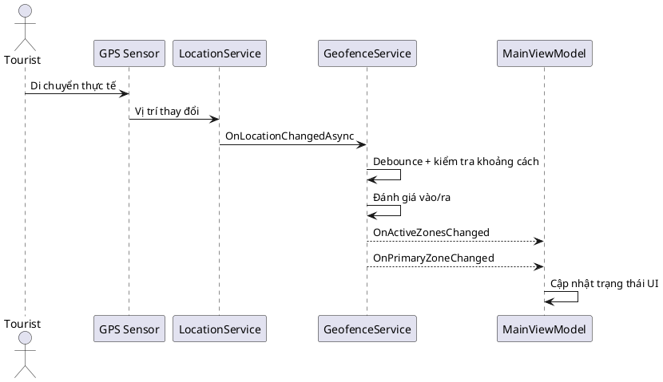

## Sự kiện 3: Mở chi tiết POI

### Đặc tả Use Case
- Mục tiêu: Hiển thị thông tin POI đầy đủ theo ngôn ngữ chọn.
- Tác nhân chính: Tourist.
- Kích hoạt: Nhấn POI trên map/list.
- Tiền điều kiện: POI tồn tại.
- Hậu điều kiện: Trang chi tiết hiển thị nội dung, menu, review, audio.

### Use Case Diagram
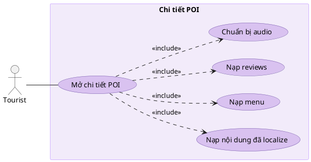

### Sequence Diagram
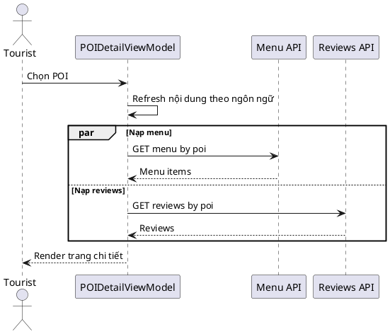

## Sự kiện 4: Phát audio với fallback nhiều tầng

### Đặc tả Use Case
- Mục tiêu: Đảm bảo luôn có cách phát thuyết minh.
- Tác nhân chính: Tourist.
- Kích hoạt: Nhấn nút Phát.
- Tiền điều kiện: Có POI, có ngôn ngữ hiện tại.
- Hậu điều kiện: Audio phát thành công hoặc fallback Native TTS.

### Use Case Diagram
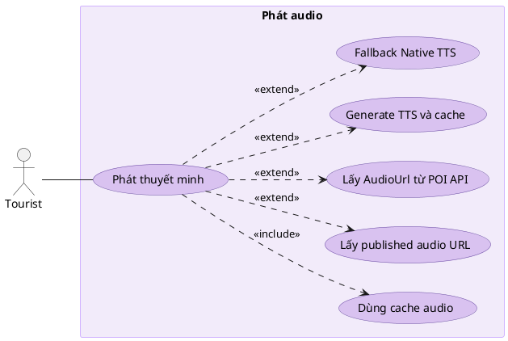

### Sequence Diagram
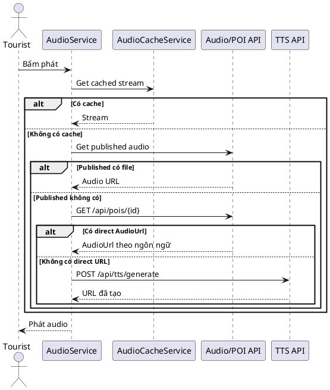

## Sự kiện 5: Generate TTS ở backend

### Đặc tả Use Case
- Mục tiêu: Tạo MP3 từ văn bản.
- Tác nhân chính: Mobile App hoặc Web Portal.
- Kích hoạt: Gọi endpoint generate TTS.
- Tiền điều kiện: Text hợp lệ, dịch vụ TTS hoạt động.
- Hậu điều kiện: Trả audio URL hoặc lỗi.

### Use Case Diagram
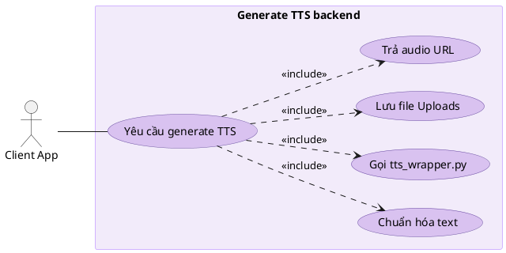

### Sequence Diagram
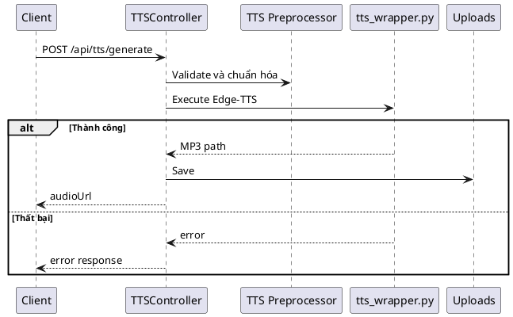

## Sự kiện 6: Đăng nhập và cấp JWT

### Đặc tả Use Case
- Mục tiêu: Xác thực user và cấp token truy cập.
- Tác nhân chính: Admin, Vendor, Tourist.
- Kích hoạt: Gửi form đăng nhập.
- Tiền điều kiện: Tài khoản tồn tại.
- Hậu điều kiện: Token hợp lệ được trả về và lưu.

### Use Case Diagram
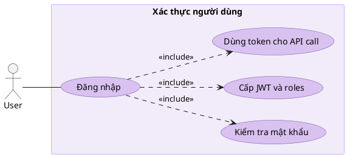

### Sequence Diagram
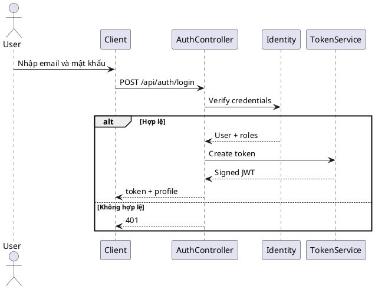

## Sự kiện 7: Gửi review và đánh giá POI (khong co lam cai nay)

### Đặc tả Use Case
- Mục tiêu: Lưu đánh giá và cập nhật điểm trung bình.
- Tác nhân chính: Tourist.
- Kích hoạt: Submit review.
- Tiền điều kiện: POI hợp lệ.
- Hậu điều kiện: Review được tạo, rating POI được cập nhật.

### Use Case Diagram
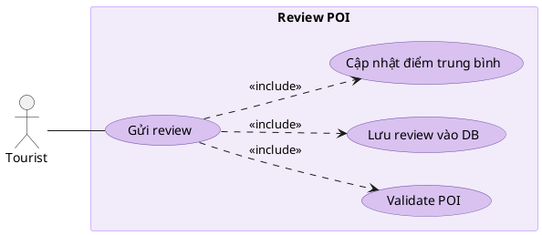

### Sequence Diagram
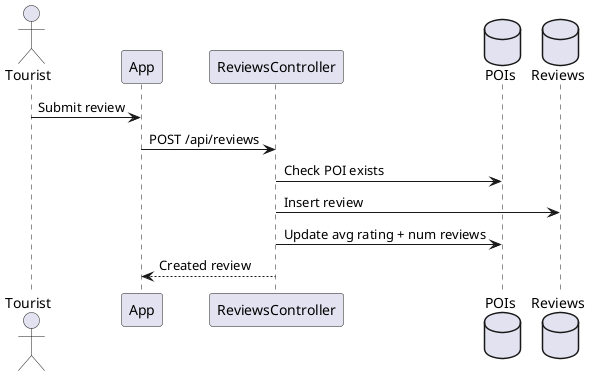

## Sự kiện 8: Nhận thông báo realtime qua SignalR

### Đặc tả Use Case
- Mục tiêu: Đẩy thông báo đúng nhóm người dùng.
- Tác nhân chính: Admin, Vendor, Tourist (phía nhận).
- Kích hoạt: Có domain event cần thông báo.
- Tiền điều kiện: Client đã kết nối hub hợp lệ.
- Hậu điều kiện: Notification lưu DB và hiển thị client.

### Use Case Diagram
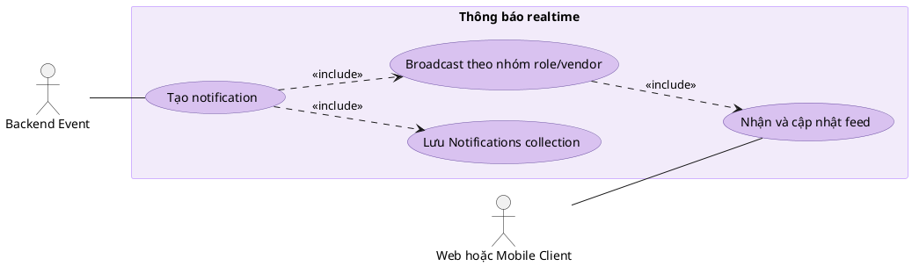

### Sequence Diagram
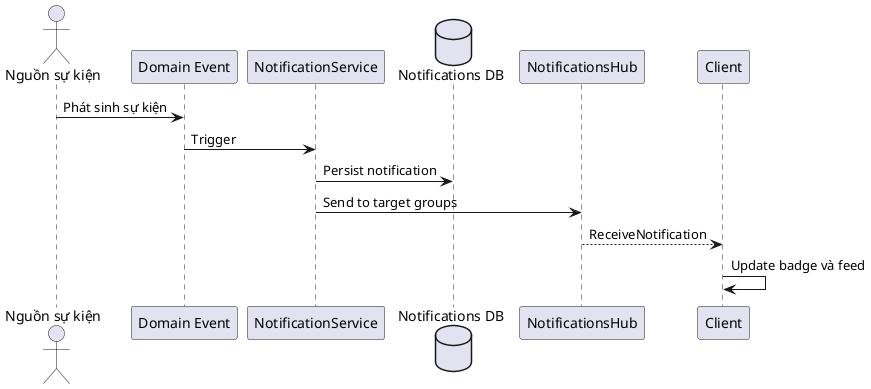

## Sự kiện 9: Vendor quản lý danh sách POI

### Đặc tả Use Case
- Mục tiêu: Vendor chỉ xem/quản lý POI thuộc quyền của mình.
- Tác nhân chính: Vendor.
- Kích hoạt: Mở trang POI list.
- Tiền điều kiện: Vendor đã đăng nhập.
- Hậu điều kiện: Danh sách lọc theo VendorId.

### Use Case Diagram
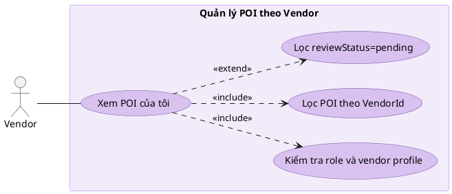

### Sequence Diagram
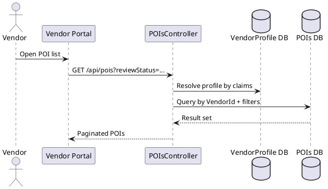

## Sự kiện 10: Auto-translate nội dung POI

### Đặc tả Use Case
- Mục tiêu: Dịch nhanh nội dung POI sang nhiều ngôn ngữ.
- Tác nhân chính: Admin, Vendor.
- Kích hoạt: Bấm auto-translate.
- Tiền điều kiện: Có văn bản nguồn.
- Hậu điều kiện: Trả map bản dịch theo ngôn ngữ.

### Use Case Diagram
```plantuml
@startuml
left to right direction
skinparam actorStyle stick
skinparam usecase {
  BackgroundColor #D9C2F0
  BorderColor #6B4FA2
}
skinparam rectangle {
  BackgroundColor #F2EBFA
  BorderColor #D1B3FF
}

actor "Admin hoặc Vendor" as User

rectangle "Auto-translate nội dung" {
  usecase "Yêu cầu auto-translate" as UC1
  usecase "Duyệt target languages" as UC2
  usecase "Gọi dịch vụ dịch" as UC3
  usecase "Trả kết quả theo ngôn ngữ" as UC4
}

User -- UC1
UC1 ..> UC2 : <<include>>
UC1 ..> UC3 : <<include>>
UC1 ..> UC4 : <<include>>
@enduml
```

### Sequence Diagram
```plantuml
@startuml
actor "Admin hoặc Vendor" as U
participant "Web Client" as C
participant AutoTranslateController as AT
participant "Translate Endpoint" as GT

U -> C: Click auto-translate
C -> AT: POST /api/autotranslate
loop Mỗi ngôn ngữ đích
  AT -> GT: Translate text
  GT --> AT: Translated text
end
AT --> C: Map language -> text
@enduml
```

## Sự kiện 11: Xem analytics narration logs

### Đặc tả Use Case
- Mục tiêu: Theo dõi hiệu quả sử dụng narration.
- Tác nhân chính: Admin.
- Kích hoạt: Mở trang analytics.
- Tiền điều kiện: Admin đã đăng nhập.
- Hậu điều kiện: Có dữ liệu logs phân trang theo filter.

### Use Case Diagram
```plantuml
@startuml
left to right direction
skinparam actorStyle stick
skinparam usecase {
  BackgroundColor #D9C2F0
  BorderColor #6B4FA2
}
skinparam rectangle {
  BackgroundColor #F2EBFA
  BorderColor #D1B3FF
}

actor Admin

rectangle "Analytics narration" {
  usecase "Xem narration logs" as UC1
  usecase "Lọc theo POI/user/date" as UC2
  usecase "Map thêm tên POI" as UC3
  usecase "Hiển thị bảng và chart" as UC4
}

Admin -- UC1
UC1 ..> UC2 : <<include>>
UC1 ..> UC3 : <<include>>
UC1 ..> UC4 : <<include>>
@enduml
```

### Sequence Diagram
```plantuml
@startuml
actor Admin as A
participant Dashboard as D
participant AnalyticsController as An
database "NarrationLogs DB" as L
database "POIs DB" as P

A -> D: Open analytics page
D -> An: GET /api/analytics/narration-logs
An -> L: Query filters + paging
An -> P: Resolve POI names
An --> D: DTO list
D --> A: Render table/charts
@enduml
```

## Sự kiện 12: Xử lý QR deeplink vào POI/Tour

### Đặc tả Use Case
- Mục tiêu: Mở đúng trang theo deeplink.
- Tác nhân chính: Tourist.
- Kích hoạt: App nhận deeplink.
- Tiền điều kiện: Link hợp lệ.
- Hậu điều kiện: Focus đúng POI hoặc Tour.

### Use Case Diagram
```plantuml
@startuml
left to right direction
skinparam actorStyle stick
skinparam usecase {
  BackgroundColor #D9C2F0
  BorderColor #6B4FA2
}
skinparam rectangle {
  BackgroundColor #F2EBFA
  BorderColor #D1B3FF
}

actor Tourist

rectangle "QR Deeplink" {
  usecase "Mở app bằng deeplink" as UC1
  usecase "Parse và queue payload" as UC2
  usecase "Validate expiry" as UC3
  usecase "Focus POI hoặc Tour" as UC4
}

Tourist -- UC1
UC1 ..> UC2 : <<include>>
UC1 ..> UC3 : <<include>>
UC1 ..> UC4 : <<include>>
@enduml
```

### Sequence Diagram
```plantuml
@startuml
actor Tourist as U
participant "Deep Link" as L
participant MainActivity as MA
participant QrDeepLinkManager as Q
participant MainPage as MP
participant ExploreMapPage as EM

U -> L: Quét QR hoặc mở deeplink
L -> MA: Intent arrived
MA -> Q: Save payload
MP -> Q: Consume pending link
alt Link còn hạn
  MP -> EM: Open with POI/Tour target
else Hết hạn
  MP -> MP: Show invalid message
end
@enduml
```

## Sự kiện 13: Admin đăng nhập web và truy cập trang bảo vệ

### Đặc tả Use Case
- Mục tiêu: Truy cập trang quản trị có bảo vệ.
- Tác nhân chính: Admin.
- Kích hoạt: Submit form đăng nhập web.
- Tiền điều kiện: Tài khoản Admin hợp lệ.
- Hậu điều kiện: Cookie/token hợp lệ, truy cập dashboard.

### Use Case Diagram
```plantuml
@startuml
left to right direction
skinparam actorStyle stick
skinparam usecase {
  BackgroundColor #D9C2F0
  BorderColor #6B4FA2
}
skinparam rectangle {
  BackgroundColor #F2EBFA
  BorderColor #D1B3FF
}

actor Admin

rectangle "Đăng nhập web Admin" {
  usecase "Đăng nhập web portal" as UC1
  usecase "Nhận JWT và lưu auth cookie" as UC2
  usecase "Truy cập admin-dashboard" as UC3
  usecase "Middleware validate token" as UC4
}

Admin -- UC1
UC1 ..> UC2 : <<include>>
UC1 ..> UC3 : <<include>>
UC3 ..> UC4 : <<include>>
@enduml
```

### Sequence Diagram
```plantuml
@startuml
actor Admin as A
participant "Login Page" as Web
participant AuthController as Auth
participant Identity as Id
participant "Auth Middleware" as MW

A -> Web: Submit email/password
Web -> Auth: POST /api/auth/login
Auth -> Id: Verify credentials + role
Id --> Auth: Valid admin
Auth --> Web: JWT token
Web -> Web: Set auth_token cookie
A -> Web: Open /admin-dashboard
Web -> MW: Request protected html
MW --> Web: Allow access
@enduml
```

## Sự kiện 14: Admin duyệt hồ sơ Vendor

### Đặc tả Use Case
- Mục tiêu: Kiểm duyệt Vendor trước khi vận hành.
- Tác nhân chính: Admin.
- Kích hoạt: Mở danh sách vendor pending.
- Tiền điều kiện: Admin đã đăng nhập.
- Hậu điều kiện: Hồ sơ vendor được approve/reject.

### Use Case Diagram
```plantuml
@startuml
left to right direction
skinparam actorStyle stick
skinparam usecase {
  BackgroundColor #D9C2F0
  BorderColor #6B4FA2
}
skinparam rectangle {
  BackgroundColor #F2EBFA
  BorderColor #D1B3FF
}

actor Admin

rectangle "Duyệt hồ sơ Vendor" {
  usecase "Xem danh sách vendor pending" as UC1
  usecase "Xem chi tiết hồ sơ vendor" as UC2
  usecase "Approve hoặc reject" as UC3
  usecase "Cập nhật verification status" as UC4
}

Admin -- UC1
UC1 ..> UC2 : <<include>>
UC1 ..> UC3 : <<include>>
UC3 ..> UC4 : <<include>>
@enduml
```

### Sequence Diagram
```plantuml
@startuml
actor Admin as A
participant "Admin Vendor Page" as Web
participant VendorsController as VC
database "VendorProfile DB" as DB
participant NotificationService as N

A -> Web: Open vendor approvals
Web -> VC: GET vendors pending list
VC -> DB: Query pending profiles
DB --> VC: Pending vendors
VC --> Web: Render list
A -> Web: Approve/Reject vendor
Web -> VC: Update verification status
VC -> DB: Save status
VC -> N: Trigger vendor notification
@enduml
```

## Sự kiện 15: Admin duyệt nội dung POI pending

### Đặc tả Use Case
- Mục tiêu: Kiểm duyệt thay đổi POI từ Vendor.
- Tác nhân chính: Admin.
- Kích hoạt: Lọc reviewStatus=pending.
- Tiền điều kiện: Có POI pending update.
- Hậu điều kiện: POI được approve publish hoặc reject.

### Use Case Diagram
```plantuml
@startuml
left to right direction
skinparam actorStyle stick
skinparam usecase {
  BackgroundColor #D9C2F0
  BorderColor #6B4FA2
}
skinparam rectangle {
  BackgroundColor #F2EBFA
  BorderColor #D1B3FF
}

actor Admin

rectangle "Duyệt nội dung POI" {
  usecase "Xem POI pending review" as UC1
  usecase "So sánh nội dung cũ/mới" as UC2
  usecase "Approve publish hoặc reject" as UC3
  usecase "Ghi nhận kết quả duyệt" as UC4
}

Admin -- UC1
UC1 ..> UC2 : <<include>>
UC1 ..> UC3 : <<include>>
UC3 ..> UC4 : <<include>>
@enduml
```

### Sequence Diagram
```plantuml
@startuml
actor Admin as A
participant "Admin POI Page" as Web
participant POIsController as POI
database "POIs DB" as DB
participant NotificationService as N

A -> Web: Open pending POI tab
Web -> POI: GET /api/pois?reviewStatus=pending
POI -> DB: Query pending POIs
DB --> POI: Pending list
POI --> Web: Return list
A -> Web: Approve/Reject POI
Web -> POI: Submit moderation decision
POI -> DB: Update status and content
POI -> N: Notify vendor result
@enduml
```

## Sự kiện 16: Admin quản lý audio và bulk TTS

### Đặc tả Use Case
- Mục tiêu: Tạo/cập nhật audio và phát hành cho mobile.
- Tác nhân chính: Admin.
- Kích hoạt: Thao tác trên audio-list hoặc bulk-generate.
- Tiền điều kiện: Có dữ liệu text hợp lệ.
- Hậu điều kiện: Audio được tạo/lưu/publish.

### Use Case Diagram
```plantuml
@startuml
left to right direction
skinparam actorStyle stick
skinparam usecase {
  BackgroundColor #D9C2F0
  BorderColor #6B4FA2
}
skinparam rectangle {
  BackgroundColor #F2EBFA
  BorderColor #D1B3FF
}

actor Admin

rectangle "Quản lý audio" {
  usecase "Xem danh sách audio" as UC1
  usecase "Generate TTS đơn lẻ/hàng loạt" as UC2
  usecase "Upload hoặc thay thế audio" as UC3
  usecase "Publish audio cho mobile" as UC4
}

Admin -- UC1
UC1 ..> UC2 : <<include>>
UC1 ..> UC3 : <<include>>
UC1 ..> UC4 : <<include>>
@enduml
```

### Sequence Diagram
```plantuml
@startuml
actor Admin as A
participant "Audio Admin Page" as Web
participant AudioController as AC
participant TTSController as TTS
database "AudioContent DB" as DB

A -> Web: Start bulk generate
Web -> TTS: POST /api/tts/generate (for each POI)
TTS --> Web: Generated URLs
Web -> AC: Save audio metadata
AC -> DB: Insert/Update AudioContent
DB --> AC: Success
AC --> Web: Updated list
@enduml
```

## Sự kiện 17: Vendor tạo hoặc cập nhật POI gửi chờ duyệt

### Đặc tả Use Case
- Mục tiêu: Vendor cập nhật nội dung POI và gửi Admin duyệt.
- Tác nhân chính: Vendor.
- Kích hoạt: Submit form tạo/sửa POI.
- Tiền điều kiện: Vendor hợp lệ, đã đăng nhập.
- Hậu điều kiện: POI ở trạng thái pending review.

### Use Case Diagram
```plantuml
@startuml
left to right direction
skinparam actorStyle stick
skinparam usecase {
  BackgroundColor #D9C2F0
  BorderColor #6B4FA2
}
skinparam rectangle {
  BackgroundColor #F2EBFA
  BorderColor #D1B3FF
}

actor Vendor

rectangle "Vendor gửi nội dung POI" {
  usecase "Tạo mới hoặc sửa POI" as UC1
  usecase "Gửi nội dung và media" as UC2
  usecase "Đặt trạng thái pending review" as UC3
  usecase "Theo dõi kết quả duyệt" as UC4
}

Vendor -- UC1
UC1 ..> UC2 : <<include>>
UC1 ..> UC3 : <<include>>
UC1 ..> UC4 : <<include>>
@enduml
```

### Sequence Diagram
```plantuml
@startuml
actor Vendor as V
participant "Vendor POI Form" as Web
participant POIsController as POI
database "POIs DB" as DB
participant NotificationService as N

V -> Web: Submit create/update POI
Web -> POI: POST hoặc PUT /api/pois
POI -> DB: Save POI theo VendorId + status
DB --> POI: Saved
POI --> Web: Return pending result
POI -> N: Notify admin queue
N --> V: Receive approve/reject later
@enduml
```

## Sự kiện 18: Admin xem heatmap hành vi du khách

### Đặc tả Use Case
- Mục tiêu: Giám sát điểm nóng di chuyển và tương tác theo khu vực/khung giờ.
- Tác nhân chính: Admin.
- Kích hoạt: Mở trang Heatmap trong dashboard.
- Tiền điều kiện: Có dữ liệu vị trí, lượt xem POI hoặc narration logs.
- Hậu điều kiện: Heatmap hiển thị lớp dữ liệu theo bộ lọc thời gian/khu vực.

### Use Case Diagram
```plantuml
@startuml
left to right direction
skinparam actorStyle stick
skinparam usecase {
  BackgroundColor #D9C2F0
  BorderColor #6B4FA2
}
skinparam rectangle {
  BackgroundColor #F2EBFA
  BorderColor #D1B3FF
}

actor Admin

rectangle "Heatmap hành vi du khách" {
  usecase "Mở màn hình heatmap" as UC1
  usecase "Chọn bộ lọc thời gian/khu vực" as UC2
  usecase "Tổng hợp dữ liệu vị trí và lượt tương tác" as UC3
  usecase "Hiển thị lớp heatmap trên bản đồ" as UC4
}

Admin -- UC1
UC1 ..> UC2 : <<include>>
UC1 ..> UC3 : <<include>>
UC1 ..> UC4 : <<include>>
@enduml
```

### Sequence Diagram
```plantuml
@startuml
actor Admin as A
participant "Heatmap Dashboard" as Web
participant AnalyticsController as An
database "NarrationLogs DB" as L
database "POIs DB" as P

A -> Web: Mở trang heatmap và chọn bộ lọc
Web -> An: Yêu cầu dữ liệu heatmap theo bộ lọc đã chọn
An -> L: Lấy dữ liệu tương tác theo thời gian/khu vực
An -> P: Đối chiếu tọa độ và thông tin POI
An --> Web: Trả tập điểm nóng
Web --> A: Hiển thị lớp heatmap và chú giải
@enduml
```

## Sự kiện 19: Admin xem thống kê tổng quan và báo cáo theo thời gian

### Đặc tả Use Case
- Mục tiêu: Theo dõi KPI vận hành như số lượt nghe, POI phổ biến, tỉ lệ hoàn thành tour.
- Tác nhân chính: Admin.
- Kích hoạt: Mở trang thống kê tổng quan.
- Tiền điều kiện: Có dữ liệu logs/reviews/POI/tour.
- Hậu điều kiện: Dashboard hiển thị KPI và biểu đồ theo ngày/tuần/tháng.

### Use Case Diagram
```plantuml
@startuml
left to right direction
skinparam actorStyle stick
skinparam usecase {
  BackgroundColor #D9C2F0
  BorderColor #6B4FA2
}
skinparam rectangle {
  BackgroundColor #F2EBFA
  BorderColor #D1B3FF
}

actor Admin

rectangle "Thống kê tổng quan" {
  usecase "Mở dashboard KPI" as UC1
  usecase "Lọc theo mốc thời gian" as UC2
  usecase "Tính toán chỉ số tổng hợp" as UC3
  usecase "Hiển thị biểu đồ/báo cáo" as UC4
}

Admin -- UC1
UC1 ..> UC2 : <<include>>
UC1 ..> UC3 : <<include>>
UC1 ..> UC4 : <<include>>
@enduml
```

### Sequence Diagram
```plantuml
@startuml
actor Admin as A
participant "Analytics Dashboard" as Web
participant AnalyticsController as An
database "NarrationLogs DB" as L
database "Reviews DB" as R
database "Tours DB" as T

A -> Web: Chọn khoảng thời gian báo cáo
Web -> An: Yêu cầu dữ liệu thống kê tổng quan
An -> L: Tổng hợp lượt nghe và POI phổ biến
An -> R: Tổng hợp điểm đánh giá trung bình
An -> T: Tổng hợp dữ liệu tour
An --> Web: Trả KPI và dữ liệu biểu đồ
Web --> A: Hiển thị dashboard thống kê
@enduml
```

## Sự kiện 20: Admin quản lý tour và thứ tự điểm dừng

### Đặc tả Use Case
- Mục tiêu: Tạo/sửa/xóa tour và điều chỉnh thứ tự các điểm dừng.
- Tác nhân chính: Admin.
- Kích hoạt: Admin thao tác trên trang quản lý Tour.
- Tiền điều kiện: Admin đã đăng nhập; POI dữ liệu hợp lệ.
- Hậu điều kiện: Tour được lưu với danh sách stop và thứ tự chính xác.

### Use Case Diagram
```plantuml
@startuml
left to right direction
skinparam actorStyle stick
skinparam usecase {
  BackgroundColor #D9C2F0
  BorderColor #6B4FA2
}
skinparam rectangle {
  BackgroundColor #F2EBFA
  BorderColor #D1B3FF
}

actor Admin

rectangle "Quản lý tour" {
  usecase "Tạo/Sửa/Xóa tour" as UC1
  usecase "Thêm hoặc gỡ POI khỏi tour" as UC2
  usecase "Sắp xếp thứ tự điểm dừng" as UC3
  usecase "Xuất bản tour" as UC4
}

Admin -- UC1
UC1 ..> UC2 : <<include>>
UC1 ..> UC3 : <<include>>
UC1 ..> UC4 : <<include>>
@enduml
```

### Sequence Diagram
```plantuml
@startuml
actor Admin as A
participant "Tour Admin Page" as Web
participant ToursController as Tour
database "Tours DB" as T
database "POI_Tour DB" as PT

A -> Web: Tạo hoặc chỉnh sửa tour
Web -> Tour: Gửi thông tin tour cần cập nhật
Tour -> T: Lưu thông tin tour
A -> Web: Cập nhật danh sách điểm dừng và thứ tự
Web -> Tour: Gửi cấu hình điểm dừng của tour
Tour -> PT: Lưu liên kết POI và thứ tự dừng
Tour --> Web: Trả kết quả cập nhật
Web --> A: Hiển thị tour đã cập nhật
@enduml
```

## Sự kiện 21: Vendor quản lý menu item theo POI

### Đặc tả Use Case
- Mục tiêu: Vendor quản lý thực đơn theo từng POI của mình.
- Tác nhân chính: Vendor.
- Kích hoạt: Mở trang quản lý menu của POI.
- Tiền điều kiện: Vendor có quyền với POI tương ứng.
- Hậu điều kiện: Menu item được tạo/sửa/xóa thành công.

### Use Case Diagram
```plantuml
@startuml
left to right direction
skinparam actorStyle stick
skinparam usecase {
  BackgroundColor #D9C2F0
  BorderColor #6B4FA2
}
skinparam rectangle {
  BackgroundColor #F2EBFA
  BorderColor #D1B3FF
}

actor Vendor

rectangle "Quản lý menu theo POI" {
  usecase "Xem danh sách menu item" as UC1
  usecase "Tạo menu item mới" as UC2
  usecase "Chỉnh sửa menu item" as UC3
  usecase "Xóa menu item" as UC4
}

Vendor -- UC1
UC1 ..> UC2 : <<include>>
UC1 ..> UC3 : <<include>>
UC1 ..> UC4 : <<include>>
@enduml
```

### Sequence Diagram
```plantuml
@startuml
actor Vendor as V
participant "Menu Management Page" as Web
participant MenuItemsController as Menu
database "MenuItems DB" as M

V -> Web: Mở menu của một POI
Web -> Menu: Yêu cầu danh sách menu item
Menu --> Web: Danh sách menu item
V -> Web: Tạo/Sửa/Xóa menu item
Web -> Menu: Gửi thay đổi thực đơn
Menu -> M: Lưu thay đổi thực đơn
M --> Menu: Thành công
Menu --> Web: Trả kết quả cập nhật
@enduml
```

## Sự kiện 22: Admin quản lý tài khoản và phân quyền

### Đặc tả Use Case
- Mục tiêu: Quản trị vòng đời tài khoản và quyền truy cập hệ thống.
- Tác nhân chính: Admin.
- Kích hoạt: Mở trang quản lý người dùng.
- Tiền điều kiện: Admin có quyền quản trị người dùng.
- Hậu điều kiện: Tài khoản được khóa/mở khóa hoặc đổi role theo chính sách.

### Use Case Diagram
```plantuml
@startuml
left to right direction
skinparam actorStyle stick
skinparam usecase {
  BackgroundColor #D9C2F0
  BorderColor #6B4FA2
}
skinparam rectangle {
  BackgroundColor #F2EBFA
  BorderColor #D1B3FF
}

actor Admin

rectangle "Quản lý tài khoản và phân quyền" {
  usecase "Xem danh sách người dùng" as UC1
  usecase "Khóa/Mở khóa tài khoản" as UC2
  usecase "Gán hoặc thay đổi role" as UC3
  usecase "Lưu lịch sử thao tác quản trị" as UC4
}

Admin -- UC1
UC1 ..> UC2 : <<include>>
UC1 ..> UC3 : <<include>>
UC1 ..> UC4 : <<include>>
@enduml
```

### Sequence Diagram
```plantuml
@startuml
actor Admin as A
participant "User Admin Page" as Web
participant UsersController as Uc
database "Users DB" as U

A -> Web: Mở trang người dùng và chọn tài khoản
Web -> Uc: Yêu cầu danh sách người dùng
Uc --> Web: Danh sách người dùng
A -> Web: Chọn thao tác khóa/mở khóa hoặc đổi quyền
Web -> Uc: Gửi yêu cầu cập nhật trạng thái/quyền
Uc -> U: Cập nhật trạng thái hoặc role
U --> Uc: Thành công
Uc --> Web: Trả kết quả
@enduml
```
