# StreetFoodNarrator - Use Case + Sequence + Activity Theo Sự Kiện Chức Năng (PlantUML)

Ghi chú: Tài liệu này dùng PlantUML cho toàn bộ sơ đồ Use Case và Sequence.

Xem thêm class diagram cho báo cáo tại: Documentation/Project-Class-Diagrams.md

## Bảng đánh dấu flow — Toàn bộ F0–F28

> Mỗi sự kiện gồm 4 phần: **Đặc tả Use Case** (bảng chuẩn + luồng chính/thay thế/ngoại lệ) · **Use Case Diagram** (PlantUML) · **Sequence Diagram** (PlantUML) · **Activity Diagram** (PlantUML).

| Flow ID | Sự kiện | Nhóm | Flow này làm gì |
|---|---|---|---|
| F0 | Sự kiện 0 | Tổng quan | Mô tả hành trình tổng thể hệ thống |
| F1 | Sự kiện 1 | User App | Khởi động app, đọc cache, đồng bộ dữ liệu |
| F2 | Sự kiện 2 | User App | Cập nhật GPS và geofence vào/ra vùng |
| F3 | Sự kiện 3 | User App | Mở chi tiết POI và nạp dữ liệu |
| F4 | Sự kiện 4 | User App | Phát audio với fallback 4 tầng |
| F5 | Sự kiện 5 | API | Tạo TTS ở backend và trả audio URL |
| F6 | Sự kiện 6 | Auth | Đăng nhập và cấp JWT |
| F7 | Sự kiện 7 | User App | Gửi review và cập nhật rating POI |
| F8 | Sự kiện 8 | Web | Nhận thông báo theo polling sidebar |
| F9 | Sự kiện 9 | Web Vendor | Vendor xem và lọc POI của mình |
| F10 | Sự kiện 10 | Web Vendor/Admin | Auto-translate nội dung POI sang đa ngôn ngữ |
| F11 | Sự kiện 11 | Web Admin | Xem và phân tích narration logs |
| F12 | Sự kiện 12 | User App | Xử lý QR deeplink vào POI/Tour |
| F13 | Sự kiện 13 | Web Admin | Admin đăng nhập web và truy cập trang bảo vệ |
| F14 | Sự kiện 14 | Web Admin | Admin duyệt hồ sơ Vendor pending |
| F15 | Sự kiện 15 | Web Admin | Admin duyệt nội dung POI pending từ Vendor |
| F16 | Sự kiện 16 | Web Vendor/Admin | Vendor tạo bộ audio, Admin duyệt 3 ngôn ngữ |
| F17 | Sự kiện 17 | Web Vendor | Vendor tạo/sửa POI gửi Admin duyệt |
| F18 | Sự kiện 18 | Web Admin | Xem heatmap điểm nóng hành vi du khách |
| F19 | Sự kiện 19 | Web Admin | Xem thống kê KPI tổng quan và báo cáo theo thời gian |
| F20 | Sự kiện 20 | Web Admin | Quản lý tour với ràng buộc free tour và premium POI |
| F21 | Sự kiện 21 | Web Vendor | Vendor quản lý menu item theo POI |
| F22 | Sự kiện 22 | Web Admin | Admin quản lý vòng đời tài khoản và phân quyền |
| F23 | Sự kiện 23 | Web / Auth | Đăng ký tài khoản web (mặc định role Vendor) |
| F24 | Sự kiện 24 | User App | Xem và tham gia Tour từ Mobile App |
| F25 | Sự kiện 25 | Web Admin | Quản lý bản dịch nội dung POI (Translations) |
| F26 | Sự kiện 26 | Web Admin | Theo dõi thiết bị và lịch sử truy cập |
| F27 | Sự kiện 27 | Web Vendor/Admin | Vendor gửi thanh toán premium, Admin duyệt submission |
| F28 | Sự kiện 28 | User App + API | Xác nhận VIP theo thiết bị và khôi phục bằng recovery code |

## Kết quả rà soát theo code hiện tại (đối chiếu PRD)

| Mục rà soát | Kết luận từ code hiện tại | Hành động trong tài liệu này |
|---|---|---|
| F8 Notification | Không có SignalR/Hub; web dùng polling `GET /api/Notifications/sidebar` (10s khi visible, 30s khi hidden) | Sửa F8 sang polling flow + sequence/activity mới |
| F12 QR | Có thêm server landing `/qr/{**deepPath}` trong `Program.cs`, có check hạn link + fallback tải APK | Mở rộng F12 thành flow web landing -> deep link app |
| F16 Audio | Upload/replace audio thủ công đang tắt (`410`), luồng chính là TTS + moderation theo bộ 3 ngôn ngữ | Sửa F16 theo workflow thực tế Vendor/Admin |
| F20 Tour | Không dùng bảng `POI_Tour`; thứ tự stop nằm trong `Tour.PoiIds`; có rule chỉ 1 free tour active và POI vendor phải còn premium | Sửa F20 theo rule validate thực tế |
| F21 Menu | `DELETE /api/MenuItems/{id}` bị disable (`405`); xóa mềm qua `PUT` với `isDeleted` | Sửa F21 để tránh mô tả sai API |
| F23 Register | `POST /api/Auth/register` không nhận role; backend luôn gán role `Vendor`; VendorProfile tạo lazy ở `GET /api/Vendors/me` | Sửa F23 theo implementation thật |
| Tour access mobile | Mobile áp dụng free-first: non-VIP chỉ vào free tour; tour khác bị khóa/paywall | Sửa F24 và thêm F28 |
| Payment/Subscription | Có 2 luồng riêng: `PaymentsController` (vendor/admin duyệt premium) và `SubscriptionsController` (VIP theo device) | Bổ sung F27 + F28 |
| PRD chênh lệch lớn | Một số hạng mục PRD vẫn chưa có trong code hiện tại: SSE progress audio task, AI Advisor, dynamic RBAC nhiều permission, offline map pack PMTiles | Giữ trong phần nhận xét chấm đồ án, không mô tả như tính năng đã hoàn thành |
| Contract cần sửa | Web API wrapper đang gọi `/Settings/me` nhưng backend hiện có `/api/Settings/{deviceId}` | Đánh dấu là mismatch cần fix ở sprint tiếp theo |

## Sự kiện 0: Use case tổng quan hệ thống

### Đặc tả Use Case

| Trường | Nội dung |
|--------|---------|
| **Use Case ID** | F0 |
| **Tên** | Khám phá phố ẩm thực bằng ứng dụng |
| **Tác nhân chính** | Tourist |
| **Tác nhân phụ** | Admin (quản trị nội dung), Vendor (cung cấp thông tin POI) |
| **Kích hoạt** | Tourist mở ứng dụng Street Food Narrator |
| **Tiền điều kiện** | App đã cài đặt; API hoạt động; dữ liệu POI sẵn sàng |
| **Hậu điều kiện** | Tourist hoàn thành hành trình khám phá; dữ liệu sử dụng được ghi nhận vào hệ thống |
| **Quan hệ** | include: F1 (Sync dữ liệu), F2 (GPS/Geofence), F3 (Chi tiết POI), F4 (Phát audio), F7 (Review) |

**Luồng chính:**

| Bước | Tác nhân | Hành động |
|------|----------|-----------|
| 1 | Tourist | Mở app → hệ thống khởi động và tải dữ liệu (F1) |
| 2 | Hệ thống | GPS được kích hoạt, geofence bắt đầu theo dõi (F2) |
| 3 | Tourist | Di chuyển trên thực địa hoặc chọn Virtual Tour |
| 4 | Hệ thống | Khi vào zone POI → tự động phát thuyết minh audio (F4) |
| 5 | Tourist | Tap POI trên map → xem chi tiết thông tin (F3) |
| 6 | Tourist | (Tùy chọn) Gửi review và đánh giá (F7) |
| 7 | Hệ thống | Ghi nhận narration log, cập nhật analytics |

**Luồng thay thế — Virtual Tour (không ở thực địa):**

| Bước | Tác nhân | Hành động |
|------|----------|-----------|
| 3a | App | Phát hiện user > 1km khỏi trung tâm khu vực |
| 3b | App | Gợi ý tham gia Tour ảo |
| 3c | Tourist | Đồng ý → dùng simulated location theo thứ tự stop |

**Ngoại lệ:**
- GPS bị từ chối → vô hiệu hóa geofence, hiện thông báo yêu cầu quyền.
- API không khả dụng → app chạy offline từ SQLite cache.

### Use Case Diagram
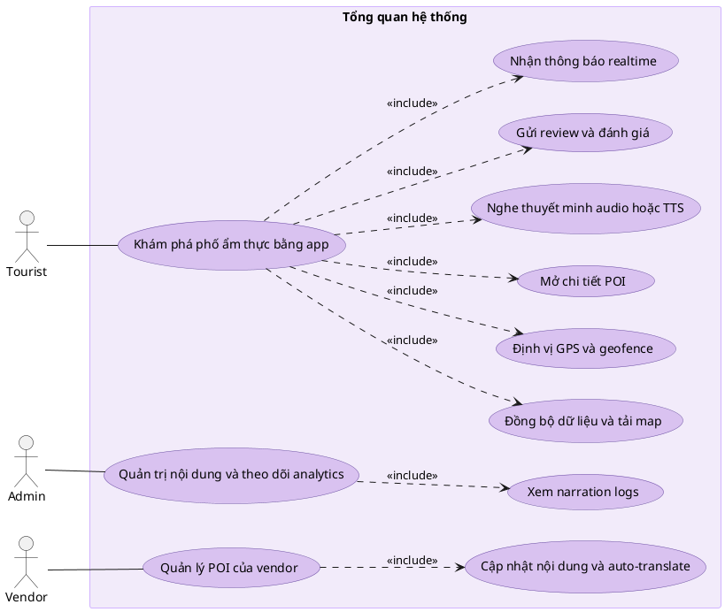

### Sequence Diagram
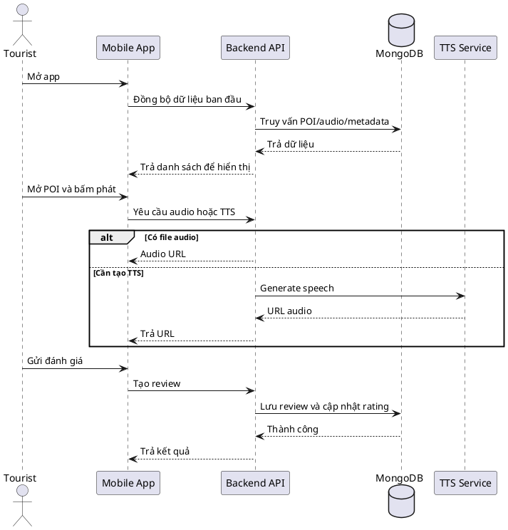

## Sự kiện 1: Khởi động app và đồng bộ dữ liệu

### Đặc tả Use Case

| Trường | Nội dung |
|--------|---------|
| **Use Case ID** | F1 |
| **Tên** | Khởi động app và đồng bộ dữ liệu |
| **Tác nhân chính** | Tourist |
| **Tác nhân phụ** | Backend API (POIsController), SQLite local |
| **Kích hoạt** | Tourist mở ứng dụng |
| **Tiền điều kiện** | App đã cài đặt |
| **Hậu điều kiện** | Map hiển thị POI pins; dữ liệu local được cập nhật từ API hoặc dùng từ cache nếu offline |

**Luồng chính:**

| Bước | Tác nhân | Hành động |
|------|----------|-----------|
| 1 | Tourist | Mở app |
| 2 | MainViewModel | Load SQLite cache ngay lập tức → hiển thị map với POI cũ (0ms wait) |
| 3 | Hệ thống | Kiểm tra kết nối mạng |
| 4 | App | `GET /api/POIs/sync?version={lastVersion}` để lấy delta |
| 5 | API | Trả danh sách POI thay đổi từ version đó |
| 6 | App | Merge dữ liệu mới vào SQLite; cập nhật pins trên map |
| 7 | App | Khởi động GPS ForegroundService song song |

**Luồng thay thế — Mất mạng:**

| Bước | Tác nhân | Hành động |
|------|----------|-----------|
| 3a | Hệ thống | Không có kết nối mạng |
| 3b | App | Bỏ qua sync API; hiện badge "⚡ Offline — dữ liệu cũ" |
| 3c | App | Dùng toàn bộ dữ liệu từ SQLite cache |

**Luồng thay thế — Lần đầu cài đặt (cache rỗng):**

| Bước | Tác nhân | Hành động |
|------|----------|-----------|
| 2a | App | SQLite rỗng → hiện loading indicator |
| 4a | App | `GET /api/POIs` không kèm version → download toàn bộ |
| 6a | App | Lưu toàn bộ vào SQLite lần đầu |

**Ngoại lệ:**
- API trả lỗi 5xx → dùng cache, hiện thông báo "Không thể cập nhật dữ liệu".
- SQLite bị lỗi/corrupt → xóa cache, buộc download lại.

### Use Case Diagram
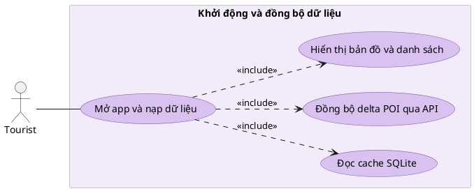

### Sequence Diagram
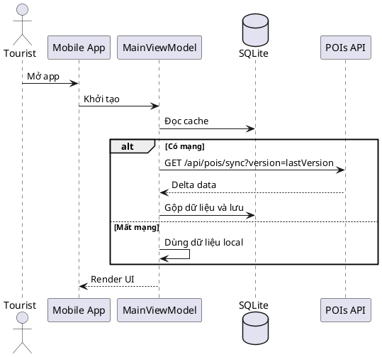

## Sự kiện 2: Cập nhật GPS và geofence

### Đặc tả Use Case

| Trường | Nội dung |
|--------|---------|
| **Use Case ID** | F2 |
| **Tên** | Cập nhật GPS và phát hiện geofence |
| **Tác nhân chính** | Tourist (di chuyển vật lý) |
| **Tác nhân phụ** | GPS Sensor, LocationService, GeofenceService |
| **Kích hoạt** | Có location update từ GPS sensor |
| **Tiền điều kiện** | Quyền vị trí đã được cấp; danh sách POI đã load vào bộ nhớ |
| **Hậu điều kiện** | Active zones và primary zone được cập nhật; event ENTER_ZONE được emit nếu vào zone mới |

**Luồng chính:**

| Bước | Tác nhân | Hành động |
|------|----------|-----------|
| 1 | GPS Sensor | Cập nhật vị trí mới (throttle 5 giây) |
| 2 | LocationService | Nhận `OnLocationChangedAsync(lat, lng)` |
| 3 | GeofenceService | Heartbeat loop 1 giây: tính Haversine(user, poi) cho mỗi POI |
| 4 | GeofenceService | Phát hiện distance ≤ geofence_radius (30m) |
| 5 | GeofenceService | Debounce 3 giây: GPS phải confirm ENTER liên tục |
| 6 | GeofenceService | Kiểm tra cooldown 5 phút per zone |
| 7 | GeofenceService | Emit `OnActiveZonesChanged` + `OnPrimaryZoneChanged` |
| 8 | MainViewModel | Nhận event → trigger F4 (phát audio) |

**Luồng thay thế — Nhiều zone overlap:**

| Bước | Tác nhân | Hành động |
|------|----------|-----------|
| 4a | GeofenceService | Nhiều POI trong bán kính cùng lúc |
| 4b | GeofenceService | Sort theo `audio_priority` (thấp = ưu tiên cao hơn) |
| 4c | GeofenceService | Chỉ emit event cho POI có priority cao nhất |

**Luồng thay thế — Thoát khỏi zone:**

| Bước | Tác nhân | Hành động |
|------|----------|-----------|
| 4a | GeofenceService | distance > geofence_radius + hysteresis |
| 4b | GeofenceService | Emit `EXIT_ZONE` sau debounce |
| 4c | App | Dừng audio đang phát cho zone đó |

**Ngoại lệ:**
- GPS signal mất → giữ nguyên vị trí cuối, không trigger zone mới.
- Accuracy GPS > 50m → bỏ qua update, log cảnh báo.
- Quyền vị trí bị thu hồi → dừng service, hiện thông báo yêu cầu quyền.

### Use Case Diagram
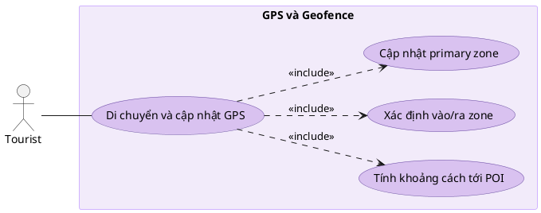

### Sequence Diagram
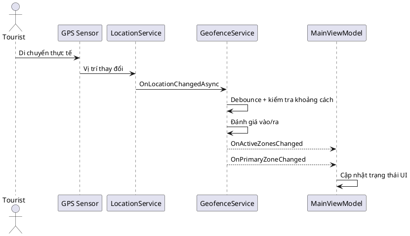

## Sự kiện 3: Mở chi tiết POI

### Đặc tả Use Case

| Trường | Nội dung |
|--------|---------|
| **Use Case ID** | F3 |
| **Tên** | Mở và xem chi tiết điểm ẩm thực (POI) |
| **Tác nhân chính** | Tourist |
| **Tác nhân phụ** | POIsController, MenuItemsController, ReviewsController |
| **Kích hoạt** | Tourist tap vào POI pin trên map hoặc chọn từ danh sách |
| **Tiền điều kiện** | POI tồn tại trong hệ thống hoặc SQLite cache |
| **Hậu điều kiện** | Trang chi tiết hiển thị đầy đủ: tên, mô tả, menu, review, nút phát audio |

**Luồng chính:**

| Bước | Tác nhân | Hành động |
|------|----------|-----------|
| 1 | Tourist | Tap vào POI pin hoặc item trong list |
| 2 | App | Navigate đến `POIDetailPage(poiId)` |
| 3 | POIDetailViewModel | Load nội dung POI từ SQLite cache theo ngôn ngữ hiện tại |
| 4 | App | Song song: `GET /api/MenuItems?poiId={id}` và `GET /api/Reviews?poiId={id}` |
| 5 | App | Render: hình ảnh gallery, tên, mô tả localized, menu items, điểm rating |
| 6 | Tourist | Xem nội dung; tap ❤️ (yêu thích), 🎵 (nghe audio), 📤 (chia sẻ) |

**Luồng thay thế — Offline, không có cache:**

| Bước | Tác nhân | Hành động |
|------|----------|-----------|
| 3a | App | Không có dữ liệu trong cache và không có mạng |
| 3b | App | Hiện thông báo "Không thể tải chi tiết khi offline" |

**Ngoại lệ:**
- API lỗi khi load menu/review → hiển thị phần nội dung chính, ẩn section bị lỗi.
- Hình ảnh không tải được → dùng placeholder image.

### Use Case Diagram
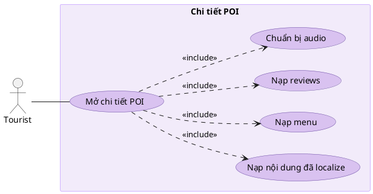

### Sequence Diagram
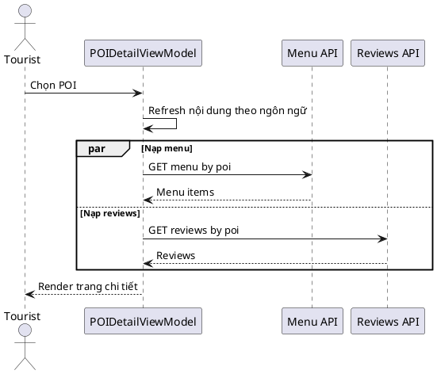

## Sự kiện 4: Phát audio với fallback nhiều tầng

### Đặc tả Use Case

| Trường | Nội dung |
|--------|---------|
| **Use Case ID** | F4 |
| **Tên** | Phát thuyết minh audio với fallback 4 tầng |
| **Tác nhân chính** | Tourist (tap nút phát) hoặc Hệ thống (auto từ geofence F2) |
| **Tác nhân phụ** | AudioService, AudioCacheService, TTSController |
| **Kích hoạt** | Nhấn nút Phát **hoặc** sự kiện ENTER_ZONE từ geofence |
| **Tiền điều kiện** | Có POI ID và ngôn ngữ hiện tại của người dùng |
| **Hậu điều kiện** | Audio được phát thành công qua một trong 4 tầng; NarrationLog được ghi |

**Luồng chính — 4 tầng fallback:**

| Bước | Tác nhân | Hành động |
|------|----------|-----------|
| 1 | App | AudioService nhận yêu cầu phát (poiId, lang) |
| 2 | AudioCacheService | Kiểm tra file trong bộ nhớ cache local |
| **Tầng 1** | AudioCacheService | Có file cache → stream trực tiếp (0ms latency) ✅ |
| **Tầng 2** | AudioService | Không có cache → `GET /api/Audio/poi/{id}/{lang}` lấy published URL |
| **Tầng 3** | AudioService | Không có published audio → `POST /api/TTS/generate` với text POI |
| **Tầng 4** | AudioService | TTS API thất bại/offline → Native MAUI `TextToSpeech.SpeakAsync()` |
| 3 | App | Ghi NarrationLog sau khi phát xong |

**Luồng thay thế — Đang phát audio khác:**

| Bước | Tác nhân | Hành động |
|------|----------|-----------|
| 1a | AudioService | Phát hiện có audio đang chạy |
| 1b | AudioService | So sánh `audio_priority`: POI mới cao hơn? |
| 1c | Cao hơn | Dừng audio hiện tại → phát audio mới |
| 1d | Thấp hơn | Queue audio mới, đợi audio hiện tại kết thúc |

**Ngoại lệ:**
- Tất cả 4 tầng đều thất bại → log lỗi, hiện icon cảnh báo nhỏ, không crash app.
- File audio corrupt → xóa khỏi cache, thử lại từ Tầng 2.

### Use Case Diagram
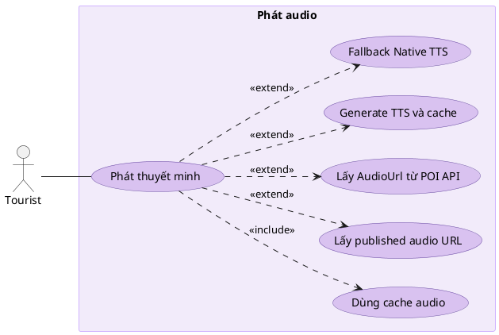

### Sequence Diagram
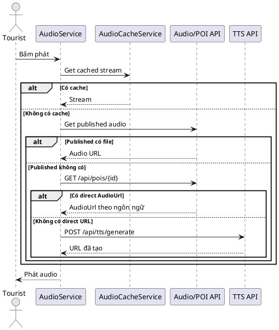

## Sự kiện 5: Generate TTS ở backend

### Đặc tả Use Case

| Trường | Nội dung |
|--------|---------|
| **Use Case ID** | F5 |
| **Tên** | Tạo file audio TTS từ văn bản tại backend |
| **Tác nhân chính** | Mobile App hoặc Web Admin/Vendor |
| **Tác nhân phụ** | TTSController, TtsTextPreprocessor, tts_wrapper.py (Edge-TTS) |
| **Kích hoạt** | `POST /api/TTS/generate` được gọi |
| **Tiền điều kiện** | Text hợp lệ; Python runtime và edge-tts đã cài đặt |
| **Hậu điều kiện** | File MP3 được tạo trong `/uploads/audio/`; trả về audioUrl |

**Luồng chính:**

| Bước | Tác nhân | Hành động |
|------|----------|-----------|
| 1 | Client | `POST /api/TTS/generate` `{ text, language, voice? }` |
| 2 | TtsTextPreprocessor | Chuẩn hóa text: loại ký tự đặc biệt, số → chữ, viết tắt → đầy đủ |
| 3 | TTSController | Kiểm tra cache: `MD5(text:lang).mp3` đã tồn tại? |
| 4a | Cache HIT | Trả URL file đã có, header `X-Cache: HIT` (0ms) |
| 4b | Cache MISS | Gọi `tts_wrapper.py --text "..." --lang vi --voice {voice}` |
| 5 | tts_wrapper.py | Edge-TTS synthesize → xuất file MP3 tạm |
| 6 | TTSController | Move file về `/uploads/audio/`, lưu metadata |
| 7 | TTSController | Trả `{ audioUrl, duration, voice, cached: false }` |

**Luồng thay thế — Text quá dài:**

| Bước | Tác nhân | Hành động |
|------|----------|-----------|
| 2a | TtsTextPreprocessor | Text vượt giới hạn ký tự |
| 2b | TTSController | Tự động cắt thành các segment → tạo nhiều file → ghép lại |

**Ngoại lệ:**
- Python runtime không tìm thấy → `503 Service Unavailable`.
- Edge-TTS timeout → retry 1 lần → nếu vẫn lỗi → `500` với message rõ ràng.

### Use Case Diagram
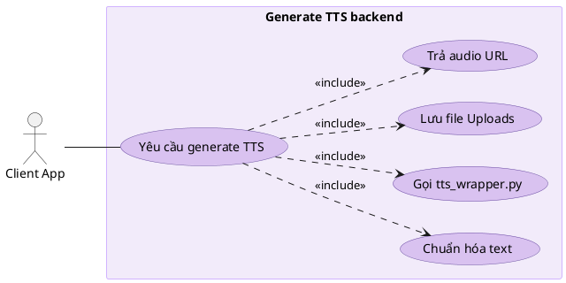

### Sequence Diagram
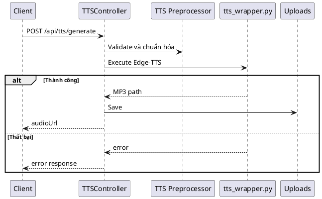

## Sự kiện 6: Đăng nhập và cấp JWT

### Đặc tả Use Case

| Trường | Nội dung |
|--------|---------|
| **Use Case ID** | F6 |
| **Tên** | Đăng nhập và cấp JWT token |
| **Tác nhân chính** | Admin, Vendor, Tourist |
| **Tác nhân phụ** | AuthController, ASP.NET Identity, JWT Service |
| **Kích hoạt** | User submit form đăng nhập |
| **Tiền điều kiện** | Tài khoản đã tồn tại và không bị khóa |
| **Hậu điều kiện** | JWT token hợp lệ được cấp; client lưu token để dùng cho các API request tiếp theo |

**Luồng chính:**

| Bước | Tác nhân | Hành động |
|------|----------|-----------|
| 1 | User | Nhập email và password trên form đăng nhập |
| 2 | Client | `POST /api/Auth/login` `{ email, password }` |
| 3 | AuthController | Gọi `SignInManager.CheckPasswordSignInAsync()` |
| 4 | Identity | Verify credentials + kiểm tra tài khoản không bị lock |
| 5 | AuthController | Lấy roles của user từ Identity |
| 6 | TokenService | Tạo JWT có claims: userId, email, roles, expiry |
| 7 | AuthController | Trả `{ token, expiresIn, profile: { id, email, role } }` |
| 8 | Client Web | Lưu token vào cookie `auth_token` (httpOnly) |
| 8 | Client Mobile | Lưu token vào SecureStorage |

**Luồng thay thế — Sai mật khẩu:**

| Bước | Tác nhân | Hành động |
|------|----------|-----------|
| 4a | Identity | Credentials không khớp → `401 Unauthorized` |
| 4b | Client | Hiện thông báo "Email hoặc mật khẩu không đúng" |

**Luồng thay thế — Tài khoản bị khóa:**

| Bước | Tác nhân | Hành động |
|------|----------|-----------|
| 4a | Identity | Tài khoản bị lock → `403 Forbidden` |
| 4b | Client | Hiện thông báo "Tài khoản đã bị khóa, liên hệ Admin" |

**Ngoại lệ:**
- Token hết hạn khi đang dùng → `POST /api/Auth/refresh` để lấy token mới.

### Use Case Diagram
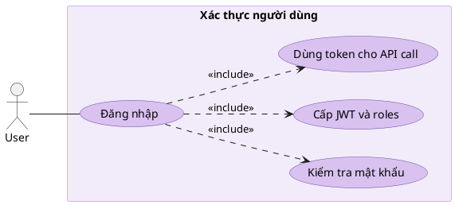

### Sequence Diagram
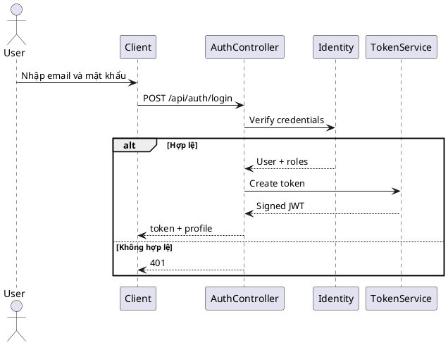

## Sự kiện 7: Gửi review và đánh giá POI (khong co lam cai nay)

### Đặc tả Use Case

| Trường | Nội dung |
|--------|---------|
| **Use Case ID** | F7 |
| **Tên** | Gửi review và cập nhật rating POI |
| **Tác nhân chính** | Tourist |
| **Tác nhân phụ** | ReviewsController, POIs DB, Reviews DB |
| **Kích hoạt** | Tourist submit form review trên POIDetailPage |
| **Tiền điều kiện** | POI tồn tại và hợp lệ |
| **Hậu điều kiện** | Review được lưu vào DB; avg_rating của POI được tính lại |
| **Ghi chú** | Chức năng này đã có model/controller nhưng chưa hoàn chỉnh UI mobile |

**Luồng chính:**

| Bước | Tác nhân | Hành động |
|------|----------|-----------|
| 1 | Tourist | Mở form review, chọn số sao (1–5), nhập nhận xét |
| 2 | App | `POST /api/Reviews` `{ poiId, rating, comment }` |
| 3 | ReviewsController | Validate POI tồn tại |
| 4 | ReviewsController | Lưu Review document vào Reviews collection |
| 5 | ReviewsController | Tính lại `avg_rating` và `num_reviews` cho POI |
| 6 | ReviewsController | Update POI document |
| 7 | API | Trả `201 Created` với review vừa tạo |
| 8 | App | Hiện thông báo "Cảm ơn đánh giá của bạn!" |

**Luồng thay thế — Chưa đăng nhập:**

| Bước | Tác nhân | Hành động |
|------|----------|-----------|
| 2a | API | Chưa có token → `401 Unauthorized` |
| 2b | App | Hiện dialog "Đăng nhập để gửi đánh giá" |

**Ngoại lệ:**
- Tourist đã review POI này trước đó → cho phép cập nhật review (update, không tạo mới).

### Use Case Diagram
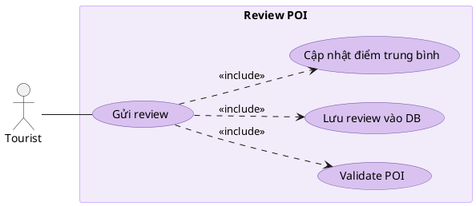

### Sequence Diagram
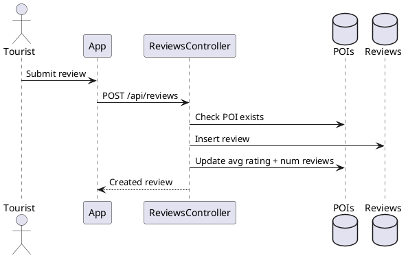

## Sự kiện 8: Nhận thông báo theo polling sidebar (không dùng SignalR)

### Đặc tả Use Case

| Trường | Nội dung |
|--------|---------|
| **Use Case ID** | F8 |
| **Tên** | Nhận thông báo trong sidebar qua polling API |
| **Tác nhân chính** | Admin, Vendor (web portal) |
| **Tác nhân phụ** | `NotificationsController`, collection `app_notifications`, `sidebar.js` |
| **Kích hoạt** | Trang web khởi tạo sidebar hoặc đến chu kỳ poll kế tiếp |
| **Tiền điều kiện** | User đã đăng nhập, có JWT hợp lệ và role Admin/Vendor |
| **Hậu điều kiện** | Danh sách thông báo và badge sidebar được cập nhật theo role/vendor |

**Luồng chính:**

| Bước | Tác nhân | Hành động |
|------|----------|-----------|
| 1 | Admin/Vendor | Mở trang web có sidebar |
| 2 | `sidebar.js` | Gọi `GET /api/Notifications/sidebar?limit=20` |
| 3 | API | Xác định audience filter theo role (`admin`/`vendor`) và `AudienceVendorId` |
| 4 | API | Query `app_notifications`, sort giảm dần theo thời gian |
| 5 | API | Map dữ liệu về DTO hiển thị sidebar |
| 6 | Web | Render feed + badge unread |
| 7 | `sidebar.js` | Lên lịch poll tiếp: 10 giây (tab visible), 30 giây (tab hidden) |
| 8 | Web | Trigger refresh lại khi focus/online/manual refresh |

**Luồng thay thế — Refresh thủ công:**

| Bước | Tác nhân | Hành động |
|------|----------|-----------|
| 2a | User | Nhấn nút refresh trong panel thông báo |
| 2b | Web | Gọi lại `GET /api/Notifications/sidebar` ngay lập tức |

**Ngoại lệ:**
- API lỗi/mất mạng tạm thời → sidebar giữ dữ liệu cũ và hiển thị trạng thái "Không tải được thông báo".
- Vendor chưa bind được `VendorId` theo user hiện tại → chỉ nhận thông báo chung (không có `AudienceVendorId` cụ thể).

### Use Case Diagram
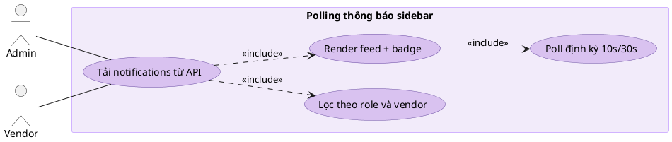

### Sequence Diagram
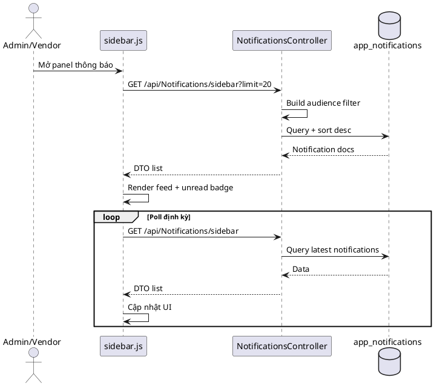

### Activity Diagram
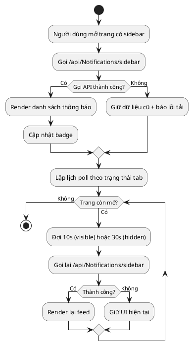

## Sự kiện 9: Vendor quản lý danh sách POI

### Đặc tả Use Case

| Trường | Nội dung |
|--------|---------|
| **Use Case ID** | F9 |
| **Tên** | Vendor xem và lọc danh sách POI của mình |
| **Tác nhân chính** | Vendor |
| **Tác nhân phụ** | POIsController, VendorProfile DB |
| **Kích hoạt** | Vendor mở trang POI list trên web portal |
| **Tiền điều kiện** | Vendor đã đăng nhập; VendorProfile đã được Admin verify (status = approved) |
| **Hậu điều kiện** | Danh sách POI được lọc chính xác theo VendorId của người dùng |

**Luồng chính:**

| Bước | Tác nhân | Hành động |
|------|----------|-----------|
| 1 | Vendor | Mở `/poi-list.html` |
| 2 | Web | `GET /api/Vendors/me` để lấy thông tin VendorProfile |
| 3 | Web | `GET /api/POIs?vendorId={id}` lấy POI của vendor này |
| 4 | API | Tự động scope query theo VendorId từ JWT claims |
| 5 | Web | Render danh sách với filter reviewStatus (all/pending/approved) |
| 6 | Vendor | Click vào POI để xem chi tiết, sửa hoặc quản lý audio |

**Luồng thay thế — Vendor pending (chưa được duyệt):**

| Bước | Tác nhân | Hành động |
|------|----------|-----------|
| 2a | API | VendorProfile có status = pending |
| 2b | Web | Hiện banner "Hồ sơ của bạn đang chờ Admin xét duyệt" |
| 2c | Web | Ẩn nút "Tạo POI mới" |

**Ngoại lệ:**
- VendorProfile không tồn tại → redirect về trang tạo hồ sơ vendor.

### Use Case Diagram
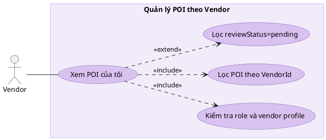

### Sequence Diagram
```plantuml
@startuml
actor Vendor as V
participant "Vendor Portal" as Web
participant POIsController as POI
database "VendorProfile DB" as VP
database "POIs DB" as DB

V -> Web: Open POI list
Web -> POI: GET /api/pois?reviewStatus=...
POI -> VP: Resolve profile by claims
POI -> DB: Query by VendorId + filters
DB --> POI: Result set
POI --> Web: Paginated POIs
@enduml
```

## Sự kiện 10: Auto-translate nội dung POI

### Đặc tả Use Case

| Trường | Nội dung |
|--------|---------|
| **Use Case ID** | F10 |
| **Tên** | Tự động dịch nội dung POI sang nhiều ngôn ngữ |
| **Tác nhân chính** | Admin, Vendor |
| **Tác nhân phụ** | AutoTranslateController, Translation Engine |
| **Kích hoạt** | Nhấn nút "Auto-translate" trên form POI edit |
| **Tiền điều kiện** | POI có nội dung text nguồn (tiếng Việt) hợp lệ |
| **Hậu điều kiện** | Map `{language: translatedText}` được trả về, có thể áp dụng vào form |

**Luồng chính:**

| Bước | Tác nhân | Hành động |
|------|----------|-----------|
| 1 | User | Click "Auto-translate" trên POI form |
| 2 | Web | `POST /api/AutoTranslate` `{ sourceText, targetLanguages: ["en","zh","ja","ko"] }` |
| 3 | AutoTranslateController | Validate input; loop qua từng ngôn ngữ đích |
| 4 | Controller | Gọi translation service cho mỗi ngôn ngữ |
| 5 | Controller | Trả `{ "en": "...", "zh": "...", "ja": "...", "ko": "..." }` |
| 6 | Web | Điền kết quả vào các field ngôn ngữ tương ứng |
| 7 | User | Review và điều chỉnh thủ công nếu cần trước khi lưu |

**Ngoại lệ:**
- Translation service lỗi cho 1 ngôn ngữ → trả partial result, báo lỗi riêng từng ngôn ngữ.

### Use Case Diagram
```plantuml
@startuml
left to right direction
skinparam actorStyle stick
skinparam usecase {
  BackgroundColor #D9C2F0
  BorderColor #6B4FA2
}
skinparam rectangle {
  BackgroundColor #F2EBFA
  BorderColor #D1B3FF
}

actor "Admin hoặc Vendor" as User

rectangle "Auto-translate nội dung" {
  usecase "Yêu cầu auto-translate" as UC1
  usecase "Duyệt target languages" as UC2
  usecase "Gọi dịch vụ dịch" as UC3
  usecase "Trả kết quả theo ngôn ngữ" as UC4
}

User -- UC1
UC1 ..> UC2 : <<include>>
UC1 ..> UC3 : <<include>>
UC1 ..> UC4 : <<include>>
@enduml
```

### Sequence Diagram
```plantuml
@startuml
actor "Admin hoặc Vendor" as U
participant "Web Client" as C
participant AutoTranslateController as AT
participant "Translate Endpoint" as GT

U -> C: Click auto-translate
C -> AT: POST /api/autotranslate
loop Mỗi ngôn ngữ đích
  AT -> GT: Translate text
  GT --> AT: Translated text
end
AT --> C: Map language -> text
@enduml
```

## Sự kiện 11: Xem analytics narration logs

### Đặc tả Use Case

| Trường | Nội dung |
|--------|---------|
| **Use Case ID** | F11 |
| **Tên** | Xem và phân tích narration logs |
| **Tác nhân chính** | Admin |
| **Tác nhân phụ** | AnalyticsController, NarrationLogs DB, POIs DB |
| **Kích hoạt** | Admin mở trang analytics |
| **Tiền điều kiện** | Admin đã đăng nhập; có dữ liệu narration logs trong hệ thống |
| **Hậu điều kiện** | Dữ liệu logs được hiển thị theo filter với tên POI đã map, hỗ trợ phân trang |

**Luồng chính:**

| Bước | Tác nhân | Hành động |
|------|----------|-----------|
| 1 | Admin | Mở trang analytics, chọn filter (POI, ngày, ngôn ngữ) |
| 2 | Web | `GET /api/Analytics/narration-logs?poiId=&dateFrom=&dateTo=&page=` |
| 3 | AnalyticsController | Query NarrationLogs DB với filter + pagination |
| 4 | AnalyticsController | Resolve POI names từ POIs DB |
| 5 | API | Trả DTO list đầy đủ |
| 6 | Web | Render bảng dữ liệu và biểu đồ thống kê |

**Ngoại lệ:**
- Không có dữ liệu cho filter đó → hiện "Không có dữ liệu trong khoảng thời gian này".

### Use Case Diagram
```plantuml
@startuml
left to right direction
skinparam actorStyle stick
skinparam usecase {
  BackgroundColor #D9C2F0
  BorderColor #6B4FA2
}
skinparam rectangle {
  BackgroundColor #F2EBFA
  BorderColor #D1B3FF
}

actor Admin

rectangle "Analytics narration" {
  usecase "Xem narration logs" as UC1
  usecase "Lọc theo POI/user/date" as UC2
  usecase "Map thêm tên POI" as UC3
  usecase "Hiển thị bảng và chart" as UC4
}

Admin -- UC1
UC1 ..> UC2 : <<include>>
UC1 ..> UC3 : <<include>>
UC1 ..> UC4 : <<include>>
@enduml
```

### Sequence Diagram
```plantuml
@startuml
actor Admin as A
participant Dashboard as D
participant AnalyticsController as An
database "NarrationLogs DB" as L
database "POIs DB" as P

A -> D: Open analytics page
D -> An: GET /api/analytics/narration-logs
An -> L: Query filters + paging
An -> P: Resolve POI names
An --> D: DTO list
D --> A: Render table/charts
@enduml
```

## Sự kiện 12: Xử lý QR landing + deeplink vào POI/Tour

### Đặc tả Use Case

| Trường | Nội dung |
|--------|---------|
| **Use Case ID** | F12 |
| **Tên** | Mở đúng màn hình từ QR code (qua landing web + deeplink app) |
| **Tác nhân chính** | Tourist |
| **Tác nhân phụ** | `Program.cs` (`/qr/{**deepPath}`), `QrDeepLinkManager`, MainActivity |
| **Kích hoạt** | Tourist quét QR link dạng `https://<host>/qr/...` hoặc mở trực tiếp deeplink |
| **Tiền điều kiện** | App đã cài đặt; link hợp lệ và chưa hết hạn |
| **Hậu điều kiện** | App mở đúng đích POI/Tour/Main; nếu chưa cài app thì được dẫn về trang tải APK |

**Luồng chính:**

| Bước | Tác nhân | Hành động |
|------|----------|-----------|
| 1 | Tourist | Quét QR |
| 2 | Browser | Mở URL `GET /qr/{deepPath}?...` |
| 3 | Backend | Tạo app link `streetfood://qr/{deepPath}{query}` + kiểm tra `exp/expires` |
| 4 | Backend | Trả HTML landing page có nút mở app + fallback tải APK |
| 5 | Landing JS | Tự động thử mở deeplink app; đồng thời lên lịch fallback |
| 6 | Android OS | Nếu app có cài, Intent chuyển vào MainActivity |
| 7 | QrDeepLinkManager | `SavePending(rawUrl)` rồi parse payload (`poiId`/`tourId`/`main`) |
| 8 | MainPage | `ConsumePending()` khi app ready |
| 9a | POI link | Navigate đến POI chi tiết |
| 9b | Tour link | Navigate đến tour tương ứng |
| 9c | Main link | Mở MainPage/Explore |

**Luồng thay thế — Link hết hạn:**

| Bước | Tác nhân | Hành động |
|------|----------|-----------|
| 3a | Backend | QR đã hết hạn |
| 3b | Landing | Hiện trạng thái "QR đã hết hạn", khóa nút mở app |
| 3c | User | Quét lại mã mới tại điểm đến |

**Luồng thay thế — Chưa cài app hoặc mở app thất bại:**

| Bước | Tác nhân | Hành động |
|------|----------|-----------|
| 6a | Landing JS | Sau ~2.2s không chuyển app thành công |
| 6b | Browser | Redirect sang `apk-download.html` |
| 6c | Tourist | Cài app rồi quét lại QR |

**Ngoại lệ:**
- App chưa load xong khi nhận deeplink → payload được queue trong Preferences, xử lý sau khi MainPage ready.
- Payload thiếu đích (`poi/tour/main`) hoặc sai format → app báo "Mã QR không hợp lệ".

### Use Case Diagram
```plantuml
@startuml
left to right direction
skinparam actorStyle stick
skinparam usecase {
  BackgroundColor #D9C2F0
  BorderColor #6B4FA2
}
skinparam rectangle {
  BackgroundColor #F2EBFA
  BorderColor #D1B3FF
}

actor Tourist

rectangle "QR Landing + Deeplink" {
  usecase "Mở landing /qr" as UC1
  usecase "Kiểm tra hạn QR" as UC2
  usecase "Mở deeplink app" as UC3
  usecase "Fallback tải APK" as UC4
  usecase "Route vào POI/Tour/Main" as UC5
}

Tourist -- UC1
UC1 ..> UC2 : <<include>>
UC1 ..> UC3 : <<include>>
UC1 ..> UC4 : <<extend>>
UC3 ..> UC5 : <<include>>
@enduml
```

### Sequence Diagram
```plantuml
@startuml
actor Tourist as U
participant Browser as B
participant "Program.cs /qr" as QR
participant "Landing JS" as JS
participant MainActivity as MA
participant QrDeepLinkManager as Q
participant MainPage as MP

U -> B: Quét QR
B -> QR: GET /qr/{deepPath}?exp=...
QR -> QR: Build streetfood://qr/... + check expiry
QR --> B: HTML landing

alt QR còn hạn
  B -> JS: Auto open deeplink
  JS -> MA: Launch streetfood://qr/...
  MA -> Q: SavePending(rawUrl)
  MP -> Q: ConsumePending()
  Q --> MP: Payload (poi/tour/main)
  MP -> MP: Navigate đúng màn hình
else QR hết hạn
  B -> B: Hiển thị thông báo hết hạn
end

alt App không mở được
  JS -> B: Redirect apk-download.html
end
@enduml
```

### Activity Diagram
```plantuml
@startuml
start
:Người dùng quét QR;
:Mở /qr/{deepPath};
:Backend kiểm tra hạn QR;

if (QR còn hạn?) then (Có)
  :Render landing + auto open app;
  if (App mở thành công?) then (Có)
    :Queue deep link;
    :MainPage consume payload;
    :Đi tới POI/Tour/Main;
  else (Không)
    :Redirect trang tải APK;
  endif
else (Không)
  :Hiện trạng thái QR hết hạn;
endif

stop
@enduml
```

## Sự kiện 13: Admin đăng nhập web và truy cập trang bảo vệ

### Đặc tả Use Case

| Trường | Nội dung |
|--------|---------|
| **Use Case ID** | F13 |
| **Tên** | Admin đăng nhập web portal và truy cập trang bảo vệ |
| **Tác nhân chính** | Admin |
| **Tác nhân phụ** | AuthController, Auth Middleware (cookie guard trong Program.cs) |
| **Kích hoạt** | Admin truy cập URL trang quản trị hoặc submit form đăng nhập |
| **Tiền điều kiện** | Tài khoản Admin hợp lệ, không bị khóa |
| **Hậu điều kiện** | Cookie `auth_token` được set; Admin truy cập được dashboard và các trang bảo vệ |

**Luồng chính:**

| Bước | Tác nhân | Hành động |
|------|----------|-----------|
| 1 | Admin | Truy cập `/admin-dashboard.html` lần đầu |
| 2 | Auth Middleware | Kiểm tra cookie `auth_token` — chưa có → redirect về `/index.html` (login) |
| 3 | Admin | Nhập email/password tại trang đăng nhập |
| 4 | Web JS | `POST /api/Auth/login` |
| 5 | AuthController | Verify credentials; kiểm tra role = Admin |
| 6 | Web JS | Nhận JWT; `document.cookie = "auth_token=..."` (7 ngày) |
| 7 | Admin | Truy cập lại `/admin-dashboard.html` |
| 8 | Auth Middleware | Validate cookie JWT → cho phép serve HTML |

**Ngoại lệ:**
- Token hết hạn khi đang dùng web → `api.js` tự động gọi `POST /api/Auth/refresh`.
- Role không phải Admin → middleware chặn, redirect về login.

### Use Case Diagram
```plantuml
@startuml
left to right direction
skinparam actorStyle stick
skinparam usecase {
  BackgroundColor #D9C2F0
  BorderColor #6B4FA2
}
skinparam rectangle {
  BackgroundColor #F2EBFA
  BorderColor #D1B3FF
}

actor Admin

rectangle "Đăng nhập web Admin" {
  usecase "Đăng nhập web portal" as UC1
  usecase "Nhận JWT và lưu auth cookie" as UC2
  usecase "Truy cập admin-dashboard" as UC3
  usecase "Middleware validate token" as UC4
}

Admin -- UC1
UC1 ..> UC2 : <<include>>
UC1 ..> UC3 : <<include>>
UC3 ..> UC4 : <<include>>
@enduml
```

### Sequence Diagram
```plantuml
@startuml
actor Admin as A
participant "Login Page" as Web
participant AuthController as Auth
participant Identity as Id
participant "Auth Middleware" as MW

A -> Web: Submit email/password
Web -> Auth: POST /api/auth/login
Auth -> Id: Verify credentials + role
Id --> Auth: Valid admin
Auth --> Web: JWT token
Web -> Web: Set auth_token cookie
A -> Web: Open /admin-dashboard
Web -> MW: Request protected html
MW --> Web: Allow access
@enduml
```

## Sự kiện 14: Admin duyệt hồ sơ Vendor

### Đặc tả Use Case

| Trường | Nội dung |
|--------|---------|
| **Use Case ID** | F14 |
| **Tên** | Admin kiểm duyệt hồ sơ đăng ký Vendor |
| **Tác nhân chính** | Admin |
| **Tác nhân phụ** | VendorsController, NotificationService |
| **Kích hoạt** | Admin mở trang duyệt vendor trên `/vendors-list.html` |
| **Tiền điều kiện** | Admin đã đăng nhập; có ít nhất 1 VendorProfile trạng thái pending |
| **Hậu điều kiện** | Hồ sơ vendor được approve (có thể tạo POI) hoặc reject; Vendor nhận thông báo |

**Luồng chính:**

| Bước | Tác nhân | Hành động |
|------|----------|-----------|
| 1 | Admin | Mở `/vendors-list.html`, lọc status = pending |
| 2 | Web | `GET /api/Vendors?status=pending` |
| 3 | API | Trả danh sách VendorProfile chờ duyệt |
| 4 | Admin | Xem chi tiết hồ sơ (tên, mô tả quán, liên hệ) |
| 5 | Admin | Nhấn Approve hoặc Reject |
| 6 | Web | `PUT /api/Vendors/{vendorId}/status` `{ status: "approved"/"rejected" }` |
| 7 | API | Cập nhật `isVerified` trong VendorProfile |
| 8 | NotificationService | Gửi thông báo kết quả cho Vendor |

**Ngoại lệ:**
- Vendor đã xóa tài khoản → API trả `404`; web hiện "Hồ sơ không còn tồn tại".

### Use Case Diagram
```plantuml
@startuml
left to right direction
skinparam actorStyle stick
skinparam usecase {
  BackgroundColor #D9C2F0
  BorderColor #6B4FA2
}
skinparam rectangle {
  BackgroundColor #F2EBFA
  BorderColor #D1B3FF
}

actor Admin

rectangle "Duyệt hồ sơ Vendor" {
  usecase "Xem danh sách vendor pending" as UC1
  usecase "Xem chi tiết hồ sơ vendor" as UC2
  usecase "Approve hoặc reject" as UC3
  usecase "Cập nhật verification status" as UC4
}

Admin -- UC1
UC1 ..> UC2 : <<include>>
UC1 ..> UC3 : <<include>>
UC3 ..> UC4 : <<include>>
@enduml
```

### Sequence Diagram
```plantuml
@startuml
actor Admin as A
participant "Admin Vendor Page" as Web
participant VendorsController as VC
database "VendorProfile DB" as DB
participant NotificationService as N

A -> Web: Open vendor approvals
Web -> VC: GET vendors pending list
VC -> DB: Query pending profiles
DB --> VC: Pending vendors
VC --> Web: Render list
A -> Web: Approve/Reject vendor
Web -> VC: Update verification status
VC -> DB: Save status
VC -> N: Trigger vendor notification
@enduml
```

## Sự kiện 15: Admin duyệt nội dung POI pending

### Đặc tả Use Case

| Trường | Nội dung |
|--------|---------|
| **Use Case ID** | F15 |
| **Tên** | Admin kiểm duyệt nội dung POI từ Vendor |
| **Tác nhân chính** | Admin |
| **Tác nhân phụ** | `POIsController`, `VendorProfiles`, `ServiceSubmissions` |
| **Kích hoạt** | Admin lọc POI có `reviewStatus = pending` trên trang POI list |
| **Tiền điều kiện** | Admin đã đăng nhập; có POI đang chờ duyệt |
| **Hậu điều kiện** | POI được publish (active) hoặc reject; Vendor nhận thông báo kết quả |

**Luồng chính:**

| Bước | Tác nhân | Hành động |
|------|----------|-----------|
| 1 | Admin | Mở `/poi-list.html`, chọn tab "Chờ duyệt" |
| 2 | Web | `GET /api/POIs?reviewStatus=pending` |
| 3 | Web | Hiển thị danh sách POI pending kèm preview nội dung |
| 4 | Admin | Xem chi tiết, so sánh nội dung mới với nội dung cũ |
| 5 | Admin | Nhấn Approve hoặc Reject |
| 6 | Web | `POST /api/POIs/{id}/review` `{ approve: true/false, reason? }` |
| 7 | API | Cập nhật `reviewStatus`, `isActive` của POI |
| 8 | NotificationService | Notify Vendor kết quả duyệt |

**Luồng thay thế — Reject với lý do:**

| Bước | Tác nhân | Hành động |
|------|----------|-----------|
| 5a | Admin | Nhấn Reject, nhập lý do từ chối |
| 6a | Web | Gửi kèm `{ reason: "Nội dung không phù hợp..." }` |
| 8a | NotificationService | Notify Vendor kèm lý do từ chối |

**Ngoại lệ:**
- POI không còn tồn tại → `404`; web xóa item khỏi danh sách pending.

### Use Case Diagram
```plantuml
@startuml
left to right direction
skinparam actorStyle stick
skinparam usecase {
  BackgroundColor #D9C2F0
  BorderColor #6B4FA2
}
skinparam rectangle {
  BackgroundColor #F2EBFA
  BorderColor #D1B3FF
}

actor Admin

rectangle "Duyệt nội dung POI" {
  usecase "Xem POI pending review" as UC1
  usecase "So sánh nội dung cũ/mới" as UC2
  usecase "Approve publish hoặc reject" as UC3
  usecase "Ghi nhận kết quả duyệt" as UC4
}

Admin -- UC1
UC1 ..> UC2 : <<include>>
UC1 ..> UC3 : <<include>>
UC3 ..> UC4 : <<include>>
@enduml
```

### Sequence Diagram
```plantuml
@startuml
actor Admin as A
participant "Admin POI Page" as Web
participant POIsController as POI
database "POIs DB" as DB
participant NotificationService as N

A -> Web: Open pending POI tab
Web -> POI: GET /api/pois?reviewStatus=pending
POI -> DB: Query pending POIs
DB --> POI: Pending list
POI --> Web: Return list
A -> Web: Approve/Reject POI
Web -> POI: Submit moderation decision
POI -> DB: Update status and content
POI -> N: Notify vendor result
@enduml
```

## Sự kiện 16: Vendor tạo bộ audio TTS, Admin duyệt 3 ngôn ngữ

### Đặc tả Use Case

| Trường | Nội dung |
|--------|---------|
| **Use Case ID** | F16 |
| **Tên** | Tạo audio từ text và duyệt theo bộ 3 ngôn ngữ |
| **Tác nhân chính** | Vendor (tạo/gửi duyệt), Admin (duyệt/từ chối) |
| **Tác nhân phụ** | `AudioController`, `AudioContent`, `app_notifications` |
| **Kích hoạt** | Vendor thao tác ở `audio-list`/`audio-bulk-generate`, Admin duyệt tại `audio-list` |
| **Tiền điều kiện** | Vendor đã đăng nhập và còn premium; POI có text để TTS |
| **Hậu điều kiện** | Bộ audio vi/en/zh ở trạng thái `approved` hoặc `rejected`; vendor/admin nhận thông báo tương ứng |

**Luồng chính — Vendor bulk generate + submit duyệt:**

| Bước | Tác nhân | Hành động |
|------|----------|-----------|
| 1 | Vendor | Mở trang bulk generate, chọn POI và ngôn ngữ (mặc định vi/en/zh) |
| 2 | Web | `POST /api/Audio/bulk-generate` `{ poiIds, language, voice }` |
| 3 | API | Tạo/cập nhật AudioContent theo POI+language, sinh file TTS |
| 4 | API | Vendor records ở `draft` (Admin tạo trực tiếp thì auto `approved`) |
| 5 | Vendor | Gửi duyệt: `POST /api/Audio/{id}/submit` |
| 6 | API | Validate đủ 3 ngôn ngữ + có file audio; set cả bộ sang `pending` |
| 7 | API | Tạo thông báo cho Admin trong `app_notifications` |

**Luồng chính — Admin duyệt hoặc từ chối:**

| Bước | Tác nhân | Hành động |
|------|----------|-----------|
| 1a | Admin | Mở danh sách audio pending theo POI |
| 2a | Admin | Duyệt: `POST /api/Audio/{id}/approve` hoặc từ chối: `POST /api/Audio/{id}/reject` |
| 3a | API | Cập nhật trạng thái cả bộ 3 ngôn ngữ và gửi thông báo cho Vendor |

**Luồng thay thế — Upload/replace thủ công:**

| Bước | Tác nhân | Hành động |
|------|----------|-----------|
| 2b | Web | Gọi `POST /api/Audio/upload` hoặc `POST /api/Audio/{id}/replace-file` |
| 3b | API | Trả `410 Gone` (luồng upload thủ công đã tắt) |

**Ngoại lệ:**
- Thiếu 1 trong 3 ngôn ngữ vi/en/zh hoặc thiếu file ở bất kỳ ngôn ngữ nào -> không cho submit duyệt.
- Vendor sửa/xóa bản ghi đã `approved` -> API từ chối.

### Use Case Diagram
```plantuml
@startuml
left to right direction
skinparam actorStyle stick
skinparam usecase {
  BackgroundColor #D9C2F0
  BorderColor #6B4FA2
}
skinparam rectangle {
  BackgroundColor #F2EBFA
  BorderColor #D1B3FF
}

actor Vendor
actor Admin

rectangle "Quản lý audio" {
  usecase "Generate bộ audio vi/en/zh" as UC1
  usecase "Gửi duyệt bộ audio" as UC2
  usecase "Admin duyệt hoặc từ chối" as UC3
  usecase "Gửi thông báo moderation" as UC4
}

Vendor -- UC1
Vendor -- UC2
Admin -- UC3
UC2 ..> UC4 : <<include>>
UC3 ..> UC4 : <<include>>
@enduml
```

### Sequence Diagram
```plantuml
@startuml
actor Vendor as V
actor Admin as A
participant "Audio Web" as Web
participant AudioController as AC
database "AudioContent DB" as DB
database "app_notifications" as N

V -> Web: Bulk generate audio cho POIs
Web -> AC: POST /api/Audio/bulk-generate
AC -> DB: Upsert AudioContent + generate file
AC --> Web: created/skipped/failed

V -> Web: Submit bộ audio
Web -> AC: POST /api/Audio/{id}/submit
AC -> DB: Set status=pending (cả bộ 3 ngôn ngữ)
AC -> N: Insert admin notification
AC --> Web: Submit OK

A -> Web: Approve hoặc Reject
Web -> AC: POST /api/Audio/{id}/approve|reject
AC -> DB: Update status theo quyết định
AC -> N: Insert vendor notification
AC --> Web: Moderation result
@enduml
```

### Activity Diagram
```plantuml
@startuml
start
:Vendor bulk-generate audio;
:Tạo bản ghi draft + file TTS;

if (Đủ 3 ngôn ngữ và đủ file?) then (Có)
  :Vendor submit duyệt;
  :Set pending cho cả bộ;
  :Notify Admin;
  :Admin review;
  if (Approve?) then (Có)
    :Set approved;
    :Notify Vendor kết quả duyệt;
  else (Không)
    :Set rejected + reason;
    :Notify Vendor kết quả từ chối;
  endif
else (Không)
  :Giữ draft/rejected và yêu cầu bổ sung;
endif

stop
@enduml
```

## Sự kiện 17: Vendor tạo hoặc cập nhật POI gửi chờ duyệt

### Đặc tả Use Case

| Trường | Nội dung |
|--------|---------|
| **Use Case ID** | F17 |
| **Tên** | Vendor tạo mới hoặc cập nhật POI gửi Admin duyệt |
| **Tác nhân chính** | Vendor |
| **Tác nhân phụ** | POIsController, NotificationService |
| **Kích hoạt** | Vendor submit form tạo/sửa POI trên web portal |
| **Tiền điều kiện** | Vendor đã verify `approved`; khi tạo mới phải còn premium; có quyền với POI (VendorId match) |
| **Hậu điều kiện** | POI được lưu với trạng thái moderation phù hợp (`pending/approved/rejected` theo nghiệp vụ hiện tại) |

**Luồng chính:**

| Bước | Tác nhân | Hành động |
|------|----------|-----------|
| 1 | Vendor | Mở form tạo POI (`/poi-create.html`) hoặc sửa (`/poi-edit.html`) |
| 2 | Vendor | Điền tên, mô tả (đa ngôn ngữ), tọa độ GPS, giờ mở cửa, giá |
| 3 | Vendor | Upload ảnh: `POST /api/POIs/upload-image` |
| 4 | Vendor | Submit form |
| 5 | Web | `POST /api/POIs` (tạo mới) hoặc `PUT /api/POIs/{id}` (cập nhật) |
| 6 | API | Validate VendorId từ JWT claims match với POI |
| 7 | API | Tạo mới: set `reviewStatus = pending`, `isActive = false` và lưu DB |
| 8 | API | Cập nhật: kiểm tra ownership + trạng thái verify; lưu thay đổi theo rule hiện hành |
| 9 | Vendor | Theo dõi trạng thái qua danh sách POI và chờ Admin xử lý ở F15 |

**Luồng thay thế — Trùng dữ liệu POI khi tạo mới:**

| Bước | Tác nhân | Hành động |
|------|----------|-----------|
| 6a | API | Phát hiện POI tương tự (tên/địa chỉ/vị trí) trong cùng vendor |
| 6b | API | Trả `409 Conflict` với mã `DUPLICATE_POI_SUSPECTED` |

**Ngoại lệ:**
- Vendor cố sửa POI của vendor khác → `403 Forbidden`.
- Vendor chưa verify hoặc chưa có premium khi tạo mới -> `403`/`400` theo rule API.

### Use Case Diagram
```plantuml
@startuml
left to right direction
skinparam actorStyle stick
skinparam usecase {
  BackgroundColor #D9C2F0
  BorderColor #6B4FA2
}
skinparam rectangle {
  BackgroundColor #F2EBFA
  BorderColor #D1B3FF
}

actor Vendor

rectangle "Vendor gửi nội dung POI" {
  usecase "Tạo mới hoặc sửa POI" as UC1
  usecase "Gửi nội dung và media" as UC2
  usecase "Đặt trạng thái pending review" as UC3
  usecase "Theo dõi kết quả duyệt" as UC4
}

Vendor -- UC1
UC1 ..> UC2 : <<include>>
UC1 ..> UC3 : <<include>>
UC1 ..> UC4 : <<include>>
@enduml
```

### Sequence Diagram
```plantuml
@startuml
actor Vendor as V
participant "Vendor POI Form" as Web
participant POIsController as POI
database "POIs DB" as DB
database "VendorProfiles + ServiceSubmissions" as V

V -> Web: Submit create/update POI
Web -> POI: POST hoặc PUT /api/pois
POI -> V: Validate ownership + verify + premium rule
POI -> DB: Save POI theo VendorId + moderation status
DB --> POI: Saved
POI --> Web: Return pending result
@enduml
```

## Sự kiện 18: Admin xem heatmap hành vi du khách

### Đặc tả Use Case

| Trường | Nội dung |
|--------|---------|
| **Use Case ID** | F18 |
| **Tên** | Xem heatmap điểm nóng di chuyển của du khách |
| **Tác nhân chính** | Admin |
| **Tác nhân phụ** | AnalyticsController, NarrationLogs DB, POIs DB |
| **Kích hoạt** | Admin mở trang Heatmap trong dashboard |
| **Tiền điều kiện** | Admin đã đăng nhập; có dữ liệu narration logs trong hệ thống |
| **Hậu điều kiện** | Heatmap hiển thị lớp dữ liệu tương tác theo bộ lọc thời gian và khu vực |

**Luồng chính:**

| Bước | Tác nhân | Hành động |
|------|----------|-----------|
| 1 | Admin | Mở trang heatmap; chọn khoảng thời gian (ngày/tuần/tháng) |
| 2 | Web | `GET /api/Analytics/narration-logs?dateFrom=&dateTo=` |
| 3 | AnalyticsController | Tổng hợp tọa độ tương tác từ NarrationLogs |
| 4 | API | Đối chiếu với POIs DB để lấy tọa độ chính xác |
| 5 | API | Trả tập hợp điểm `[{lat, lng, weight}]` |
| 6 | Web | Render lớp heatmap lên bản đồ Leaflet/MapLibre |
| 7 | Admin | Zoom/pan, đổi filter để xem các khung giờ/khu vực khác nhau |

**Ngoại lệ:**
- Không có dữ liệu trong khoảng thời gian chọn → map rỗng, hiện thông báo hướng dẫn.

### Use Case Diagram
```plantuml
@startuml
left to right direction
skinparam actorStyle stick
skinparam usecase {
  BackgroundColor #D9C2F0
  BorderColor #6B4FA2
}
skinparam rectangle {
  BackgroundColor #F2EBFA
  BorderColor #D1B3FF
}

actor Admin

rectangle "Heatmap hành vi du khách" {
  usecase "Mở màn hình heatmap" as UC1
  usecase "Chọn bộ lọc thời gian/khu vực" as UC2
  usecase "Tổng hợp dữ liệu vị trí và lượt tương tác" as UC3
  usecase "Hiển thị lớp heatmap trên bản đồ" as UC4
}

Admin -- UC1
UC1 ..> UC2 : <<include>>
UC1 ..> UC3 : <<include>>
UC1 ..> UC4 : <<include>>
@enduml
```

### Sequence Diagram
```plantuml
@startuml
actor Admin as A
participant "Heatmap Dashboard" as Web
participant AnalyticsController as An
database "NarrationLogs DB" as L
database "POIs DB" as P

A -> Web: Mở trang heatmap và chọn bộ lọc
Web -> An: Yêu cầu dữ liệu heatmap theo bộ lọc đã chọn
An -> L: Lấy dữ liệu tương tác theo thời gian/khu vực
An -> P: Đối chiếu tọa độ và thông tin POI
An --> Web: Trả tập điểm nóng
Web --> A: Hiển thị lớp heatmap và chú giải
@enduml
```

## Sự kiện 19: Admin xem thống kê tổng quan và báo cáo theo thời gian

### Đặc tả Use Case

| Trường | Nội dung |
|--------|---------|
| **Use Case ID** | F19 |
| **Tên** | Xem thống kê KPI tổng quan và báo cáo theo thời gian |
| **Tác nhân chính** | Admin |
| **Tác nhân phụ** | AnalyticsController (`/overview`, `/top-pois`) |
| **Kích hoạt** | Admin mở trang thống kê tổng quan trong dashboard |
| **Tiền điều kiện** | Admin đã đăng nhập; có dữ liệu logs, reviews, POI, tour |
| **Hậu điều kiện** | Dashboard hiển thị KPI cards, biểu đồ line/bar theo ngày/tuần/tháng và bảng top POI |

**Luồng chính:**

| Bước | Tác nhân | Hành động |
|------|----------|-----------|
| 1 | Admin | Mở `/dashboard.html`; chọn khoảng thời gian |
| 2 | Web | Song song: `GET /api/Analytics/overview` + `GET /api/Analytics/top-pois` |
| 3 | API | Tổng hợp: tổng lượt nghe, POI phổ biến, avg rating, tour completion rate |
| 4 | API | Trả KPI summary + time-series data cho biểu đồ |
| 5 | Web | Render KPI cards + line chart + bar chart + bảng top POI |

**Ngoại lệ:**
- Khoảng thời gian quá rộng (> 1 năm) → API tự giới hạn, gợi ý thu hẹp filter.

### Use Case Diagram
```plantuml
@startuml
left to right direction
skinparam actorStyle stick
skinparam usecase {
  BackgroundColor #D9C2F0
  BorderColor #6B4FA2
}
skinparam rectangle {
  BackgroundColor #F2EBFA
  BorderColor #D1B3FF
}

actor Admin

rectangle "Thống kê tổng quan" {
  usecase "Mở dashboard KPI" as UC1
  usecase "Lọc theo mốc thời gian" as UC2
  usecase "Tính toán chỉ số tổng hợp" as UC3
  usecase "Hiển thị biểu đồ/báo cáo" as UC4
}

Admin -- UC1
UC1 ..> UC2 : <<include>>
UC1 ..> UC3 : <<include>>
UC1 ..> UC4 : <<include>>
@enduml
```

### Sequence Diagram
```plantuml
@startuml
actor Admin as A
participant "Analytics Dashboard" as Web
participant AnalyticsController as An
database "NarrationLogs DB" as L
database "Reviews DB" as R
database "Tours DB" as T

A -> Web: Chọn khoảng thời gian báo cáo
Web -> An: Yêu cầu dữ liệu thống kê tổng quan
An -> L: Tổng hợp lượt nghe và POI phổ biến
An -> R: Tổng hợp điểm đánh giá trung bình
An -> T: Tổng hợp dữ liệu tour
An --> Web: Trả KPI và dữ liệu biểu đồ
Web --> A: Hiển thị dashboard thống kê
@enduml
```

## Sự kiện 20: Admin quản lý tour và thứ tự điểm dừng

### Đặc tả Use Case

| Trường | Nội dung |
|--------|---------|
| **Use Case ID** | F20 |
| **Tên** | Quản lý tour với ràng buộc free tour và premium POI |
| **Tác nhân chính** | Admin |
| **Tác nhân phụ** | `ToursController`, `POIsController`, `Tours`, `VendorProfiles`, `ServiceSubmissions` |
| **Kích hoạt** | Admin thao tác trên trang `/tour.html` |
| **Tiền điều kiện** | Admin đã đăng nhập; POI tồn tại và đủ điều kiện đưa vào tour |
| **Hậu điều kiện** | Tour lưu thành công với `PoiIds` theo đúng thứ tự; rule free tour/premium được đảm bảo |

**Luồng chính:**

| Bước | Tác nhân | Hành động |
|------|----------|-----------|
| 1 | Admin | Mở `/tour.html`, chọn tạo mới hoặc chỉnh sửa tour |
| 2 | Web | Tải danh sách POI đủ điều kiện qua `GET /api/POIs?tourEligible=true` |
| 3 | Admin | Chọn stop, kéo-thả thứ tự, cấu hình `isFreeTour`, route geometry |
| 4 | Web | Gửi `POST /api/Tours` hoặc `PUT /api/Tours/{id}` với danh sách `PoiIds` đã sắp thứ tự |
| 5 | API | Validate: POI tồn tại/chưa xóa + POI vendor phải thuộc vendor premium còn hạn |
| 6 | API | Validate rule "chỉ 1 free tour active" trong hệ thống |
| 7 | API | Lưu trực tiếp thứ tự stop trong document `Tour.PoiIds` |
| 8 | Web | Hiển thị kết quả cập nhật hoặc lỗi conflict |

**Luồng thay thế — Xóa tour:**

| Bước | Tác nhân | Hành động |
|------|----------|-----------|
| 1a | Admin | Chọn tour → nhấn Xóa |
| 1b | Web | Confirm dialog xác nhận xóa |
| 1c | Web | `DELETE /api/Tours/{id}` |
| 1d | API | Xóa document tour khỏi collection `tours` |

**Ngoại lệ:**
- Kích hoạt free tour khi đã có free tour active khác -> `409 Conflict` kèm payload tour hiện tại.
- Chọn POI của vendor không còn premium -> `400 Bad Request` với danh sách POI không hợp lệ.

### Use Case Diagram
```plantuml
@startuml
left to right direction
skinparam actorStyle stick
skinparam usecase {
  BackgroundColor #D9C2F0
  BorderColor #6B4FA2
}
skinparam rectangle {
  BackgroundColor #F2EBFA
  BorderColor #D1B3FF
}

actor Admin

rectangle "Quản lý tour" {
  usecase "Tạo/Sửa/Xóa tour" as UC1
  usecase "Chọn POI đủ điều kiện" as UC2
  usecase "Sắp xếp thứ tự bằng PoiIds" as UC3
  usecase "Đảm bảo chỉ 1 free tour active" as UC4
}

Admin -- UC1
UC1 ..> UC2 : <<include>>
UC1 ..> UC3 : <<include>>
UC1 ..> UC4 : <<include>>
@enduml
```

### Sequence Diagram
```plantuml
@startuml
actor Admin as A
participant "Tour Admin Page" as Web
participant POIsController as POI
participant ToursController as Tour
database "Tours DB" as T
database "VendorProfiles/ServiceSubmissions" as V

A -> Web: Tạo hoặc chỉnh sửa tour
Web -> POI: GET /api/POIs?tourEligible=true
POI --> Web: POI đủ điều kiện
Web -> Tour: POST/PUT tour với PoiIds theo thứ tự
Tour -> V: Validate vendor premium (nếu POI thuộc vendor)
Tour -> T: Validate free tour active + save Tour
Tour --> Web: Trả kết quả cập nhật
Web --> A: Hiển thị tour đã cập nhật
@enduml
```

### Activity Diagram
```plantuml
@startuml
start
:Admin mở trang Tour;
:Tải POI tourEligible;
:Chỉnh thứ tự PoiIds + cấu hình free tour;
:Gửi POST/PUT /api/Tours;

if (POI hợp lệ + vendor premium?) then (Có)
  if (Vi phạm rule free tour active?) then (Có)
    :Trả 409 Conflict;
    :Yêu cầu admin chỉnh lại;
  else (Không)
    :Lưu Tour vào DB;
    :Trả thành công;
  endif
else (Không)
  :Trả 400 Bad Request;
endif

stop
@enduml
```

## Sự kiện 21: Vendor quản lý menu item theo POI

### Đặc tả Use Case

| Trường | Nội dung |
|--------|---------|
| **Use Case ID** | F21 |
| **Tên** | Quản lý menu item theo POI (xóa mềm qua update) |
| **Tác nhân chính** | Vendor |
| **Tác nhân phụ** | MenuItemsController, MenuItems DB |
| **Kích hoạt** | Vendor mở trang quản lý menu của một POI |
| **Tiền điều kiện** | Vendor đã đăng nhập; có quyền sở hữu POI tương ứng (VendorId match) |
| **Hậu điều kiện** | Menu items được tạo/cập nhật/xóa mềm đúng quyền; mobile app hiển thị theo trạng thái mới |

**Luồng chính:**

| Bước | Tác nhân | Hành động |
|------|----------|-----------|
| 1 | Vendor | Mở trang chi tiết POI → tab "Thực đơn" |
| 2 | Web | `GET /api/MenuItems?poiId={id}` |
| 3 | Web | Hiển thị danh sách menu items hiện có |
| 4 | Vendor | Nhấn "Thêm món" hoặc sửa món |
| 5 | Web | `POST /api/MenuItems` hoặc `PUT /api/MenuItems/{id}` |
| 6 | API | Validate ownership với POI/MenuItem; lưu thay đổi |
| 7 | Web | Cập nhật danh sách ngay lập tức |

**Luồng thay thế — Xóa mềm món ăn:**

| Bước | Tác nhân | Hành động |
|------|----------|-----------|
| 4a | Vendor | Chọn item -> đánh dấu xóa |
| 5a | Web | `PUT /api/MenuItems/{id}` với `isDeleted=true` |
| 6a | API | Cập nhật `IsDeleted`, `DeletedAt` |

**Luồng thay thế — Admin can thiệp menu:**

| Bước | Tác nhân | Hành động |
|------|----------|-----------|
| 4b | Admin | Chỉ đổi trạng thái bán (`isAvailable`) |
| 5b | API | Nếu Admin sửa thông tin món (name/price/desc...) -> trả `403` |

**Ngoại lệ:**
- Vendor thao tác menu item của POI vendor khác -> `403 Forbidden`.
- Gọi `DELETE /api/MenuItems/{id}` -> `405 Method Not Allowed` (đã disable).

### Use Case Diagram
```plantuml
@startuml
left to right direction
skinparam actorStyle stick
skinparam usecase {
  BackgroundColor #D9C2F0
  BorderColor #6B4FA2
}
skinparam rectangle {
  BackgroundColor #F2EBFA
  BorderColor #D1B3FF
}

actor Vendor

rectangle "Quản lý menu theo POI" {
  usecase "Xem danh sách menu item" as UC1
  usecase "Tạo/Cập nhật menu item" as UC2
  usecase "Xóa mềm menu item" as UC3
  usecase "Kiểm tra quyền theo POI" as UC4
}

Vendor -- UC1
UC1 ..> UC2 : <<include>>
UC1 ..> UC3 : <<include>>
UC2 ..> UC4 : <<include>>
UC3 ..> UC4 : <<include>>
@enduml
```

### Sequence Diagram
```plantuml
@startuml
actor Vendor as V
participant "Menu Management Page" as Web
participant MenuItemsController as Menu
database "MenuItems DB" as M
database "POIs DB" as P

V -> Web: Mở menu của một POI
Web -> Menu: Yêu cầu danh sách menu item
Menu --> Web: Danh sách menu item
V -> Web: Tạo hoặc sửa menu item
Web -> Menu: POST/PUT /api/MenuItems
Menu -> P: Validate ownership theo POI
Menu -> M: Lưu thay đổi thực đơn
M --> Menu: Thành công
Menu --> Web: Trả kết quả cập nhật
@enduml
```

### Activity Diagram
```plantuml
@startuml
start
:Vendor mở tab Thực đơn;
:Tải danh sách MenuItems theo POI;
:Người dùng thao tác tạo/sửa/xóa mềm;
:Gửi POST/PUT;

if (Đúng quyền theo POI?) then (Có)
  :Lưu thay đổi;
  :Refresh danh sách;
else (Không)
  :Trả 403 Forbidden;
endif

stop
@enduml
```

## Sự kiện 22: Admin quản lý tài khoản và phân quyền

### Đặc tả Use Case

| Trường | Nội dung |
|--------|---------|
| **Use Case ID** | F22 |
| **Tên** | Admin quản lý vòng đời tài khoản và phân quyền |
| **Tác nhân chính** | Admin |
| **Tác nhân phụ** | UsersController, ASP.NET Identity, Users DB |
| **Kích hoạt** | Admin mở trang `/users.html` |
| **Tiền điều kiện** | Admin có role = Admin; tài khoản cần quản lý tồn tại |
| **Hậu điều kiện** | Tài khoản được khóa/mở khóa hoặc đổi role; thay đổi có hiệu lực ngay lập tức |

**Luồng chính:**

| Bước | Tác nhân | Hành động |
|------|----------|-----------|
| 1 | Admin | Mở danh sách users; tìm kiếm theo email/role |
| 2 | Web | `GET /api/Users` (chỉ Admin mới được gọi) |
| 3 | Admin | Chọn user muốn thao tác |
| 4a | (Khóa) | Web: `POST /api/Users/{id}/lock` |
| 4b | (Mở khóa) | Web: `POST /api/Users/{id}/unlock` |
| 4c | (Đổi role) | Web: `PUT /api/Users/{id}` với role mới |
| 5 | API | Cập nhật Identity user; revoke token nếu khóa |
| 6 | Web | Cập nhật UI; hiện thông báo thành công |

**Ngoại lệ:**
- Admin cố khóa chính tài khoản mình → `400 Bad Request` "Không thể khóa chính mình".
- User không tồn tại → `404 Not Found`.

### Use Case Diagram
```plantuml
@startuml
left to right direction
skinparam actorStyle stick
skinparam usecase {
  BackgroundColor #D9C2F0
  BorderColor #6B4FA2
}
skinparam rectangle {
  BackgroundColor #F2EBFA
  BorderColor #D1B3FF
}

actor Admin

rectangle "Quản lý tài khoản và phân quyền" {
  usecase "Xem danh sách người dùng" as UC1
  usecase "Khóa/Mở khóa tài khoản" as UC2
  usecase "Gán hoặc thay đổi role" as UC3
  usecase "Lưu lịch sử thao tác quản trị" as UC4
}

Admin -- UC1
UC1 ..> UC2 : <<include>>
UC1 ..> UC3 : <<include>>
UC1 ..> UC4 : <<include>>
@enduml
```

### Sequence Diagram
```plantuml
@startuml
actor Admin as A
participant "User Admin Page" as Web
participant UsersController as Uc
database "Users DB" as U

A -> Web: Mở trang người dùng và chọn tài khoản
Web -> Uc: Yêu cầu danh sách người dùng
Uc --> Web: Danh sách người dùng
A -> Web: Chọn thao tác khóa/mở khóa hoặc đổi quyền
Web -> Uc: Gửi yêu cầu cập nhật trạng thái/quyền
Uc -> U: Cập nhật trạng thái hoặc role
U --> Uc: Thành công
Uc --> Web: Trả kết quả
@enduml
```

---

## Sự kiện 23: Đăng ký tài khoản web (mặc định role Vendor)

### Đặc tả Use Case

| Trường | Nội dung |
|--------|---------|
| **Use Case ID** | F23 |
| **Tên** | Đăng ký tài khoản qua web register |
| **Tác nhân chính** | Guest user |
| **Tác nhân phụ** | `AuthController`, ASP.NET Identity |
| **Kích hoạt** | Người dùng chọn "Đăng ký" trên web portal |
| **Tiền điều kiện** | Email chưa tồn tại trong hệ thống |
| **Hậu điều kiện** | Tài khoản được tạo và được gán role `Vendor` mặc định |
| **Mức độ ưu tiên** | P0 — Critical |

**Luồng chính:**

| Bước | Tác nhân | Hành động |
|------|----------|-----------|
| 1 | User | Truy cập `/register.html`, điền form (email, password, họ tên, số điện thoại) |
| 2 | Web | `POST /api/Auth/register` với thông tin đăng ký |
| 3 | API | Validate dữ liệu, kiểm tra email trùng |
| 4 | API | Tạo `ApplicationUser` qua ASP.NET Identity |
| 5 | API | Gán role mặc định `Vendor` (`AddToRoleAsync(user, "Vendor")`) |
| 6 | API | Trả `200 OK` + `userId` |
| 7 | User | Web chuyển hướng về trang đăng nhập |

**Luồng thay thế — Tạo VendorProfile sau đăng nhập (lazy create):**

| Bước | Tác nhân | Hành động |
|------|----------|-----------|
| 7a | Vendor | Đăng nhập thành công |
| 7b | Web | Gọi `GET /api/Vendors/me` |
| 7c | API | Nếu chưa có VendorProfile thì tự tạo mới |

**Luồng thay thế — Email đã tồn tại:**

| Bước | Tác nhân | Hành động |
|------|----------|-----------|
| 3a | API | Email trùng → trả `400 Bad Request` với thông báo lỗi |
| 3b | Web | Hiển thị "Email đã được sử dụng" |

**Ngoại lệ:**
- Dữ liệu đầu vào không hợp lệ (password quá ngắn) → `400` với chi tiết lỗi từng trường.
- API không khả dụng → hiện thông báo lỗi kết nối.

### Use Case Diagram

```plantuml
@startuml
left to right direction
skinparam actorStyle stick
skinparam usecase {
  BackgroundColor #D9C2F0
  BorderColor #6B4FA2
}
skinparam rectangle {
  BackgroundColor #F2EBFA
  BorderColor #D1B3FF
}

actor "Guest User" as Guest

rectangle "Đăng ký tài khoản" {
  usecase "Điền form đăng ký" as UC1
  usecase "Validate dữ liệu" as UC2
  usecase "Tạo ApplicationUser" as UC3
  usecase "Gán role Vendor mặc định" as UC4
  usecase "Tạo VendorProfile lazy khi gọi Vendors/me" as UC5
}

Guest -- UC1
UC1 ..> UC2 : <<include>>
UC1 ..> UC3 : <<include>>
UC3 ..> UC4 : <<include>>
UC4 ..> UC5 : <<extend>>

note right of UC5 : Tạo profile sau lần đăng nhập đầu
@enduml
```

### Sequence Diagram

```plantuml
@startuml
actor User as U
participant "Register Page" as Web
participant AuthController as Auth
participant "Identity Service" as Id
database "Users DB" as UDB

U -> Web: Điền form đăng ký
Web -> Auth: POST /api/Auth/register
Auth -> Auth: Validate input
alt Email đã tồn tại
  Auth --> Web: 400 - Email đã được sử dụng
else Email hợp lệ
  Auth -> Id: CreateAsync(ApplicationUser)
  Id -> UDB: Lưu user
  Id --> Auth: IdentityResult.Succeeded
  Auth -> Id: AddToRoleAsync("Vendor")
  Auth --> Web: 200 OK + userId
  Web --> U: Chuyển hướng đăng nhập
end
@enduml
```

### Activity Diagram
```plantuml
@startuml
start
:User nhập form đăng ký;
:Gửi POST /api/Auth/register;

if (Email đã tồn tại?) then (Có)
  :Trả 400 + lỗi;
else (Không)
  :Tạo ApplicationUser;
  :Gán role Vendor mặc định;
  :Trả thành công;
  :Chuyển về trang đăng nhập;
endif

stop
@enduml
```

---

## Sự kiện 24: Xem và tham gia Tour từ Mobile App theo chính sách Free-first/VIP

### Đặc tả Use Case

| Trường | Nội dung |
|--------|---------|
| **Use Case ID** | F24 |
| **Tên** | Truy cập tour và POI theo trạng thái VIP |
| **Tác nhân chính** | Tourist |
| **Tác nhân phụ** | `ToursController`, `MainViewModel`, `PremiumTourPaywallPage`, `SubscriptionsController` |
| **Kích hoạt** | Tourist chọn một tour từ danh sách hoặc nhận deeplink |
| **Tiền điều kiện** | Có ít nhất 1 tour đã publish, POI data đã load |
| **Hậu điều kiện** | Tour/POI được mở đúng theo quyền (free hoặc VIP); trạng thái VIP được đồng bộ theo thiết bị |
| **Mức độ ưu tiên** | P1 |

**Luồng chính:**

| Bước | Tác nhân | Hành động |
|------|----------|-----------|
| 1 | App | Tải danh sách tour active: `GET /api/Tours?page=1&pageSize=100&isActive=true` |
| 2 | App | Xác định free tour (`isFreeTour` do Admin chỉ định hoặc fallback tour đầu tiên) |
| 3 | Tourist | Chọn tour muốn tham gia |
| 4 | App | Kiểm tra quyền: non-VIP chỉ được vào free tour, VIP được vào mọi tour |
| 5a | Nếu được phép | `StartTourNowAsync` + set tour override + mở map/tour flow |
| 5b | Nếu bị khóa | Hiện paywall (`PremiumTourPaywallPage`) |
| 6 | App | Đồng bộ trạng thái VIP định kỳ: `GET /api/Subscriptions/status?deviceId=...` |
| 7 | Tourist | Khi đã có VIP hợp lệ, mở lại tour/POI và phát audio như luồng chính |

**Luồng thay thế — Gia hạn VIP trong paywall:**

| Bước | Tác nhân | Hành động |
|------|----------|-----------|
| 5b1 | Tourist | Xác nhận đã chuyển khoản trên paywall |
| 5b2 | App | `POST /api/Subscriptions/confirm-device-payment` |
| 5b3 | API | Trả `isVip`, `invoice`, `expiresAt`, `recoveryCode` |
| 5b4 | App | Cập nhật local VIP state, badge và mở khóa tính năng |

**Luồng thay thế — Khôi phục VIP từ recovery code:**

| Bước | Tác nhân | Hành động |
|------|----------|-----------|
| 5c1 | Tourist | Nhập recovery code trên paywall |
| 5c2 | App | `POST /api/Subscriptions/restore-device-vip` |
| 5c3 | API | Nếu code hợp lệ còn hạn -> trả VIP active cho thiết bị hiện tại |

**Ngoại lệ:**
- VIP đã hết hạn -> app prompt gia hạn trước khi mở tour/POI bị khóa.
- API status lỗi/mất mạng -> app giữ trạng thái VIP local gần nhất.

### Use Case Diagram

```plantuml
@startuml
left to right direction
skinparam actorStyle stick
skinparam usecase {
  BackgroundColor #D9C2F0
  BorderColor #6B4FA2
}
skinparam rectangle {
  BackgroundColor #F2EBFA
  BorderColor #D1B3FF
}

actor Tourist

rectangle "Tham gia Tour" {
  usecase "Tải tour active" as UC1
  usecase "Áp chính sách free-first/VIP" as UC2
  usecase "Mở paywall khi tour bị khóa" as UC3
  usecase "Xác nhận/khôi phục VIP theo device" as UC4
  usecase "Bắt đầu tour và phát audio" as UC5
}

Tourist -- UC1
UC1 ..> UC2 : <<include>>
UC2 ..> UC3 : <<extend>>
UC3 ..> UC4 : <<include>>
UC2 ..> UC5 : <<include>>
@enduml
```

### Sequence Diagram

```plantuml
@startuml
actor Tourist as T
participant "MainViewModel" as VM
participant "Tour UI" as UI
participant "Paywall" as PW
participant "SubscriptionsController" as Sub
participant "ToursController" as TC
participant "AudioService" as AS
database "Local Preferences" as Pref

VM -> TC: GET /api/Tours?isActive=true
TC --> VM: Danh sách tour active
VM -> VM: Resolve free tour policy

T -> UI: Chọn tour
UI -> VM: StartTourNow(tour)

alt Tour được phép (free hoặc VIP)
  VM -> UI: Mở tour + stop list
  UI -> AS: PlayAudioForPOI(...)
else Tour bị khóa
  UI -> PW: Mở paywall
  T -> PW: Xác nhận thanh toán
  PW -> Sub: POST /api/Subscriptions/confirm-device-payment
  Sub --> PW: isVip + expiresAt + recoveryCode
  PW -> VM: ApplyVipSubscriptionFromServer(...)
  VM -> Pref: Persist VIP status
  VM -> UI: Mở lại tour đã chọn
end

loop Đồng bộ VIP định kỳ
  VM -> Sub: GET /api/Subscriptions/status?deviceId=...
  Sub --> VM: isVip + expiresAt
  VM -> Pref: Cập nhật trạng thái local
end
@enduml
```

### Activity Diagram
```plantuml
@startuml
start
:Load tour active từ API;
:Xác định free tour;
:Người dùng chọn tour;

if (Tour được phép theo subscription?) then (Có)
  :Bắt đầu tour;
  :Phát audio theo stop;
else (Không)
  :Mở paywall;
  if (Xác nhận thanh toán hoặc restore thành công?) then (Có)
    :Cập nhật VIP local;
    :Mở khóa và bắt đầu tour;
  else (Không)
    :Giữ trạng thái bị khóa;
  endif
endif

:Sync VIP status định kỳ;
stop
@enduml
```

---

## Sự kiện 25: Quản lý bản dịch nội dung (Translations)

### Đặc tả Use Case

| Trường | Nội dung |
|--------|---------|
| **Use Case ID** | F25 |
| **Tên** | Quản lý bản dịch nội dung POI |
| **Tác nhân chính** | Admin |
| **Tác nhân phụ** | TranslationsController, AutoTranslateController |
| **Kích hoạt** | Admin mở trang `/translation.html` |
| **Tiền điều kiện** | Admin đã đăng nhập; POI có nội dung gốc tiếng Việt |
| **Hậu điều kiện** | Bản dịch được lưu/cập nhật trong collection `translations` hoặc `poi_translations` |
| **Mức độ ưu tiên** | P1 |

**Luồng chính:**

| Bước | Tác nhân | Hành động |
|------|----------|-----------|
| 1 | Admin | Mở trang quản lý bản dịch |
| 2 | Web | `GET /api/Translations` lấy danh sách bản dịch hiện có |
| 3 | Admin | Chọn POI và ngôn ngữ cần dịch |
| 4 | Admin | Nhập bản dịch thủ công **hoặc** nhấn Auto-translate |
| 5a (Thủ công) | Web | `POST/PUT /api/Translations` với nội dung đã nhập |
| 5b (Auto) | Web | `POST /api/AutoTranslate` → nhận bản dịch từ engine |
| 6 | API | Lưu vào `translations` hoặc `poi_translations` |
| 7 | Web | Hiển thị danh sách bản dịch đã cập nhật |

**Luồng thay thế — Sửa bản dịch sẵn có:**

| Bước | Tác nhân | Hành động |
|------|----------|-----------|
| 3a | Admin | Chọn bản dịch đã có trong danh sách |
| 4a | Admin | Sửa nội dung → `PUT /api/Translations/{id}` |

**Ngoại lệ:**
- Auto-translate thất bại (mạng, quota) → hiện thông báo, cho phép nhập thủ công.
- Ngôn ngữ không hỗ trợ → validation error.

### Use Case Diagram

```plantuml
@startuml
left to right direction
skinparam actorStyle stick
skinparam usecase {
  BackgroundColor #D9C2F0
  BorderColor #6B4FA2
}
skinparam rectangle {
  BackgroundColor #F2EBFA
  BorderColor #D1B3FF
}

actor Admin

rectangle "Quản lý bản dịch" {
  usecase "Xem danh sách bản dịch" as UC1
  usecase "Thêm bản dịch thủ công" as UC2
  usecase "Sửa bản dịch" as UC3
  usecase "Xóa bản dịch" as UC4
  usecase "Auto-translate nội dung" as UC5
  usecase "Xem thống kê bản dịch" as UC6
}

Admin -- UC1
UC1 ..> UC2 : <<include>>
UC1 ..> UC3 : <<include>>
UC1 ..> UC4 : <<include>>
UC2 ..> UC5 : <<extend>>
Admin -- UC6
@enduml
```

### Sequence Diagram

```plantuml
@startuml
actor Admin as A
participant "Translation Page" as Web
participant TranslationsController as TC
participant AutoTranslateController as AT
database "Translations DB" as TDB

A -> Web: Mở trang bản dịch
Web -> TC: GET /api/Translations
TC --> Web: Danh sách bản dịch hiện có

A -> Web: Chọn POI + ngôn ngữ
alt Nhập thủ công
  A -> Web: Điền nội dung dịch
  Web -> TC: POST /api/Translations
  TC -> TDB: Lưu bản dịch mới
else Dùng Auto-translate
  Web -> AT: POST /api/AutoTranslate
  loop Mỗi ngôn ngữ đích
    AT --> Web: Bản dịch tự động
  end
  Web -> TC: POST /api/Translations (auto result)
  TC -> TDB: Lưu bản dịch
end
TC --> Web: 200 OK
Web --> A: Cập nhật danh sách
@enduml
```

---

## Sự kiện 26: Theo dõi thiết bị và lịch sử truy cập

### Đặc tả Use Case

| Trường | Nội dung |
|--------|---------|
| **Use Case ID** | F26 |
| **Tên** | Theo dõi thiết bị và lịch sử truy cập |
| **Tác nhân chính** | Admin |
| **Tác nhân phụ** | AnalyticsController, Mobile App (gửi log) |
| **Kích hoạt** | Admin mở trang quản lý thiết bị / Mobile App tự động đăng ký |
| **Tiền điều kiện** | Mobile App đã gửi device registration; Admin đã đăng nhập |
| **Hậu điều kiện** | Admin thấy danh sách thiết bị, lịch sử sử dụng và narration log |
| **Mức độ ưu tiên** | P2 |

**Luồng chính — Mobile tự đăng ký thiết bị:**

| Bước | Tác nhân | Hành động |
|------|----------|-----------|
| 1 | Mobile App | Khởi động, gọi `POST /api/Analytics/devices/register` với device info |
| 2 | API | Upsert `DeviceInfo` vào collection `devices` |
| 3 | Mobile App | Khi nghe audio → `POST /api/Analytics/narration-logs/mobile` |
| 4 | API | Lưu `NarrationLog` vào collection `narration_logs` |

**Luồng chính — Admin xem thống kê thiết bị:**

| Bước | Tác nhân | Hành động |
|------|----------|-----------|
| 1 | Admin | Mở trang analytics / history |
| 2 | Web | `GET /api/Analytics/devices` → danh sách thiết bị |
| 3 | Web | `GET /api/Analytics/narration-logs` → lịch sử narration |
| 4 | Admin | Lọc theo ngày, thiết bị, POI |
| 5 | Admin | Xem chart / export nếu cần |

**Ngoại lệ:**
- Device registration thất bại → App retry tự động, không block flow chính.
- Admin lọc với khoảng thời gian quá lớn → API tự giới hạn kết quả trả về (pagination).

### Use Case Diagram

```plantuml
@startuml
left to right direction
skinparam actorStyle stick
skinparam usecase {
  BackgroundColor #D9C2F0
  BorderColor #6B4FA2
}
skinparam rectangle {
  BackgroundColor #F2EBFA
  BorderColor #D1B3FF
}

actor Admin
actor "Mobile App" as App

rectangle "Theo dõi thiết bị" {
  usecase "Đăng ký thiết bị tự động" as UC1
  usecase "Ghi log narration" as UC2
  usecase "Xem danh sách thiết bị" as UC3
  usecase "Xem lịch sử narration theo thiết bị" as UC4
  usecase "Lọc và phân trang kết quả" as UC5
}

App -- UC1
App -- UC2
Admin -- UC3
Admin -- UC4
UC3 ..> UC5 : <<include>>
UC4 ..> UC5 : <<include>>
@enduml
```

### Sequence Diagram

```plantuml
@startuml
actor "Mobile App" as App
actor Admin as A
participant AnalyticsController as An
database "Devices DB" as D
database "NarrationLogs DB" as L

== Mobile tự động đăng ký ==
App -> An: POST /api/Analytics/devices/register
An -> D: Upsert DeviceInfo
D --> An: OK
App -> An: POST /api/Analytics/narration-logs/mobile (sau khi nghe)
An -> L: Insert NarrationLog
L --> An: OK

== Admin xem thống kê ==
A -> An: GET /api/Analytics/devices
An -> D: Query devices
D --> An: Device list
An --> A: Danh sách thiết bị

A -> An: GET /api/Analytics/narration-logs?deviceId=...
An -> L: Query logs + filter
An --> A: NarrationLog list + paging
@enduml
```

---

## Sự kiện 27: Vendor gửi thanh toán premium, Admin duyệt submission

### Đặc tả Use Case

| Trường | Nội dung |
|--------|---------|
| **Use Case ID** | F27 |
| **Tên** | Quản lý submission thanh toán premium 1 năm |
| **Tác nhân chính** | Vendor, Admin |
| **Tác nhân phụ** | `PaymentsController`, `ServiceSubmissions`, `VendorProfiles` |
| **Kích hoạt** | Vendor thao tác tại `payment-management`; Admin mở danh sách submissions |
| **Tiền điều kiện** | Vendor đã verify `approved`; Admin có role `Admin` |
| **Hậu điều kiện** | Submission chuyển `approved/rejected`; nếu approved thì vendor có premium còn hạn |

**Luồng chính:**

| Bước | Tác nhân | Hành động |
|------|----------|-----------|
| 1 | Vendor | Nhấn tạo yêu cầu thanh toán (demo): `POST /api/Payments/simulate-premium` |
| 2 | API | Tạo `ServiceSubmission` trạng thái `pending` |
| 3 | Vendor | Theo dõi yêu cầu qua `GET /api/Payments/me` |
| 4 | Admin | Mở danh sách submissions: `GET /api/Payments/admin/submissions` |
| 5 | Admin | Duyệt/từ chối: `POST /api/Payments/admin/submissions/{id}/review` |
| 6 | API | Cập nhật trạng thái submission, ghi reviewer/note |
| 7 | API | Nếu approved: cập nhật `VendorProfile.ServicePlan=premium`, set `PremiumExpiresAt` |
| 8 | Vendor | Kiểm tra trạng thái premium qua `GET /api/Payments/me/premium-status` |

**Luồng thay thế — Tạo gói sắp hết hạn để test:**

| Bước | Tác nhân | Hành động |
|------|----------|-----------|
| 1a | Vendor | Gọi `POST /api/Payments/simulate-premium-expiring` |
| 2a | API | Tạo submission approved backdated để còn vài phút hết hạn |

**Ngoại lệ:**
- Vendor chưa được verify -> từ chối tạo submission premium.
- Submission không còn trạng thái pending -> admin review bị từ chối.

### Use Case Diagram
```plantuml
@startuml
left to right direction
skinparam actorStyle stick
skinparam usecase {
  BackgroundColor #D9C2F0
  BorderColor #6B4FA2
}
skinparam rectangle {
  BackgroundColor #F2EBFA
  BorderColor #D1B3FF
}

actor Vendor
actor Admin

rectangle "Premium submission workflow" {
  usecase "Tạo submission premium" as UC1
  usecase "Admin review submission" as UC2
  usecase "Kích hoạt premium cho vendor" as UC3
  usecase "Theo dõi trạng thái premium" as UC4
}

Vendor -- UC1
Admin -- UC2
UC2 ..> UC3 : <<include>>
Vendor -- UC4
UC1 ..> UC4 : <<extend>>
@enduml
```

### Sequence Diagram
```plantuml
@startuml
actor Vendor as V
actor Admin as A
participant "Payment Page" as Web
participant PaymentsController as Pay
database "ServiceSubmissions" as S
database "VendorProfiles" as VP

V -> Web: Tạo yêu cầu premium
Web -> Pay: POST /api/Payments/simulate-premium
Pay -> S: Insert pending submission
Pay --> Web: Submission created

A -> Web: Mở submissions pending
Web -> Pay: GET /api/Payments/admin/submissions
Pay -> S: Query submissions
S --> Pay: Pending rows
Pay --> Web: List

A -> Web: Approve submission
Web -> Pay: POST /api/Payments/admin/submissions/{id}/review
Pay -> S: Update status=approved
Pay -> VP: Set ServicePlan=premium + PremiumExpiresAt
Pay --> Web: Review result
@enduml
```

### Activity Diagram
```plantuml
@startuml
start
:Vendor tạo submission premium;
:Submission = pending;
:Admin mở danh sách chờ duyệt;

if (Admin duyệt?) then (Approve)
  :Cập nhật approved;
  :Kích hoạt premium cho vendor;
else (Reject)
  :Cập nhật rejected + note;
endif

:Vendor kiểm tra premium-status;
stop
@enduml
```

---

## Sự kiện 28: Xác nhận VIP theo thiết bị và khôi phục bằng recovery code

### Đặc tả Use Case

| Trường | Nội dung |
|--------|---------|
| **Use Case ID** | F28 |
| **Tên** | Quản lý VIP subscription theo `deviceId` |
| **Tác nhân chính** | Tourist (mobile user) |
| **Tác nhân phụ** | `PremiumTourPaywallPage`, `MainViewModel`, `SubscriptionsController` |
| **Kích hoạt** | User mở paywall do tour/POI bị khóa hoặc chủ động gia hạn |
| **Tiền điều kiện** | Thiết bị có `deviceId` local; API subscription khả dụng |
| **Hậu điều kiện** | VIP được kích hoạt/khôi phục theo thiết bị; app lưu `invoice/expires` local |

**Luồng chính — Xác nhận thanh toán thiết bị:**

| Bước | Tác nhân | Hành động |
|------|----------|-----------|
| 1 | User | Bấm "Xác nhận đã chuyển khoản" trên paywall |
| 2 | App | `POST /api/Subscriptions/confirm-device-payment` kèm device info |
| 3 | API | Tạo `DeviceSubscription`, sinh `invoiceNumber` + `recoveryCode` |
| 4 | API | Trả `isVip=true`, `invoiceCreatedAtUtc`, `expiresAtUtc` |
| 5 | App | `ApplyVipSubscriptionFromServer(...)` + lưu Preferences |
| 6 | App | Mở khóa tính năng tour/POI cho user |

**Luồng thay thế — Khôi phục VIP bằng recovery code:**

| Bước | Tác nhân | Hành động |
|------|----------|-----------|
| 1a | User | Nhập recovery code trên paywall |
| 2a | App | `POST /api/Subscriptions/restore-device-vip` |
| 3a | API | Nếu code còn hạn: restore VIP cho thiết bị hiện tại |
| 4a | App | Cập nhật trạng thái VIP local và tiếp tục hành trình |

**Luồng phụ — Đồng bộ trạng thái định kỳ:**

| Bước | Tác nhân | Hành động |
|------|----------|-----------|
| 1b | App | Mỗi chu kỳ, gọi `GET /api/Subscriptions/status?deviceId=...` |
| 2b | API | Trả trạng thái VIP hiện tại (có thể auto-expire) |
| 3b | App | Đồng bộ lại badge/quyền truy cập |

**Ngoại lệ:**
- Recovery code không tồn tại hoặc đã hết hạn -> không mở khóa VIP.
- API lỗi tạm thời -> app giữ trạng thái local gần nhất, retry ở chu kỳ sau.

### Use Case Diagram
```plantuml
@startuml
left to right direction
skinparam actorStyle stick
skinparam usecase {
  BackgroundColor #D9C2F0
  BorderColor #6B4FA2
}
skinparam rectangle {
  BackgroundColor #F2EBFA
  BorderColor #D1B3FF
}

actor Tourist

rectangle "VIP by device" {
  usecase "Xác nhận thanh toán" as UC1
  usecase "Nhận recovery code" as UC2
  usecase "Khôi phục VIP" as UC3
  usecase "Đồng bộ status định kỳ" as UC4
}

Tourist -- UC1
UC1 ..> UC2 : <<include>>
Tourist -- UC3
UC1 ..> UC4 : <<include>>
UC3 ..> UC4 : <<include>>
@enduml
```

### Sequence Diagram
```plantuml
@startuml
actor Tourist as T
participant "PremiumTourPaywallPage" as PW
participant MainViewModel as VM
participant SubscriptionsController as Sub
database "DeviceSubscriptions" as DS

T -> PW: Xác nhận đã chuyển khoản
PW -> Sub: POST /api/Subscriptions/confirm-device-payment
Sub -> DS: Insert subscription + invoice + recovery code
Sub --> PW: isVip + expiresAt + recoveryCode
PW -> VM: ApplyVipSubscriptionFromServer(...)
VM -> VM: Persist VIP state

loop Đồng bộ định kỳ
  VM -> Sub: GET /api/Subscriptions/status?deviceId=...
  Sub --> VM: Current VIP status
end

opt Khôi phục VIP
  T -> PW: Nhập recovery code
  PW -> Sub: POST /api/Subscriptions/restore-device-vip
  Sub --> PW: Restored status
  PW -> VM: ApplyVipSubscriptionFromServer(...)
end
@enduml
```

### Activity Diagram
```plantuml
@startuml
start
:Mở paywall;

if (Xác nhận thanh toán?) then (Có)
  :POST confirm-device-payment;
  :Nhận invoice + recovery code;
  :Cập nhật VIP local;
else (Không)
  if (Nhập recovery code?) then (Có)
    :POST restore-device-vip;
    if (Code hợp lệ?) then (Có)
      :Cập nhật VIP local;
    else (Không)
      :Thông báo restore thất bại;
    endif
  endif
endif

:Đồng bộ status VIP định kỳ;
stop
@enduml
```

---


